Interazione tra Ente Creditore e NodoSPC
========================================

Questo capitolo descrive le interfacce utilizzate nella cooperazione applicativa tra Nodo dei Pagamenti-SPC e Enti Creditori aderenti. L'uso combinato di tali interfacce consente l'erogazione dei servizi di pagamento secondo i modelli di pagamento di cui sopra.

L'architettura SPCoop, di cooperazione applicativa, rende indipendenti i servizi applicativi dal loro indirizzo fisico.

Nel nostro contesto, il legame tra Ente Creditore e Nodo dei Pagamenti-SPC passa attraverso l'intermediarioPA (in molti casi potrebb coincidere con l'EC stesso), che con il proprio sistema si connette direttamente al Nodo dei Pagamenti-SPC con le modalità indicate.

Il Nodo dei Pagamenti-SPC pone a fattor comune le infrastrutture tecniche di comunicazione, agendo quindi come normalizzatore dei protocolli di accesso ai servizi di pagamento oltre a fornire funzioni di supporto all'utilizzatore finale per facilitare le operazioni di pagamento.

Gli Enti Creditori aderenti, di conseguenza, devono implementare i protocolli di accesso al Nodo dei Pagamenti-SPC, come definiti dagli *Web service* relativi e utilizzati nei diversi modelli di pagamento.

Il Nodo dei Pagamenti-SPC, attraverso le informazioni di configurazione specifiche e i meccanismi di normalizzazione, rende disponibili le diverse soluzioni dei PSP facendosi carico di trattare le eventuali specificità dei protocolli di trust e comunicazione.

Identificazione degli oggetti scambiati nel sistema pagoPA\ :sup:`®`
---------------------------------------------------------------------

Gli oggetti legati all'esecuzione dei pagamenti scambiati nel sistema [Richiesta di Pagamento Telematico (RPT), Ricevuta Telematica (RT), Richiesta Revoca (RR) ed Esito Revoca (ER)] sono identificati in modo univoco dal "dominio" del singolo Ente Creditore (identificativoDominio) e dal codice IUV [1]_ (identificativoUnivocoVersamento).

Al fine di consentire la ripetizione di un pagamento (ad esempio, in caso di esito negativo), a tale coppia di informazioni si associa un terzo dato che, nei casi previsti, codiceContestoPagamento (CCP) che identifica univocamente una singola attività di pagamento attivata presso un PSP e riferita al medesimo pagamento in attesa.

Ciò significa che ogni RPT, alla quale sono legati gli oggetti correlati (RT, RR, ER), può avere più repliche in funzione delle ripetute interazioni che potrebbero avvenire tra Enti Creditori e PSP nel corso dell'esecuzione di un pagamento.

In Tabella 34 è riepilogato l'insieme di dati necessari ad identificare in modo univoco all'interno del sistema le interazioni tra i soggetti aderenti.

\ **Tabella 34 - Identificazione degli oggetti scambiati**

+---------------------------------------+----------------------------------------------------------------------------------+-------------------------------------+
| **Dato**                              | **Pagamenti attivati presso EC**                                                 | **Pagamenti attivati presso PSP**   |
|                                       | **(modello 1 e modello 2)**                                                      | **(modello 3 e modello 4)**         |
+=======================================+==================================================================================+=====================================+
|     identificativoDominio             | Campo alfanumerico contenente il codice fiscale dell'Ente Creditore.             |                                     |
+---------------------------------------+----------------------------------------------------------------------------------+-------------------------------------+
|     identificativoUnivocoVersamento   | Riferimento univoco assegnato al pagamento dall'Ente Creditore.                  |                                     |
+---------------------------------------+----------------------------------------------------------------------------------+-------------------------------------+
|     codiceContestoPagamento           | Assume il valore "n/a" oppure un codice univoco assegnato dall'Ente Creditore.   | Codice univoco assegnato dal PSP.   |
+---------------------------------------+----------------------------------------------------------------------------------+-------------------------------------+

*Workflow* dei modelli di pagamento e dei processi accessori
------------------------------------------------------------

I paragrafi seguenti descrivono a livello generale, valide quindi per tutti i soggetti coinvolti, le interazioni tra gli Enti Creditori, il Nodo dei Pagamenti-SPC ed i PSP necessarie per attuare i modelli di pagamento indicati nel Capitolo 2 della Sezione I, focalizzando però l'attenzione sulle attività di pertinenza degli Enti Creditori.

Pertanto, in questo paragrafo e nei successivi saranno analizzati nel dettaglio i *workflow* dei processi che sono attivati presso gli Enti Creditori. Sono, peraltro, qui descritti con meno dettagli anche i *workflow* dei processi che coinvolgono il Nodo dei Pagamenti-SPC.

Pagamenti attivati presso l'Ente Creditore
~~~~~~~~~~~~~~~~~~~~~~~~~~~~~~~~~~~~~~~~~~

|PlantUML 23diagram|

\ **Figura 23 - *Activity Diagram* del pagamento attivato presso l'Ente Creditore**

Si tenga presente che, in questo paragrafo e nei successivi, in alcuni
casi la componente di *Back-end* del NodoSPC sarà indicata come
componente FESP (per mantenere una terminologia già conosciuta);
parimenti, per non complicare troppo i *workflow* esposti, in alcuni
casi la componente "PortaleEC" comprende sia la parte di Fr\ *ont-end*,
sia quella di *Back-end* presso l'Ente Creditore.

Le caratteristiche del Nodo dei Pagamenti-SPC consentono agli Enti
Creditori di gestire in modo univoco i modelli di pagamento attivati
presso il portale dell'ente (modelli 1 e 2) senza vincoli rispetto
all'implementazione realizzata dal PSP scelto dall'utilizzatore finale e
viceversa.

La versione attuale delle Specifiche Attuative prevede importanti
cambiamenti ai processi interni del Nodo dei Pagamenti-SPC. Tali
modifiche, che apportano fondamentali miglioramenti alla *user
experience* dell'utilizzatore finale, avranno un impatto minimale nei
confronti degli EC. Il flusso principale delle attività, vedi *activity
diagram* di Figura 23 a pagina 117, contempla i seguenti passi:

1) *Check-out e pagamento*:
       a completamento dei processi interni
       all'Ente Creditore e sulla base delle proprie scelte,
       l'utilizzatore finale compone il carrello e attiva la fase di
       pagamento richiamando le funzionalità della componente WISP. Come
       supporto a tale processo, il NodoSPC offre agli EC l'accesso a
       una funzione di emulazione che assicura la retro compatibilità
       con le precedenti versioni. Poiché la funzione di emulazione non
       ha altri compiti specifici, il suo utilizzo è opzionale e
       *deprecato per i nuovi sviluppi*.

       Con l'invio del carrello al Nodo dei Pagamenti-SPC termina la fase
       di inizializzazione del pagamento a carico dell'EC. L'utilizzo della
       primitiva ***nodoInviaRPT***, pur effettuabile, è deprecato per tale
       processo.

       Per maggiori informazioni si veda il *workflow* di dettaglio al
       paragrafo 8.2.1.1.

1) *Autenticazione*:
       la componente WISP 2.0 del NodoSPC propone
       all'utilizzatore finale la possibilità di autenticarsi per poter
       usufruire delle funzionalità avanzate. Nel caso che l'EC lo abbia
       identificato con SPID, WISP ne erediterà le credenziali.
       L'identificazione non è obbligatoria e l'utilizzatore finale
       potrà operare anche in forma anonima.

2) *Scelta della modalità di pagamento*:
       l'utilizzatore finale sceglie
       un servizio di pagamento fra quelli disponibili o ne richiama uno
       fra quelli memorizzati. In base a tale scelta il pagamento viene
       indirizzato su uno dei modelli descritti al paragrafo 2.1 della
       Sezione I.

3) In funzione dello strumento utilizzato, il pagamento potrà avvenire:

   1. *con carta di pagamento*:
          attraverso il POS virtuale messo a
          disposizione dalla componente WISP 2.0 del NodoSPC,

   2. *con altre modalità*:
          dipendenti dal servizio offerto dal PSP per
          le altre tipologie di pagamento, attraverso le componenti FESP
          e WFESP del NodoSPC;

4) *Invio carrello a PSP*:
       la componente FESP del NodoSPC invia il
       carrello di RPT al PSP in modalità diverse in funzione della
       scelta effettuata dall'utilizzatore finale\ *.* Per maggiori
       informazioni si veda il *workflow* di dettaglio al paragrafo Invio carrello al PSP;

5) *Gestione RPT*:
       il PSP gestisce le RPT pervenute raccogliendo le
       autorizzazioni del pagamento date dall'utilizzatore finale,
       eventualmente mettendo a disposizione sui propri sistemi una
       specifica *landing page*. Su tale pagina l'utilizzatore finale
       viene reindirizzato dal WISP tramite una URL restituita dal PSP
       al ricevimento del carrello. Per consentire agli utenti
       registrati su WISP la successiva memorizzazione del servizio di
       pagamento su WISP, al PSP è fatto divieto di offrire funzionalità
       che possano modificare la scelta che l'utilizzatore ha operato al
       precedente passo 3.

6) *Generazione RT*:
       il PSP genera la RT tenendo conto delle diverse
       modalità di autorizzazione del pagamento, di inoltro del carrello
       e dei dati presenti sulla RPT;

7) *Invio RT al NodoSPC*:
       il PSP invia le RT generate dal carrello
       utilizzando la primitiva ***nodoInviaRT***. La primitiva
       ***pspChiediListaRT*** sarà utilizzata solo per indirizzare la
       gestione delle eccezioni. Per maggiori informazioni si veda il
       *workflow* di dettaglio al paragrafo 8.2.1.1;

8) *Chiusura della transazione*: la componente FESP del Nodo SPC attiva
       la primitiva ***paaInviaRT*** presso l'Ente Creditore concludendo
       il processo di pagamento. Per maggiori informazioni si veda il
       workflow di dettaglio al paragrafo 8.2.1.3;

9) *Memorizzazione della scelta*:
       la componente WISP 2.0 del Nodo SPC
       consente agli utenti registrati di memorizzare il servizio di
       pagamento utilizzato in caso di esito positivo del pagamento
       stesso.

Le caratteristiche del Nodo dei Pagamenti-SPC consentono agli Enti Creditori di gestire in modo univoco il pagamento attivato presso il portale dell'ente senza vincoli rispetto all'implementazione realizzata dal PSP scelto dall'utilizzatore finale e viceversa.

La componente WISP 2.0 del Nodo dei Pagamenti-SPC, che interfaccia i due soggetti, rende del tutto trasparente agli stessi le eventuali complessità, permettendo un comportamento univoco e standardizzato valido sia per i pagamenti con re indirizzamento on-line (Modello 1), sia per quelli con autorizzazione non contestuale gestita dal PSP (Modello 2).

Workflow di Check-out e pagamento
~~~~~~~~~~~~~~~~~~~~~~~~~~~~~~~~~

Come anticipato nel paragrafo precedente, i cambiamenti ai processi interni del NodoSPC modificano i *workflow* esistenti, senza peraltro comportare importanti modifiche nei confronti degli Enti Creditori che possono utilizzare un duplice approccio:

a) utilizzare direttamente la primitiva ***nodoInviaCarrelloRPT*** e dati fissi per l'indicazione del PSP [2]_ verso quale richiedere il pagamento (vedi Figura 24);

b) avvalersi della funzione di emulazione messa a disposizione dal NodoSPC, *facility* che assicura la retro compatibilità con le precedenti versioni (vedi Figura 25).

|PlantUML 24diagram|

\ **Figura 24 - Sequence diagram del workflow di check-out e pagamento**

Nello schema di Figura 24 è riportato il workflow relativo consigliato per questa fase del pagamento, che si compone dei seguenti passi:

1. l'utilizzatore finale esegue il check-out;

2. il Portale EC invoca la primitiva ***nodoInviaCarrelloRPT*** per trasmettere alla componente FESP del NodoSPC il carrello di RPT (per l'indicazione del PSP verso il quale richiedere il pagamento sono utilizzati dati fissi [3]_);

3. alla ricezione della primitiva, la componente FESP del NodoSPC
   verifica che le RPT ricevute siano utilizzabili per il pagamento;

    **se sono rilevati uno o più errori:**

1. la componente FESP del NodoSPC fornisce al Portale EC la *response* "KO" per la primitiva invocata al precedente punto 2;

2. la componente FESP del NodoSPC termina la transazione;

    **se non sono rilevati errori:**

1. la componente FESP del NodoSPC fornisce al Portale EC la *response* "OK" per la primitiva invocata al precedente punto 2. La *response* contiene l'indirizzo URL [4]_ della componente WISP 2.0 del NodoSPC al quale si deve reindirizzare l'utilizzatore finale;

2. il Portale EC reindirizza l'utilizzatore finale verso la componente WISP 2.0 del NodoSPC utilizzando la *query string* definita al paragrafo Re-direzione dal Portale EC verso il Web-FESP (contenente anche il parametro idSessione);

3. l'utilizzatore finale è reindirizzato nella *landing page* della componente WISP 2.0 del NodoSPC.

Sulla base delle informazioni acquisite nel corso di questo processo, la componente WISP 2.0 del NodoSPC sarà in grado di proporre all'utilizzatore finale le pagine corrette per la scelta del PSP e quindi indirizzare la RPT nei confronti del PSP prescelto.

Si noti che la sessione applicativa del Portale EC rimane in attesa dell'esito, che arriverà sempre mediante re-direzione dallo stesso componente WISP 2.0 del NodoSPC e sempre con gli stessi valori identificativi dell'esito, indipendenti dal PSP.

L'approccio alternativo, cioè quello che utilizza la funzione di emulazione del NodoSPC, differisce da quello illustrato in precedenza in quanto introduce i passi da 2 a 6 (peraltro a carico del NodoSPC, cioè della funzione di emulazione).

|PlantUML 25diagram|

\ **Figura 25 - Sequence diagram del workflow di check-out e pagamento con emulazione**

Nello schema di Figura 25 è riportato il workflow relativo all'approccio con emulazione, che si compone dei seguenti passi:

1. l'utilizzatore finale esegue il check-out;

2. il portale EC procede con l'auto generazione del dato **keyPA**;

    *Inizio delle azioni della componente "Emulatore"*

1. il portale EC effettua tramite HTTP POST la *redirect* sulle pagine WISP 1.3, passando come parametri le informazioni riportate nel paragrafo Interfacce HTTP per il servizio WISP;

2. la componente WISP del NodoSPC ritorna il controllo al portale dell'Ente Creditore, mediante re-direzione all'indirizzo urlReturn (ricevuto al passo 3), con passaggio di dati **idDominio + keyPA + keyWISP;**

3. il Portale EC riceve i parametri e, dal suo back-end, procede all'invocazione in contesto sicuro (SPCoop) della primitiva ***nodoChiediSceltaWISP***;

4. la componente FESP del NodoSPC restituisce nella *response* dati PSP fittizi [5]_, mantenuti unicamente per retro compatibilità;

    *Fine delle azioni della componente "Emulatore"*

1. il Portale EC invoca la primitiva ***nodoInviaRPT*** o ***nodoInviaCarrelloRPT*** per trasmettere alla componente FESP del NodoSPC la RPT ovvero il carrello di RPT. Si tenga presente che l'utilizzo della prima primitiva è deprecato per i nuovi sviluppi e mantenuto unicamente per retro compatibilità.

Da questo punto in poi, l'approccio in esame utilizza gli stessi passi previsti per il workflow analizzato in precedenza.

Invio carrello al PSP
~~~~~~~~~~~~~~~~~~~~~

Questa passo del workflow complessivo si attiva una volta che l'utilizzatore finale ha operato le sue scelte sulla componente WISP 2.0 del NodoSPC (vedi punto 3 dell'\ *activity diagram* di Figura 23 a pagina 117): se ha scelto di pagare con carta, il pagamento è già avvenuto e al PSP viene inviata la RPT o il carrello di RPT; viceversa, se ha scelto altre modalità, il pagamento deve ancora essere effettuato.

In questo paragrafo saranno pertanto analizzati gli scenari connessi alle attività di invio del carrello al PSP, che variano in funzione della scelta sopra menzionata, a seguito della quale, si possono individuare 3 diverse alternative:

a) *con carta* attraverso il POS virtuale messo a disposizione dal NodoSPC;

b) *con re indirizzamento on-line* (modello 1) sulle pagine messe a disposizione dal PSP;

c) *con autorizzazione gestita dal PSP* (modello 2).

|PlantUML 26diagram|

\ **Figura 26 - Sequence diagram degli scenari di "Invio carrello al PSP"**

Nello schema di Figura 26 a pagina 122, sono indicate i tre possibili scenari di invio del carrello di RPT al PSP:

**Scenario a) - Pagamento con carta (già eseguito)**

1. la componente FESP del NodoSPC invia alla componente di *Back-end* del PSP la RPT o il carrello di RPT ricevuto in precedenza (vedi passo 2 del Sequence diagram di Figura 24 a pagina 119) per mezzo della primitiva ***pspInviaCarrelloRPTCarte***, avente tra i parametri le informazioni relative all'identificativo della transazione (RRN) e al suo costo. Dette commissioni sono quelle che il PSP ha comunicato ad AgID attraverso il Catalogo Dati Informativi, differenziate tra costi "*on us*" e "*over all*";

2. la componente di *Back-end* del PSP prende in carico la RPT o il carrello di RPT, invia la relativa *response* e resta in attesa che la propria componente di *acquiring* confermi le informazioni acquisite al punto precedente;

**Scenario b) - Pagamento con re indirizzamento on-line (da eseguire)**

1. la componente FESP del NodoSPC invia alla componente di *Back-end* del PSP la RPT o il carrello di RPT ricevuto in precedenza per mezzo della primitiva ***pspInviaCarrelloRPT***;

2. la componente di *Back-end* del PSP prende in carico la RPT o il carrello di RPT, invia la relativa *response* (contiene il dato parametriProfiloPagamento);

3. la componente FESP del NodoSPC innesca la componente WISP 2.0 per attivare la redirezione sul Portale del PSP;

4. la componente WISP 2.0 del NodoSPC esegue la *redirect* sulla la componente WFESP;

5. la componente WFESP del NodoSPC reindirizza il browser dell'utilizzatore finale verso il Portale del PSP utilizzando la *query string* definita al paragrafo Redirezione del WEB-FESP verso il Portale del PSP (contiene il dato parametriProfiloPagamento).

6. l'utilizzatore finale può eseguire il pagamento;

**Scenario c) - Pagamento con autorizzazione gestita dal PSP (da eseguire)**

1. la componente FESP del NodoSPC invia alla componente di *Back-end* del PSP la RPT o il carrello di RPT ricevuto in precedenza per mezzo della primitiva ***pspInviaRPT***;

2. la componente di *Back-end* del PSP invia la relativa *response* e prende in carico la RPT o il carrello di RPT per il successivo pagamento.

Ancorché tuttora indicato per lo scenario c), l'utilizzo della primitiva ***pspInviaRPT*** è deprecato e mantenuto per retro compatibilità in quanto un carrello di pagamenti può essere costituito da un'unica e sola RPT.

Workflow di chiusura della transazione presso EC
~~~~~~~~~~~~~~~~~~~~~~~~~~~~~~~~~~~~~~~~~~~~~~~~

Come già accaduto per il paragrafo precedente, le attività in esame (conclusione del pagamento) si differenziano in funzione della scelta effettuata dall'utilizzatore finale attraverso la componente WISP 2.0 del NodoSPC (vedi punto 3 dell'\ *activity diagram* di Figura 23 a pagina 117). A seguito di tale scelta, si possono individuare ancora 3
diverse alternative di pagamento:

a) *con carta* attraverso il POS virtuale messo a disposizione dal NodoSPC;

b) *con re indirizzamento on-line* (modello 1) sulle pagine messe a disposizione dal PSP;

c) *con autorizzazione gestita dal PSP* (modello 2).

Si tenga presente che nel caso in cui il PSP riceva un carrello di RPT dovrà generare un insieme di RT e inviarle tutte con le primitive qui indicate, ciclando fino a raggiungere la numerosità del carrello.

Nello sviluppo dei *workflow* del presente paragrafo, al fine di non complicare inutilmente gli schemi grafici, è stato rappresentato il caso di un una singola RPT o di un carrello composto da una sola RPT.

**Scenario a) - Pagamento con carta**

|PlantUML 27diagram|

\ **Figura 27 - Sequence diagram dello scenario "Pagamento con carta"**

Lo schema di Figura 27 a pagina 124, che definisce le attività nello scenario di "pagamento con carta", prevede i seguenti passi\ *:*

**in caso di pagamento eseguito:**

1. una volta completata positivamente la transazione con carta (credito, debito, prepagata) attraverso il POS virtuale del NodoSPC, la componente WFESP del NodoSPC reindirizza il browser dell'utilizzatore finale verso il Portale EC utilizzando la *query string* definita al paragrafo Redirezione HTTP da WISP verso il portale delle'Ente Creditore (contiene l'esito positivo del pagamento);

2. la componente di *Back-end* del PSP, ricevuto il carrello di RPT (al passo 2 del paragrafo precedente) genera la RT POSITIVA da inviare all'ente Creditore;

3. la componente di *Back-end* del PSP invia la RT alla componente FESP del NodoSPC utilizzando la primitiva ***nodoInviaRT***;

4. la componente FESP del NodoSPC invia al Portale dell'Ente Creditore la RT pervenuta dal PSP utilizzando la primitiva ***paaInviaRT***;

5. il Portale EC invia la *response* della ***paaInviaRT*** alla componente di FESP del NodoSPC;

6. la componente FESP del NodoSPC invia la *response* della ***nodoInviaRT*** alla componente di FESP del NodoSPC (si noti che la primitiva ***nodoInviaRT*** è sincrona);

**in caso di timeout o abbandono:**

1. la componente WISP 2.0 del NodoSPC segnala alla componente FESP che si è verificata una condizione di timeout o di abbandono da parte dell'utente;

2. ***solo in caso di abbandono***, la componente WFESP del NodoSPC reindirizza il browser dell'utilizzatore finale verso il Portale EC utilizzando la *query string* definita al paragrafo Redirezione HTTP da WISP verso il portale delle'Ente Creditore (contiene l'esito negativo del pagamento);

3. la componente FESP del NodoSPC genera una RT negativa, indicandone il motivo (timeout o abbandono) nell'apposito campo;

4. la componente FESP del NodoSPC invia al Portale dell'Ente Creditore la RT NEGATIVA utilizzando la primitiva ***paaInviaRT***;

5. vedi precedente punto 5.

\ **Scenario b) - Pagamento con re indirizzamento on-line**

|PlantUML 28diagram|

\ **Figura 28 - Sequence diagram dello scenario "Pagamento modello 1"**

Lo schema di Figura 28 a pagina 125, che definisce le attività nello scenario di "pagamento con re indirizzamento on-line", prevede i seguenti passi\ *:*

20. l'utilizzatore finale, avendo scelto di effettuare il pagamento on-line con modalità diversa dalla carta, completa la transazione sulle pagine web messe a disposizione dal PSP;

21. alla conclusione del pagamento, il Portale del PSP rinvia alla componente WFESP del NodoSPC per segnalarne il risultato;

22. la componente WFESP del NodoSPC riceve l'esito del pagamento nella *query string* definita al paragrafo Redirezione dal portale PSP verso il WEB FESP (contenente il codice di ritorno circa l'esito della transazione);

23. la componente WFESP del NodoSPC reindirizza il browser dell'utilizzatore finale verso il Portale EC utilizzando la *query string* definita al paragrafo Redirezione HTTP da WISP verso il portale delle'Ente Creditore (contiene l'esito del pagamento);

24. il Portale del PSP segnala l'esito del pagamento alla propria componente di *Back-end*;

25. sulla base dell'esito ricevuto, la componente di *Back-end* del PSP genera la RT;

26. vedi precedente punto 3;

27. vedi precedente punto 4;

28. vedi precedente punto 5;

29. vedi precedente punto 6.

**In caso di timeout o abbandono sulla componente WISP 2.0 del NodoSPC, fare riferimento allo** **Scenario a) - Pagamento con carta.**

\ **Scenario c) - Pagamento con autorizzazione gestita dal PSP**

|PlantUML 29diagram|

\ **Figura 29 - Sequence diagram dello scenario "Pagamento modello 2"**

Il workflow legato a questo contesto (si veda lo schema di Figura 29 a pagina 126) prevede i seguenti passi:

20. l'utilizzatore finale, avendo scelto la modalità con autorizzazione non contestuale presso il PSP (lettera di manleva, ecc.), completa la transazione sulle pagine web messe a disposizione dalla componente WISP 2.0 del NodoSPC;

21. alla conclusione del pagamento, la componente WISP del NodoSPC presenta all'utente una *Thank you page* nella quale è presente un bottone per il ritorno al portale dell'Ente Creditore;

22. l'utilizzatore finale chiede di tornare al portale dell'Ente Creditore;

23. la componente WFESP del NodoSPC reindirizza il browser dell'utilizzatore finale verso il Portale EC utilizzando la *query string* definita al paragrafo Redirezione HTTP da WISP verso il portale delle'Ente Creditore (contiene l'esito del pagamento impostato al valore costante "DIFFERITO");

    .... passi non tracciati ....

20. vedi precedente punto 3;

21. vedi precedente punto 4;

22. vedi precedente punto 5;

23. vedi precedente punto 6.

**In caso di timeout o abbandono sulla componente WISP 2.0 del NodoSPC, fare riferimento allo** **Scenario a) - Pagamento con carta.**

Controllo circa lo stato di avanzamento di un pagamento
~~~~~~~~~~~~~~~~~~~~~~~~~~~~~~~~~~~~~~~~~~~~~~~~~~~~~~~

In alcune fasi del ciclo di vita del pagamento, soprattutto per quanto riguarda il pagamento con autorizzazione non contestuale gestita dal PSP (cosiddetto modello 2), l'utilizzatore finale ha la necessità di conoscere lo stato di avanzamento del pagamento in corso. A tale riguardo, il sistema mette a disposizione una particolare funzionalità che consente di avere tale informazione. Il *workflow* del processo prevede i seguenti passi, indicati in Figura 30:

1)  l'utilizzatore finale, attraverso le funzioni di *Front-office* dell'Ente Creditore, richiede di avere informazioni circa lo stato di avanzamento di un pagamento;

2)  il *Front-office* dell'Ente Creditore inoltra la richiesta alla propria componente di *Back-end*;

3)  la componente di *Back-end* dell'Ente Creditore si attiva verso il NodoSPC tramite la primitiva ***nodoChiediStatoRPT***;

4)  il NodoSPC verifica la richiesta di storno;

5)  se la richiesta non è valida, il NodoSPC invia una *response* negativa e chiude la transazione:

6)  altrimenti, se la RPT non è ancora stata inviata al PSP, il NodoSPC predispone la risposta per l'EC (il flusso prosegue al passo 11);

7)  altrimenti, se la RPT è già stata inviata al PSP, il Nodo dei Pagamenti-SPC si attiva per richiedere informazioni alla componente di *Back-end* del PSP di competenza, per mezzo della primitiva ***pspChiediAvanzamentoRPT***;

8)  la componente di *Back-end* del PSP predispone la risposta per il NodoSPC;

9)  la componente di *Back-end* del PSP invia la *response* con la risposta e la invia al NodoSPC;

10) il NodoSPC predispone la risposta per l'EC;

11) il NodoSPC invia la *response* alla componente di *Back-end* dell'Ente Creditore, contenente la risposta alla primitiva ***nodoChiediStatoRPT***;

12) la componente di *Back-end* dell'Ente Creditore inoltra la risposta al proprio *Front-office*;

13) l'utilizzatore finale, attraverso le funzioni di *Front-office*, è in grado di conoscere lo stato di avanzamento del pagamento.

|PlantUML 30diagram|

\ **Figura 30 - Sequence diagram del controllo dello stato di un pagamento**

Questa funzionalità può essere utilizzata dalla componente di *Back-end* dell'Ente Creditore in modo autonomo, senza interazione con l'utenza, per risolvere problematiche di errore (si veda il successivo paragrafo).

Casi di errore e strategie di ripristino per l'Ente Creditore
~~~~~~~~~~~~~~~~~~~~~~~~~~~~~~~~~~~~~~~~~~~~~~~~~~~~~~~~~~~~~

Dall'analisi dell'interazione complessiva esposta nei precedenti paragrafi, è possibile individuare le situazioni che generano indeterminatezza circa lo stato del pagamento:

1) *esito dell'invio del carrello di RPT* (passo 6 del *Workflow* di Check-out e pagamento): in questo caso l'Ente Creditore non è in grado di ridirigere il browser dell'utilizzatore finale;

2) *esito della re-direzione sulla componente WISP 2.0 del NodoSPC*: è uno stato temporaneo nel quale il portale dell'EC è in attesa di essere attivato dalla componente WFESP del NodoSPC a seguito di uno degli eventi relativi ai tre scenari previsti nel paragrafo Workflow di chiusura della transazione presso EC:

   a. abbandono della transazione,

   b. timeout gestito dalla componente WISP 2.0 del NodoSPC,

   c. timeout gestito dal PSP [solo **Scenario b) - Pagamento con re indirizzamento on-line**],

   d. pagamento completato;

3) *esito del pagamento*: in questo caso l'Ente Creditore è in attesa di ricevere la Ricevuta Telematica predisposta dal NodoSPC (RT negativa) o dal PSP (RT negativa o positiva).

Per ciò che attiene alla gestione dei timeout legati al processo di pagamento, si rimanda al documento "*Indicatori di qualità per i Soggetti Aderenti*" pubblicato sul sito dell'Agenzia.

Per gestire le situazioni di indeterminatezza sopra indicate, il NodoSPC mette a disposizione la primitiva *nodoChiediStatoRPT* attraverso la quale è possibile ottenere lo stato dell'operazione, comprensivo delle informazioni per riattivare la re direzione.

Analizzando la *response* della primitiva in questione e lo stato della RPT (parametro O-3, si veda anche la Tabella 35 a pagina 142) è possibile definire i comportamenti da adottare in funzione di tali risultati:

-  IUV sconosciuto (RPT non presente nel Nodo): l'Ente Creditore può ripetere l'invio della RPT usando lo stesso IUV;

-  stato indeterminato: l'Ente Creditore resta in attesa, ripetendo la chiedi stato;

-  operazione in errore (con RPT presente nel Nodo): l'Ente Creditore può ripetere l'invio della RPT usando un nuovo IUV;

-  operazione di pagamento in corso o conclusa (positivamente o negativamente): l'Ente Creditore attende la ricezione della RT.

Pagamento attivato presso il PSP
~~~~~~~~~~~~~~~~~~~~~~~~~~~~~~~~~~

Questo modello di pagamento, conosciuto anche come "Modello 3", presuppone che l'utilizzatore finale sia in possesso di un avviso (analogico o digitale) contenente le indicazioni necessarie per effettuare il pagamento.

Le attività in carico all'Ente Creditore sono la predisposizione:

a) dell'archivio dei pagamenti in attesa (APA), contenente tutte le informazioni, associate ad un identificativo univoco, necessarie per effettuare il pagamento;

b) di un'applicazione "\ *server*\ " dedicata necessaria per trattare le richieste provenienti dai PSP, come meglio dettagliato nel paragrafo Pagamenti in attesa e richiesta di generazione della RPT;

c) capacità di trattare le Ricevute Telematiche (RT), così come indicato nel paragrafo Ricezione delle RT e richiesta di copia.

Per maggiori dettagli circa il *workflow* analitico si veda il paragrafi Pagamenti attivati presso il PSP.

Pagamento spontaneo presso il PSP
~~~~~~~~~~~~~~~~~~~~~~~~~~~~~~~~~~~~~
Questo modello di pagamento, conosciuto anche come "Modello 4", consente all'utilizzatore finale di effettuare pagamenti presso i PSP pur non essendo in possesso di un avviso
(analogico o digitale), ma sulla base di informazioni a lui note (ad esempio: la targa del veicolo nel caso di pagamento della tassa automobilistica).

Le attività in carico all'Ente Creditore sono:

a) la predisposizione dell'archivio dei pagamenti in attesa (APA), con tutte le informazioni necessarie per effettuare il pagamento, associate ad un identificativo univoco;

b) la disponibilità di un archivio contenente le informazioni relative al pagamento spontaneo (ad esempio: l'archivio dei veicoli, nel caso di pagamento della tassa automobilistica);

c) la predisposizione di un'applicazione "\ *server*\ " dedicata necessaria per trattare le richieste provenienti dai PSP, che sia in grado di associare la richiesta ad un pagamento in attesa oppure di generarlo al momento.

d) capacità di trattare le Ricevute Telematiche (RT), così come indicato nel paragrafo Ricezione delle RT e richiesta di copia.

Per maggiori dettagli circa il *workflow* analitico del Modello 4 si veda il paragrafo Presentazione dell'avviso e transcodifica dei dati per il pagamento.

Processo di revoca della Ricevuta Telematica
~~~~~~~~~~~~~~~~~~~~~~~~~~~~~~~~~~~~~~~~~~~~

Il NodoSPC permette di gestire i servizi telematici per le richieste di annullamento di pagamenti già effettuati e per i quali è già stata restituita la Ricevuta Telematica corrispondente, rendendo, a questo scopo, definendo un'interfaccia specifica, ad uso dei PSP, per richiedere all'Ente Creditore di riferimento la revoca di una RT specifica.

Poiché il processo di revoca della RT si attiva presso il PSP, per il *workflow* dettagliato si faccia riferimento al paragrafo Processo di revoca della Ricevuta Telematica.

**Si tenga presente che, come già indicato in precedenza, i metodi di gestione della Revoca della RT sopra indicati sono definiti, ma *non implementati* nelle strutture software del NodoSPC.**

Processo di storno del pagamento eseguito
~~~~~~~~~~~~~~~~~~~~~~~~~~~~~~~~~~~~~~~~~

Qualora l'utilizzatore finale, a vario titolo, chieda all'Ente Creditore la cancellazione di un pagamento presso il quale questo è stato disposto (c.d. storno), il Nodo dei Pagamenti-SPC mette a disposizione i servizi telematici necessari per gestire le richieste di storno di pagamenti già effettuati e per i quali potrebbe essere già stata restituita la Ricevuta Telematica corrispondente.

Il processo si attiva presso l'Ente Creditore.

Dall'analisi del Sequence diagram del processo di Storno del pagamento riportato in Figura 31, si evidenziano i seguenti passi:

1) l'utilizzatore finale, attraverso le funzioni di *Front-office* dell'Ente Creditore, richiede lo storno di un pagamento già effettuato;

2) il *Front-office* dell'Ente Creditore inoltra la richiesta alla propria componente di *Back-end*;

3) la componente di *Back-end* dell'Ente Creditore richiede lo storno di un pagamento inviando al NodoSPC la Richiesta Revoca (RR) tramite la primitiva ***nodoInviaRichiestaStorno***;

4) il NodoSPC verifica la richiesta di storno;

5) se la richiesta non è valida, il NodoSPC invia una *response* negativa e chiude la transazione:

6) se la richiesta è valida, il Nodo dei Pagamenti-SPC la inoltra alla componente di *Back-end* del PSP di competenza per mezzo della primitiva ***pspInviaRichiestaStorno***;

7) la componente di *Back-end* del PSP conferma al NodoSPC la ricezione della RR;

8) il NodoSPC conferma alla componente di *Back-end* dell'Ente Creditore il corretto invio della richiesta di revoca al PSP;

***Attività non tracciate:*** la componente di *Back-end* del PSP e decide se accettarla o rifiutarla,

1) la componente di *Back-end* del PSP predispone il messaggio di Esito Revoca (ER);

2) la componente di *Back-end* del PSP invia il messaggio di Esito Revoca (ER) al NodoSPC utilizzando l'apposita primitiva ***nodoInviaEsitoStorno***;

3) il NodoSPC verifica l'esito dell'esito di storno (ER);

4) se la richiesta non è valida, il NodoSPC invia una *response* negativa e chiude la transazione:

5) se la richiesta è valida, il NodoSPC la inoltra alla componente di *Back-end* dell'Ente Creditore richiedente per mezzo della primitiva ***paaInviaEsitoStorno***;

6) la componente di *Back-end* dell'Ente Creditore conferma al NodoSPC la corretta ricezione del messaggio ER;

7) il NodoSPC conferma alla componente di *Back-end* del PSP il corretto invio del messaggio ER;

8) la componente di *Back-end* dell'Ente Creditore inoltra l'esito al proprio *Front-office*;

9) l'utilizzatore finale, attraverso le funzioni di *Front-office*, verifica l'esito della richiesta di storno.

|PlantUML 31diagram|

\ **Figura 31 - Sequence diagram del processo di Storno di un pagamento**

Il NodoSPC effettua unicamente un controllo di correttezza sintattica degli oggetti XML scambiato; nel caso della primitiva ***nodoInviaRichiestaStorno***, viene verificato che la RPT oggetto della richiesta di storno sia stata accettata dal NodoSPC e dal PSP, altrimenti restituisce un errore specifico.

Processo di riconciliazione dei pagamenti eseguiti
~~~~~~~~~~~~~~~~~~~~~~~~~~~~~~~~~~~~~~~~~~~~~~~~~~

Secondo quanto previsto dalle Linee guida e dal suo Allegato A "Specifiche attuative dei codici identificativi di versamento, riversamento e rendicontazione", il PSP che riceve l'ordine dal proprio cliente può regolare contabilmente l'operazione in modalità singola o in modalità cumulativa.

In questo paragrafo sarà illustrato il *workflow* del processo di riconciliazione da parte dell'Ente Creditore riferito ai pagamenti che il PSP riversa in modalità cumulativa.

|PlantUML 32diagram|

\ **Figura 32 – Sequence diagram del processo di riconciliazione dei pagamenti**

Dall'analisi del Sequence diagram del processo di riconciliazione dei pagamenti riportato in Figura 32, si evidenziano i seguenti passi:

1) al termine del proprio ciclo contabile, la componente di *Back-end* del PSP genera il flusso di rendicontazione secondo gli standard previsti;

2) la componente di *Back-end* o altra struttura del PSP provvede ad inviare, alla Banca Tesoriera dell'Ente Creditore, il SEPA Credit Transfer (SCT) contenente l'indicazione del flusso di rendicontazione generato al passo precedente;

3) la componente di *Back-end* del PSP invia al NodoSPC il flusso di rendicontazione creato in precedenza tramite la primitiva ***nodoInviaFlussoRendicontazione***;

4) se l'invio del flusso è valido, il NodoSPC memorizza il flusso ricevuto in un'apposita base dati che ha come chiavi quelle che identificano il flusso stesso e che ne consentono la ricerca;

5) il NodoSPC invia la *response* alla componente di *Back-end* del PSP:

L'invio del flusso di Rendicontazione avviene in modalità *pull*: è cioè compito dell'Ente Creditore prelevare le informazioni relative ai flussi di propria competenza memorizzati sulla piattaforma. Di seguito il flusso prosegue su iniziativa dell'Ente Creditore:

1) la componente di *Back-end* dell'Ente Creditore richiede al Nodo SPC l'elenco dei flussi di propria competenza tramite la primitiva ***nodoChiediElencoFlussiRendicontazione***;

2) se la richiesta è valida, il Nodo SPC invia nella *response* *l'elenco completo* dei flussi dell'ente presenti sulla piattaforma al momento della richiesta, indipendentemente dal fatto che uno o più flussi siano già stati consegnati all'Ente Creditore;

3) la componente di *Back-end* dell'Ente Creditore determina l'identificativo flusso da ottenere [6]_ e lo richiede al NodoSPC per mezzo della primitiva ***nodoChiedFlussoRendicontazione***;

in funzione della configurazione dell'Ente Creditore:

***Acquisizione flusso via SOAP***

1) se la richiesta è valida, il NodoSPC invia alla componente di *Back-end* dell'Ente Creditore, come allegato alla *response*, il flusso richiesto (il *workflow* prosegue al passo 13);

***Acquisizione flusso via SFTP***

1) se la richiesta è valida, il NodoSPC invia alla componente di *Back-end* dell'Ente Creditore una *response* positiva senza flusso allegato;

2) il NodoSPC esegue lo *upload* del flusso richiesto nell'apposita cartella dell'Ente Creditore definita per il servizio di file transfer sicuro;

3) la componente di *Back-end* dell'Ente Creditore esegue il *download* del flusso dalla propria cartella definita per il servizio di file transfer sicuro;

***Riconciliazione***

1) la componente di *Back-end* dell'Ente Creditore invia alla propria componente di *Back-office* il flusso ottenuto dal NodoSPC;

2) la componente di *Back-office* dell'Ente Creditore riceve dalla propria Banca Tesoriera, tramite OIL oppure OPI o altro supporto informatico, un flusso contenente i movimentai acquisiti (ad esempio: Giornale di Cassa);

3) sulla base dell'identificativo flusso presente nel supporto informatico ricevuto dalla Banca Tesoriera, la componente di *Back-office* dell'Ente Creditore effettua la riconciliazione.

Processo di avvisatura digitale *push* (su iniziativa dell'Ente Creditore)
~~~~~~~~~~~~~~~~~~~~~~~~~~~~~~~~~~~~~~~~~~~~~~~~~~~~~~~~~~~~~~~~~~~~~~~~~~

La funzione di avvisatura digitale su iniziativa dell'Ente Creditore consente di inviare agli apparati elettronici degli
utilizzatori finali avvisi di pagamento in formato elettronico, in modo
che il correlato pagamento possa essere effettuato in modalità semplice
e con i modelli di pagamento già illustrati (c.d. modello 3).

Il modello di avvisatura su iniziativa dell'Ente Creditore prevede due
schemi di interazione con il NodoSPC: in modo massivo, via File Transfer
sicuro, per l'invio sino ad un massimo di 100.000 avvisi in una
giornata; attraverso *Web service* SOAP per l'invio di un singolo
avviso\ **.**

Gestione del singolo avviso digitale
~~~~~~~~~~~~~~~~~~~~~~~~~~~~~~~~~~~~

La componente di avvisatura "\ *push*\ " del NodoSPC, che sovrintende all'inoltro degli avvisi digitali, provvede ad inoltrare il singolo avviso in base ai seguenti criteri:

a. Canale **MAIL**: l'avviso sarà inviato in presenza di un indirizzo di posta elettronica valido nel campo eMailSoggetto dell'avviso digitale (cfr. Tabella 19 a pagina 99);

b. Canale **CELLULARE (SMS)**: l'avviso sarà inviato in presenza di un numero di cellulare valido nel campo cellulareSoggetto (cfr. Tabella 19);

c. Canale **MOBILE PAYMENT**: l'avviso sarà inviato in presenza del soggetto corrispondente al destinatario dell'avviso nel database anagrafico [7]_ (DB Iscrizioni, vedi Figura 18), così come indicato nella struttura soggettoPagatore [8]_.

Si fa presente che una richiesta di avviso può essere inviata a più canali. dando luogo a uno o più esiti in base ai canali utilizzati. Nel caso non fosse possibile identificare alcun canale per l'inoltro dell'avviso, il sistema fornirà un esito negativo (nessun canale individuato).

Processo di avvisatura in modalità File Transfer
~~~~~~~~~~~~~~~~~~~~~~~~~~~~~~~~~~~~~~~~~~~~~~~~

La Figura 35 rappresenta graficamente il processo che prevede l'inoltro di un insieme di avvisi di pagamento attivato in modalità in modalità File Trasfer, dove con la dicitura mobileBackEndPSP si intende una piattaforma che rende raggiungibile l'utilizzatore finale mediante *mobile* *app* messe a disposizione dai PSP, mentre per *Server*\ CanaliDigitali si intende una piattaforma che consente di inviare all'utilizzatore finale gli avvisi tramite e-mail e SMS.

|PlantUML 33diagram|

\ **Figura 33 – Sequence diagram del processo di avvisatura via File Transfer**

Il *workflow* del processo si compone dei seguenti passi:

1) la componente di *Back-end* dell'Ente Creditore predispone il flusso con gli avvisi digitali secondo quanto indicato in Tabella 21 a pagina 101 e ne effettua lo *upload* sulla componente *server* SFTP dell'avvisatura digitale del NodoSPC;

2) la componente di avvisatura del NodoSPC effettua il *download* dei flussi dal *server*;

3) la componente di avvisatura del NodoSPC elabora i file dei flussi e compone i file di ACK (vedi Tabella 23 a pagina 101) per segnalare la presa in carico;

4) la componente di avvisatura del NodoSPC esegue lo *upload* dei file di ACK sul *server* SFTP dell'Ente Creditore;

5) la componente di *Back-end* del PSP esegue il *download* dei file ACK che segnalano la presa in carico da parte del NodoSPC;

Ciclo per elaborare gli avvisi digitali ricevuti all'interno di un flusso, sulla base dei criteri indicati al precedente paragrafo 8.2.6.1 per la gestione del singolo avviso:

1) push nel caso di soddisfacimento del criterio (a), la componente di avvisatura del NodoSPC invia, attraverso la primitiva ***pspInviaAvvisoDigitale***, l'avviso digitale alla componente di gestione *mobile* *Back-end* del PSP;

2) la componente di gestione *mobile* *Back-end* del PSP prende in carico l'avviso, per l'inoltro alla *app* dell'utilizzatore finale, e fornisce conferma alla componente di avvisatura del NodoSPC;

3) in caso di soddisfacimento del criterio (b) o del criterio (c) o di entrambi, la componente di avvisatura del NodoSPC invia l'avviso digitale alla piattaforma di gestione dei canali digitali;

4) la piattaforma di gestione dei canali digitali inoltra all'utilizzatore finale sia l'avviso tramite e-mail, sia tramite SMS;

5) la componente di avvisatura del NodoSPC memorizza gli esiti per la composizione del flusso di ritorno per l'Ente Creditore;

Al termine dell'elaborazione del singolo flusso:

1) la componente di avvisatura del NodoSPC predispone il flusso di ritorno per l'Ente Creditore contenente gli esiti, componendolo secondo quanto indicato in Tabella 22 a pagina 101;

2) la componente di avvisatura del NodoSPC esegue lo *upload* del file degli esiti sul *server* SFTP dell'Ente Creditore;

3) la componente di *Back-end* dell'Ente Creditore esegue il *download* del file degli esiti;

4) la componente di *Back-end* dell'Ente Creditore elabora il file degli esiti e predispone il file di ACK di ricezione esiti secondo quanto indicato in Tabella 23 a pagina 101;

5) la componente di *Back-end* dell'Ente Creditore esegue lo *upload* del file di ACK di ricezione degli esiti;

6) la componente di avvisatura del NodoSPC esegue il *download* del file di ACK di ricezione esiti.

Ogni invio di file (dall'Ente Creditore al NodoSPC e viceversa) prevede una risposta mediante file di presa in carico (file ACK).

Il processo termina con l'invio dell'ultimo file di ACK da parte dell'Ente Creditore.

Le specifiche di interfaccia via File Transfer e le relative convenzioni di nomenclatura dei file scambiati sono indicate nel successivo paragrafo **8.7.2**.

Il protocollo di colloquio *Web service* con il sistemaMobile del PSP è specificato nel paragrafo Avvisatura digitale push (su iniziativa dell'Ente Creditore), mentre per il colloquio via e-mail e sms saranno utilizzati i protocolli standard previsti per questi canali.

Da questo momento in poi, superato il periodo di ritenzione delle informazioni, il NodoSPC provvede ad attivare le procedure di svecchiamento e cancellazione degli avvisi.

+--------------------------------------------------------------+----+
| .. rubric:: Processo di avvisatura in modalità Web service   |    |
|    :name: processo-di-avvisatura-in-modalità-web-service     |    |
|    :class: Titolo4n                                          |    |
+--------------------------------------------------------------+----+

La Figura 34 rappresenta graficamente il processo che prevede l'inoltro del singolo avviso di pagamento attivato in modalità *Web service* dove con la dicitura mobileBackEndPSP si intende una piattaforma che rende raggiungibile l'utilizzatore finale mediante *mobile* *app* messe a disposizione dai PSP, mentre per *Server*\ CanaliDigitali si intende una piattaforma che consente di inviare all'utilizzatore finale gli avvisi tramite e-mail e SMS.

|PlantUML 34diagram|

\ **Figura 34 – Sequence diagram del processo di avvisatura via Web service**

Il *workflow* del processo si compone dei seguenti passi:

1) la componente di *Back-end* dell'Ente Creditore invia al NodoSPC una richiesta di avviso digitale (vedi Tabella 19 a pagina 99) attraverso la primitiva ***nodoInviaAvvisoDigitale***;

2) la componente di avvisatura del NodoSPC verifica la correttezza sintattica dell'avviso;

3) in caso di errori, la componente di avvisatura del NodoSPC invia una *response* negativa per la primitiva ***nodoInviaAvvisoDigitale*** e chiude la transazione;

4) in caso di correttezza formale, la componente di avvisatura del NodoSPC prende in carico l'avviso digitale e verifica la rispondenza ai criteri indicati al precedente paragrafo 8.2.6.1 per la gestione del singolo avviso;

5) in caso di soddisfacimento del criterio (b) o del criterio (c) o di entrambi, la componente di avvisatura del NodoSPC invia l'avviso digitale alla piattaforma di gestione dei canali digitali;

6) la piattaforma di gestione dei canali digitali inoltra all'utilizzatore finale sia l'avviso tramite e-mail, sia tramite SMS

7) la componente di avvisatura del NodoSPC predispone l'esito dell'avviso per i canali e-mail e SMS;

Ciclo per elaborare tutti i canali mobile dei PSP che soddisfano il criterio (a) indicato al precedente paragrafo 8.2.6.1:

1) la componente di avvisatura del NodoSPC invia, attraverso la primitiva ***pspInviaAvvisoDigitale***, l'avviso digitale alla componente di gestione *mobile* *Back-end* del PSP;

2) la componente di gestione *mobile* *Back-end* del PSP prende in carico l'avviso, per l'inoltro alla *app* dell'utilizzatore finale, e fornisce conferma alla componente di avvisatura del NodoSPC;

3) la componente di avvisatura del NodoSPC predispone l'esito dell'avviso per il canale mobile;

Al termine dell'elaborazione del ciclo:

1) la componente di avvisatura del NodoSPC invia una *response* positiva contenente gli esiti dell'inoltro dell'avviso (vedi Tabella 20 a pagina 100) per la primitiva ***nodoInviaAvvisoDigitale***;

Il protocollo di colloquio *Web service* con la componente di *Back-end* dell'Ente Creditore è specificato nel paragrafo Avvisatura digitale push (su iniziativa dell'Ente Creditore), quello con la componente di gestione *mobile* *Back-end* del PSP è specificato nel paragrafo PSP Invia Avvivo Digitale; per il colloquio via e-mail e sms saranno utilizzati i protocolli standard previsti per
questi canali.

Casi di errore e strategie di ripristino
~~~~~~~~~~~~~~~~~~~~~~~~~~~~~~~~~~~~~~~~

Nel caso di *timeout* nel corso di un invio e di altre casistiche dove l'invio risultasse incerto, la riproposizione delle richieste di avviso digitale e di esito deve contenere l'informazione originale dell'elemento identificativoMessaggioRichiesta che ha generato il *timeout*, ciò per consentire alla parte che riceve l'avviso digitale oppure l'esito della consegna di riconoscere la duplicazione dell'invio e gestire correttamente l'inoltro al destinatario.

Processo di avvisatura digitale *pull* (verifica della posizione debitoria)
~~~~~~~~~~~~~~~~~~~~~~~~~~~~~~~~~~~~~~~~~~~~~~~~~~~~~~~~~~~~~~~~~~~~~~~~~~~

Il sistema mette a disposizione apposite funzioni affinché la "posizione debitoria" di un soggetto pagatore presso un singolo Ente Creditore possa essere interrogata dall'utilizzatore finale attraverso le funzioni messe a disposizione dai PSP aderenti all'iniziativa.

Poiché il processo di verifica affinché della "posizione debitoria" prende avvio presso il PSP, per il *workflow* dettagliato si faccia riferimento al paragrafo Processo di avvisatura digitale pull (verifica della posizione debitoria).

Processo di notifica di chiusura delle "operazioni pendenti"
~~~~~~~~~~~~~~~~~~~~~~~~~~~~~~~~~~~~~~~~~~~~~~~~~~~~~~~~~~~~

Le "operazioni pendenti" sono quelle associate a RPT positivamente inviate al PSP a cui non corrisponde la ricezione di una RT correlata. Per queste operazioni, il Nodo dei Pagamenti-SPC provvede a generare automaticamente, trascorso il periodo di ritenzione previsto, una RT di chiusura dell'operazione verso l'Ente Creditore ed a notificare l'evento al PSP.

Poiché il processo di notifica di chiusura di tali operazioni ha impatti operativi minimali per l'Ente Creditore, per il *workflow* dettagliato si rimanda al paragrafo Processo di notifica di chiusura delle operazioni pendenti.

L'Ente Creditore dovrà infatti gestire una RT negativa generata dal NodoSPC che porta a bordo un codice esito particolare atto a segnalare tale fattispecie.

Interfacce Web service e dettaglio azioni SOAP
----------------------------------------------

Per gestire l'interazione tra Enti Creditori e Nodo dei Pagamenti-SPC sono previsti i metodi indicati nei paragrafi successivi e raccolti nelle interfacce *Web service* indicate nei WSDL di cui al paragrafo 14.1 dell'Appendice 1.

Tutti i metodi utilizzano la modalità sincrona del paradigma SOAP e utilizzano il protocollo *https* per il trasporto.

Nei paragrafi successivi sono riportate le specifiche di dettaglio delle primitive utilizzate dagli Enti creditori per interagire con il Nodo dei Pagamenti-SPC.

Per ogni primitiva saranno indicati i parametri della *request* (***Parametri di input***), della *response* (***Parametri di output***), nonché eventuali parametri presenti nella testata della primitiva (***Parametri header***). Ove non diversamente specificato i parametri indicati sono obbligatori.

Per la ***Gestione degli errori*** sarà utilizzata una struttura ***faultBean*** composta così come indicato al paragrafo La struttura faultBean. Con riferimento all'elemento faultBean.description, si precisa che, nel caso in cui il faultCode sia uguale a:

-  *PPT\_CANALE\_ERRORE*, il campo è valorizzato con il contenuto del **faultBean** generato dal PSP, convertito in formato stringa;

-  *CANALE\_SEMANTICA*, l'Ente Creditore dovrà indicare lo specifico errore legato all'elaborazione dell'oggetto ricevuto.

Infine, per quanto riguarda la sintassi delle *query string* presenti nei paragrafi successivi, si tenga presente che sarà utilizzato lo standard "de facto" degli URL http:

"parametro1=valore1&parametro2=valore2 .... &parametroN=valoreN"

Invio e richiesta dello stato delle RPT
~~~~~~~~~~~~~~~~~~~~~~~~~~~~~~~~~~~~~~~

.. figure:: media/figura35.png

\ **Figura 35 – NodoSPC/EC: Metodi di invio delle RPT e funzioni ancillari**

Con riferimento a tutti i modelli di pagamento previsti relativamente all'invio delle RPT e al funzionamento delle funzioni ancillari, il Nodo dei Pagamenti-SPC rende disponibili i seguenti metodi SOAP, rappresentati nel diagramma di Figura 35:

a. ***nodoInviaRPT***, con la quale viene sottomessa a Nodo dei Pagamenti-SPC una specifica RPT; l'esito fornisce ulteriori indicazioni agli Enti Creditori aderenti per la gestione del proprio *workflow*;

b. ***nodoInviaCarrelloRPT***, con la quale viene sottomesso al NodoSPC un vettore di RPT, detto in gergo "carrello", nel quale le varie RPT possono avere beneficiari tra loro differenti.

    Gli Enti Creditori beneficiari dei pagamenti presenti nel "carrello" debbono fare riferimento ad un unico intermediario tecnologico.

    Il soggetto versante che richiede il pagamento deve essere lo stesso per tutte le RPT facenti parte del "carrello", mentre il soggetto pagatore può essere diverso all'interno del "carrello".

    L'esito della primitiva fornisce ulteriori indicazioni al mittente per la gestione del proprio *workflow*.

a. ***nodoChiediStatoRPT***, restituisce una struttura descrittiva dello stato di una specifica RPT e dei suoi pagamenti.

b. ***nodoChiediListaPendentiRPT***, restituisce l'insieme di riferimenti a tutte le RPT per le quali non è ancora pervenuta al NodoSPC la relativa RT;

c. ***nodoChiediSceltaWISP***, restituisce l'insieme dei parametri relativi al PSP scelto per mezzo della componente WISP.

+----------------------------+----+
| .. rubric:: nodoInviaRPT   |    |
|    :name: nodoinviarpt     |    |
|    :class: Titolo4n        |    |
+----------------------------+----+

La primitiva sottomette al Nodo dei Pagamenti-SPC una (singola) RPT. La RPT è accettata, e quindi presa in carico dal sistema, oppure respinta con errore. Quando la transazione riguarda il processo di pagamento con esecuzione immediata, la *response* contiene lo URL di re-direzione per il pagamento online.

Parametri header

1. intestazionePPT

a. identificativoIntermediarioPA

b. identificativoStazioneIntermediarioPA

c. identificativoDominio

d. identificativoUnivocoVersamento

e. codiceContestoPagamento

Parametri di input

+-----------------------------------------------------------------------------------------------------------------------------------------------------------------------------------------------------------------------------------------------------------------+
| 1. password                                                                                                                                                                                                                                                     |
+=================================================================================================================================================================================================================================================================+
| 1. identificativoPSP: per permettere di specificare il PSP                                                                                                                                                                                                      |
+-----------------------------------------------------------------------------------------------------------------------------------------------------------------------------------------------------------------------------------------------------------------+
| 1. identificativoIntermediarioPSP                                                                                                                                                                                                                               |
+-----------------------------------------------------------------------------------------------------------------------------------------------------------------------------------------------------------------------------------------------------------------+
| 1. identificativoCanale: per permettere di specificare il percorso verso il PSP                                                                                                                                                                                 |
+-----------------------------------------------------------------------------------------------------------------------------------------------------------------------------------------------------------------------------------------------------------------+
| 1. tipoFirma: indica la modalità di firma applicata alla RPT. Il parametro è sempre vuoto in quanto la possibilità di firmare le RPT è stata rimossa a partire dalla versione 1.5 e mantenuto per garantire la retro compatibilità con le versioni precedenti   |
+-----------------------------------------------------------------------------------------------------------------------------------------------------------------------------------------------------------------------------------------------------------------+
| 1. RPT: file XML codificato in formato base64 binary (vedi Tabella 1)                                                                                                                                                                                           |
+-----------------------------------------------------------------------------------------------------------------------------------------------------------------------------------------------------------------------------------------------------------------+

Parametri di output

1. esito: OK oppure KO

2. Redirect: valori ammessi 0 \| 1; specifica se il pagamento prescelto dall'utente prevede la re-direzione dell'utilizzatore finale

3. URL: a cui re-dirigere il browser dell'utilizzatore finale, contenente anche una *query string* "idSession=<idSession>" che identifica univocamente l'operazione di pagamento

Gestione degli errori

in caso di errore: ***faultBean*** emesso dal ***NodoSPC***.

Di seguito i possibili valori dell'elemento faultBean.faultCode in funzione di faultBean.id:

1. faultBean.id = <identificativoPSP>:

    *PPT\_CANALE\_ERRORE* (vedi precisazioni dato faultBean.description)

1. faultBean.id = "NodoDeiPagamentiSPC":

    *PPT\_SINTASSI\_XSD*

    *PPT\_SINTASSI\_EXTRAXSD*

    *PPT\_AUTENTICAZIONE*

    *PPT\_AUTORIZZAZIONE*

    *PPT\_SEMANTICA*

    *PPT\_DOMINIO\_SCONOSCIUTO*

    *PPT\_DOMINIO\_DISABILITATO*

    *PPT\_STAZIONE\_INT\_PA\_SCONOSCIUTA*

    *PPT\_STAZIONE\_INT\_PA\_DISABILITATA*

    *PPT\_INTERMEDIARIO\_PA\_SCONOSCIUTO*

    *PPT\_INTERMEDIARIO\_PA\_DISABILITATO*

    *PPT\_CANALE\_SCONOSCIUTO*

    *PPT\_CANALE\_IRRAGGIUNGIBILE*

    *PPT\_CANALE\_SERVIZIO\_NONATTIVO*

    *PPT\_CANALE\_TIMEOUT*

    *PPT\_CANALE\_DISABILITATO*

    *PPT\_CANALE\_NONRISOLVIBILE*

    *PPT\_CANALE\_INDISPONIBILE*

    *PPT\_CANALE\_ERR\_PARAM\_PAG\_IMM*

    *PPT\_CANALE\_ERRORE\_RESPONSE*

    *PPT\_INTERMEDIARIO\_PSP\_SCONOSCIUTO*

    *PPT\_INTERMEDIARIO\_PSP\_DISABILITATO*

    *PPT\_PSP\_SCONOSCIUTO*

    *PPT\_PSP\_DISABILITATO*

    *PPT\_RPT\_DUPLICATA*

    *PPT\_SUPERAMENTOSOGLIA*

    *PPT\_TIPOFIRMA\_SCONOSCIUTO*

    *PPT\_ERRORE\_FORMATO\_BUSTA\_FIRMATA*

    *PPT\_FIRMA\_INDISPONIBILE*

+------------------------------------+----+
| .. rubric:: nodoInviaCarrelloRPT   |    |
|    :name: nodoinviacarrellorpt     |    |
|    :class: Titolo4n                |    |
+------------------------------------+----+

La primitiva è utilizzabile solo per gestire il *workflow* del modello di pagamento con esecuzione immediata e sottomette al Nodo dei Pagamenti-SPC un "carrello" costituito da una lista di RPT. La lista di RPT è accettata, e quindi presa in carico dal Nodo dei Pagamenti-SPC, oppure respinta per intero con errore.

La *response* contiene l'URL di re-direzione per il pagamento online relativo all'intero "carrello".

Parametri Header

1. intestazioneCarrelloPPT:

   a. identificativoCarrello

   b. identificativoIntermediarioPA

   c. identificativoStazioneIntermediarioPA

Parametri di input

1. password

2. identificativoPSP: per permettere di specificare il PSP

3. identificativoIntermediarioPSP (opzionale)

4. identificativoCanale (opzionale)

5. listaRPT: array di:

   a. idDominio

   b. identificativoUnivocoVersamento

   c. codiceContestoPagamento

+---------------------------------------------------------------------------------------------+
| a. tipoFirma: indica la modalità di firma applicata alla RPT. Il parametro è sempre vuoto   |
+=============================================================================================+
| a. RPT: file XML in formato base64 binary (vedi Tabella 1)                                  |
+---------------------------------------------------------------------------------------------+

Parametri di output

1. URL: a cui re-dirigere il browser dell'utilizzatore finale, contenente anche una *query string* "idSession=<idSession>" che identifica univocamente l'operazione di pagamento

2. esitoComplessivoOperazione: OK oppure KO.

Gestione degli errori

Se il parametro esitoComplessivoOperazione non è **OK**, sarà presente un singolo ***faultBean*** nel formato specificato in Tabella 51, oppure sarà presente la struttura ***listaErroriRPT*** costituita da *n* elementi faultBean, dove può essere presente l'elemento opzionale serial (obbligatorio quando la lista contiene più di un elemento). Il ***faultBean*** e/o la ***listaErroriRPT*** sono emessi dal ***NodoSPC*.**

Di seguito i possibili valori dell'elemento faultBean.faultCode in funzione di faultBean.id:

1. faultBean.id = <identificativoPSP>:

    *PPT\_CANALE\_ERRORE* (vedi precisazioni al dato faultBean.description)

    *PPT\_RPT\_DUPLICATA*

    *PPT\_TIPOFIRMA\_SCONOSCIUTO*

    *PPT\_ERRORE\_FORMATO\_BUSTA\_FIRMATA*

    *PPT\_FIRMA\_INDISPONIBILE*

1. faultBean.id = "NodoDeiPagamentiSPC":

    *PPT\_ID\_CARRELLO\_DUPLICATO*

    *PPT\_SINTASSI\_XSD*

    *PPT\_SINTASSI\_EXTRAXSD*

    *PPT\_AUTENTICAZIONE*

    *PPT\_AUTORIZZAZIONE*

    *PPT\_SEMANTICA*

    *PPT\_DOMINIO\_SCONOSCIUTO*

    *PPT\_DOMINIO\_DISABILITATO*

    *PPT\_STAZIONE\_INT\_PA\_SCONOSCIUTA*

    *PPT\_STAZIONE\_INT\_PA\_DISABILITATA*

    *PPT\_INTERMEDIARIO\_PA\_SCONOSCIUTO*

    *PPT\_INTERMEDIARIO\_PA\_DISABILITATO*

    *PPT\_CANALE\_SCONOSCIUTO*

    *PPT\_CANALE\_IRRAGGIUNGIBILE*

    *PPT\_CANALE\_SERVIZIO\_NONATTIVO*

    *PPT\_CANALE\_TIMEOUT*

    *PPT\_CANALE\_DISABILITATO*

    *PPT\_CANALE\_NONRISOLVIBILE*

    *PPT\_CANALE\_INDISPONIBILE*

    *PPT\_CANALE\_ERR\_PARAM\_PAG\_IMM*

    *PPT\_CANALE\_ERRORE\_RESPONSE*

    *PPT\_INTERMEDIARIO\_PSP\_SCONOSCIUTO*

    *PPT\_INTERMEDIARIO\_PSP\_DISABILITATO*

    *PPT\_PSP\_SCONOSCIUTO*

    *PPT\_PSP\_DISABILITATO*

    *PPT\_SUPERAMENTOSOGLIA*

nodoChiediStatoRPT
~~~~~~~~~~~~~~~~~~

La primitiva restituisce lo stato di una specifica RPT e dei suoi pagamenti, consentendo all'applicazione dell'Ente Creditore di realizzare funzionalità di monitoraggio verso l'utilizzatore finale.
Poiché la *response* contiene le informazioni di *redirect* allo stesso modo della primitiva ***nodoInviaRPT***, questa primitiva consente di recuperare, se necessario, il caso in cui la *response* di una precedente ***nodoInviaRPT*** sia stata perduta.

Parametri di input

1. identificativoIntermediarioPA

2. identificativoStazioneIntermediarioPA

3. password

4. identificativoDominio

5. identificativoUnivocoVersamento

6. codiceContestoPagamento

Parametri di output

1. Redirect: valori ammessi 0 \| 1; specifica se il pagamento prescelto
   dall'utente prevede la re-direzione dell'utilizzatore finale

2. URL: a cui re-dirigere il browser dell'utilizzatore finale,
   contenente chiave di sessione

3. stato: lo stato attuale della RPT (vedi Tabella 35 - Possibili
   "stati" di una RPT)

4. storicoLista: struttura contenente una lista di elementi che
   identificano i vari stati che la RPT ha assunto durante la sua
   storia, da quando è stata ricevuta dal Nodo dei Pagamenti-SPC.

Ogni elemento della lista è costituito da:

a. data: relativa allo stato

b. stato: stato della RPT (vedi Tabella 35 a pagina 142)

c. descrizione: dello stato

d. versamentiLista: struttura contenente una lista di elementi che
   identificano i vari stati che ogni singolo versamento contenuto nella
   RPT ha assunto durante la sua storia, da quando è stata ricevuta dal
   Nodo dei Pagamenti-SPC

    Gli stati possono variare in base allo specifico PSP/Canale
    utilizzato

    Ogni elemento della lista è costituito da:

1. progressivo: numero del versamento contenuto nella RPT

2. data: relativa allo stato

3. stato: della RPT alla data

4. descrizione: dello stato alla data

Gestione degli errori

in caso di errore: ***faultBean*** emesso da ***NodoSPC*** (faultBean.id
"NodoDeiPagamentiSPC").

Di seguito i possibili valori del dato faultBean.faultCode:

    *PPT\_RPT\_SCONOSCIUTA*

    *PPT\_SINTASSI\_EXTRAXSD*

    *PPT\_SEMANTICA*

    *PPT\_AUTENTICAZIONE*

    *PPT\_AUTORIZZAZIONE*

    *PPT\_DOMINIO\_SCONOSCIUTO*

    *PPT\_DOMINIO\_DISABILITATO*

    *PPT\_INTERMEDIARIO\_PA\_SCONOSCIUTO*

    *PPT\_INTERMEDIARIO\_PA\_DISABILITATO*

    *PPT\_STAZIONE\_INT\_PA\_SCONOSCIUTA*

    *PPT\_STAZIONE\_INT\_PA\_DISABILITATA*

    *PPT\_SUPERAMENTOSOGLIA*

\ **Tabella 35 - Possibili "stati" di una RPT**

+--------------------------------+------------------------------------------------------------------------------------------------+-----------------------+------------------+
| **Stato**                      | **Descrizione**                                                                                | **Tipologia stato**   | **Riuso**        |
|                                |                                                                                                |                       | **IUV**\  [9]_   |
+================================+================================================================================================+=======================+==================+
| *RPT\_RICEVUTA\_NODO*          | RPT ricevuta dal Nodo                                                                          |                       |                  |
+--------------------------------+------------------------------------------------------------------------------------------------+-----------------------+------------------+
| *RPT\_RIFIUTATA\_NODO*         | RPT rifiutata dal Nodo per sintassi o semantica errata                                         | FINALE KO             | SI               |
+--------------------------------+------------------------------------------------------------------------------------------------+-----------------------+------------------+
| *RPT\_ACCETTATA\_NODO*         | RPT accettata dal Nodo come valida                                                             |                       |                  |
+--------------------------------+------------------------------------------------------------------------------------------------+-----------------------+------------------+
| *RPT\_RIFIUTATA\_PSP*          | RPT rifiutata dall'Intermediario PSP per sintassi o semantica errata                           | FINALE KO             |                  |
+--------------------------------+------------------------------------------------------------------------------------------------+-----------------------+------------------+
| *RPT\_ERRORE\_INVIO\_A\_PSP*   | RPT inviata all'Intermediario PSP - indisponibilità del ricevente                              | FINALE KO             | SI               |
+--------------------------------+------------------------------------------------------------------------------------------------+-----------------------+------------------+
| *RPT\_INVIATA\_A\_PSP*         | RPT inviata all'Intermediario PSP - azione in attesa di risposta                               |                       |                  |
+--------------------------------+------------------------------------------------------------------------------------------------+-----------------------+------------------+
| *RPT\_ACCETTATA\_PSP*          | RPT ricevuta ed accettata dall'Intermediario PSP come valida                                   |                       |                  |
+--------------------------------+------------------------------------------------------------------------------------------------+-----------------------+------------------+
| *RPT\_DECORSI\_TERMINI*        | RPT ha superato il periodo di decorrenza termini nel Nodo                                      |                       |                  |
+--------------------------------+------------------------------------------------------------------------------------------------+-----------------------+------------------+
| *RT\_RICEVUTA\_NODO*           | RT ricevuta dal Nodo                                                                           |                       |                  |
+--------------------------------+------------------------------------------------------------------------------------------------+-----------------------+------------------+
| *RT\_RIFIUTATA\_NODO*          | RT rifiutata dal Nodo per sintassi o semantica errata                                          |                       |                  |
+--------------------------------+------------------------------------------------------------------------------------------------+-----------------------+------------------+
| *RT\_ACCETTATA\_NODO*          | RT accettata dal Nodo come valida ed in corso di invio all'Intermediario dell'Ente Creditore   |                       |                  |
+--------------------------------+------------------------------------------------------------------------------------------------+-----------------------+------------------+
| *RT\_ACCETTATA\_PA*            | RT ricevuta dall'Intermediario dell'Ente Creditore ed accettata                                | FINALE OK             |                  |
+--------------------------------+------------------------------------------------------------------------------------------------+-----------------------+------------------+
| *RT\_RIFIUTATA\_PA*            | RT ricevuta dall'Intermediario dell'Ente Creditore e rifiutata                                 |                       |                  |
+--------------------------------+------------------------------------------------------------------------------------------------+-----------------------+------------------+
| *RT\_ESITO\_SCONOSCIUTO\_PA*   | Esito dell'accettazione RT dell'Intermediario dell'Ente Creditore non interpretabile           |                       |                  |
+--------------------------------+------------------------------------------------------------------------------------------------+-----------------------+------------------+

nodoChiediListaPendentiRPT
~~~~~~~~~~~~~~~~~~~~~~~~~~

La primitiva restituisce una lista di attributi delle RPT positivamente
inviate al PSP a cui non corrisponde la ricezione di una RT correlata.
La lista restituisce l'elenco di tali transazioni al momento della
richiesta effettuata da un singolo Ente Creditore.

Parametri di input

1. identificativoIntermediarioPA

2. identificativoStazioneIntermediarioPA

3. password

4. identificativoDominio (opzionale)

5. Range temporale:

   a. rangeDa

   b. rangeA

6. dimensioneLista: numero massimo di elementi da restituire (intero
   numerico)

Parametri di output

1. totRestituiti: numero di occorrenze di rptPendente restituite

2. rptPendente: array di

   a. identificativoDominio

   b. identificativoUnivocoVersamento

   c. codiceContestoPagamento

   d. stato: stato della RPT (vedi Tabella 35 a pagina 142)

***Gestione degli errori ***

in caso di errore: ***faultBean*** emesso da ***NodoSPC*** (faultBean.id
"NodoDeiPagamentiSPC").

Di seguito i possibili valori dell'elemento faultBean.:

    *PPT\_SINTASSI\_EXTRAXSD*

    *PPT\_SEMANTICA*

    *PPT\_AUTENTICAZIONE*

    *PPT\_AUTORIZZAZIONE*

    *PPT\_DOMINIO\_SCONOSCIUTO*

    *PPT\_DOMINIO\_DISABILITATO*

    *PPT\_INTERMEDIARIO\_PA\_SCONOSCIUTO*

    *PPT\_INTERMEDIARIO\_PA\_DISABILITATO*

    *PPT\_STAZIONE\_INT\_PA\_SCONOSCIUTA*

    *PPT\_STAZIONE\_INT\_PA\_DISABILITATA*

    *PPT\_SUPERAMENTOSOGLIA*

+------------------------------------+-------------+
| .. rubric:: nodoChiediSceltaWISP   | |image15|   |
|    :name: nodochiedisceltawisp     |             |
|    :class: Titolo4n                |             |
+------------------------------------+-------------+

Per l'utilizzo del servizio WISP 1.3 in emulazione, il cui processo di
dettaglio è stato indicato al paragrafo 8.2.1.1, il NodoSPC rende
disponibili il metodo SOAP ***nodoChiediSceltaWISP***.

La primitiva deve essere invocata dall'Ente Creditore allo scopo di
recuperare i parametri relativi alla scelta del PSP effettuata
dall'utilizzatore finale, necessari per la chiusura del *workflow* di
*check-out* del pagamento.

L'invocazione deve avvenire entro il periodo di tempo prefissato dal
<timeout recupero scelta WISP>, che si calcola a partire dall'istante di
re-direzione verso urlReturn.

In caso di necessità, l'invocazione della primitiva può essere ripetuta
all'interno di tale periodo.

**L'utilizzo della primitiva è deprecato e mantenuto per retro
compatibilità: cioè non è richiesto per chi sviluppa "ex novo" le
funzionalità presenti in questo documento.**

**In seguito la primitiva sarà disattivata.**

Parametri di input

1. identificativoIntermediarioPA

2. identificativoStazioneIntermediarioPA

3. identificativoDominio

4. password

5. keyPA

6. keyWISP

Da notare che il dato keyPA è il *token* generato dall'Ente Creditore
che identifica la sessione di scelta del PSP da parte dell'utilizzatore
finale, mentre il dato keyWISP è il *token* generato dalla componente
WISP al momento della chiusura del processo di scelta del PSP e del
conseguente salvataggio in archivio dei parametri che identificano il
PSP ed il relativo servizio.

Parametri di output

1. effettuazioneScelta: indica che la terna di dati
   idDominio+keyPA+keyWISP corrisponde ad una scelta effettuata e non
   ancora scaduta (rispetto al parametro <timeout recupero scelta
   WISP>). I valori ammissibili del parametro sono:

    "**SI**\ ", l'utilizzatore finale ha scelto un servizio offerto da
    un PSP

    "**PO**\ ", l'utilizzatore finale ha chiesto di stampare l'avviso di
    pagamento

1. identificativoPSP: (opzionale) valorizzato se il parametro
   effettuazioneScelta è uguale a "\ **SI**\ "; contiene il valore
   dell'identificativo del PSP scelto

2. identificativoIntermediarioPSP: (opzionale) valorizzato se il
   parametro effettuazioneScelta è uguale a "\ **SI**\ "; contiene il
   valore dell'identificativo dell'intermediario del PSP scelto

3. identificativoCanale: (opzionale) valorizzato se il parametro
   effettuazioneScelta è uguale a "\ **SI**\ "; contiene il valore del
   identificativo del canale scelto

4. tipoVersamento: (opzionale) valorizzato se il parametro
   effettuazioneScelta è uguale a "\ **SI**\ "; contiene il valore
   identificativo del tipo di versamento scelto

Per le specifiche relative ai parametri opzionali si faccia riferimento
alle omologhe informazioni presenti nel Catalogo Dati Informativi.

***Gestione degli errori ***

in caso di errore: ***faultBean*** emesso da ***NodoSPC*** (faultBean.id
"NodoDeiPagamentiSPC").

Di seguito i possibili valori dell'elemento faultBean.faultCode:

    *PPT\_SINTASSI\_EXTRAXSD*

    *PPT\_AUTENTICAZIONE*

    *PPT\_AUTORIZZAZIONE*

    *PPT\_SEMANTICA*

    *PPT\_DOMINIO\_SCONOSCIUTO*

    *PPT\_DOMINIO\_DISABILITATO*

    *PPT\_STAZIONE\_INT\_PA\_SCONOSCIUTA*

    *PPT\_STAZIONE\_INT\_PA\_DISABILITATA*

    *PPT\_INTERMEDIARIO\_PA\_SCONOSCIUTO*

    *PPT\_INTERMEDIARIO\_PA\_DISABILITATO*

    *PPT\_WISP\_SESSIONE\_SCONOSCIUTA*

    *PPT\_WISP\_TIMEOUT\_RECUPERO\_SCELTA*

Ricezione delle RT e richiesta di copia
~~~~~~~~~~~~~~~~~~~~~~~~~~~~~~~~~~~~~~~

\ **Figura 36 – NodoSPC/EC: Metodi di invio e richiesta copia RT**

Con riferimento a tutti i modelli di pagamento previsti, per la gestione
dei meccanismi di ricezione delle RT e di eventuali richieste di copia
da parte dell'Ente Creditore, il Nodo dei Pagamenti-SPC rende
disponibili i seguenti metodi SOAP, rappresentati nel diagramma di
Figura 36:

a. ***paaInviaRT***, con la quale viene sottomessa (da parte di Nodo dei
   Pagamenti-SPC) una RT. Questo significa che la RT è veicolata in
   modalità push da parte di Nodo dei Pagamenti-SPC verso gli Enti
   Creditori aderenti. Si noti che l'Ente Creditore aderente è comunque
   in grado di richiedere di propria iniziativa una RT tramite la
   primitiva ***nodoChiediCopiaRT***, in modalità *pull*.

b. ***nodoChiediCopiaRT***, con la quale gli Enti Creditori aderenti
   possono richiedere la copia di una ricevuta telematica
   precedentemente inviata dal Nodo dei Pagamenti-SPC.

paaInviaRT
~~~~~~~~~~

Questa primitiva deve essere esposta da ogni Ente Creditore ed è
utilizzata per la ricezione delle Ricevute Telematiche: la RT è
accettata oppure respinta con errore.

***Parametri header***

1. intestazionePPT

a. identificativoIntermediarioPA

b. identificativoStazioneIntermediarioPA

c. identificativoDominio

d. identificativoUnivocoVersamento

e. codiceContestoPagamento

***Parametri di input***

1. tipoFirma

2. RT: file XML codificato in formato base64 binary, eventualmente
   firmata (vedi Tabella 2)

***Parametri di output***

1. esito: OK oppure KO.

***Gestione degli errori ***

se il parametro esito è diverso da OK: ***faultBean*** emesso da ***Ente
Creditore*** (dove faultBean.id è uguale a <identificativoDominio>)

Di seguito i possibili valori del dato faultBean.faultCode:

    *PAA\_ID\_DOMINIO\_ERRATO*

    *PAA\_ID\_INTERMEDIARIO\_ERRATO*

    *PAA\_STAZIONE\_INT\_ERRATA*

    *PAA\_RPT\_SCONOSCIUTA*

    *PAA\_RT\_DUPLICATA*

    *PAA\_TIPOFIRMA\_SCONOSCIUTO*

    *PAA\_ERRORE\_FORMATO\_BUSTA\_FIRMATA*

    *PAA\_FIRMA\_ERRATA*

    *PAA\_SINTASSI\_XSD*

    *PAA\_SINTASSI\_EXTRAXSD*

    *PAA\_SEMANTICA* (vedi precisazioni dato faultBean.description)

nodoChiediCopiaRT
~~~~~~~~~~~~~~~~~

Con questa primitiva gli Enti Creditori possono richiedere la copia di
una ricevuta telematica precedentemente inviata dal Nodo dei
Pagamenti-SPC all'ente stesso.

Request

1. identificativoIntermediarioPA

2. identificativoStazioneIntermediarioPA

3. password

4. identificativoDominio

5. identificativoUnivocoVersamento

6. codiceContestoPagamento

Parametri di output

1. tipoFirma: (opzionale) assente nel caso la RT non sia stata trovata

2. RT: (opzionale) file XML, eventualmente firmato, codificato in
   formato base64 binary (vedi Tabella 2); assente nel caso in cui la RT
   non sia stata trovata

***Gestione degli errori ***

in caso di errore: ***faultBean*** emesso da ***NodoSPC*** (faultBean.id
"NodoDeiPagamentiSPC").

Di seguito i possibili valori dell'elemento faultBean.faultCode:

    *PPT\_SINTASSI\_XSD*

    *PPT\_SINTASSI\_EXTRAXSD*

    *PPT\_SEMANTICA*

    *PPT\_AUTENTICAZIONE*

    *PPT\_AUTORIZZAZIONE*

    *PPT\_DOMINIO\_SCONOSCIUTO*

    *PPT\_DOMINIO\_DISABILITATO*

    *PPT\_STAZIONE\_INT\_PA\_SCONOSCIUTA*

    *PPT\_STAZIONE\_INT\_PA\_DISABILITATA*

    *PPT\_INTERMEDIARIO\_PA\_SCONOSCIUTO*

    *PPT\_INTERMEDIARIO\_PA\_DISABILITATO*

    *PPT\_RT\_SCONOSCIUTA*

    *PPT\_RT\_NONDISPONIBILEPPT\_TIPOFIRMA\_SCONOSCIUTO*

    *PPT\_ERRORE\_FORMATO\_BUSTA\_FIRMATA*

    *PPT\_FIRMA\_INDISPONIBILE*

    *PPT\_SUPERAMENTOSOGLIA*

Pagamenti in attesa e richiesta di generazione della RPT
~~~~~~~~~~~~~~~~~~~~~~~~~~~~~~~~~~~~~~~~~~~~~~~~~~~~~~~~

Con riferimento al modello di pagamento attivato presso i PSP (vedi paragrafo Pagamento attivato presso il PSP) e per la
gestione dei meccanismi di verifica e richiesta di generazione della RPT
per i pagamenti in attesa, il Nodo dei Pagamenti-SPC rende disponibili i
metodi SOAP descritti nel seguito ed indicati nel diagramma di Figura 37
a pagina 147:

a. ***paaAllegaRPT***, con la quale vengono richiesti da parte del
   NodoSPC la generazione e l'invio della RPT, che viene allegata
   dall'Ente Creditore direttamente nella risposta al NodoSPC; la
   richiesta è attivata su analoga iniziativa del PSP nei confronti del
   NodoSPC stesso;

b. ***paaVerificaRPT***, con la quale viene richiesta da parte del Nodo
   dei Pagamenti-SPC la verifica dello stato di un pagamento in attesa
   presso l'Ente Creditore; la richiesta è attivata su analoga
   iniziativa del PSP nei confronti del Nodo dei Pagamenti-SPC stesso;

c. ***paaAttivaRPT***, con la quale vengono richiesti da parte del
   NodoSPC la generazione e l'invio della RPT; la richiesta è attivata
   su analoga iniziativa del PSP nei confronti del NodoSPC stesso;

d. ***paaChiediNumeroAvviso***, con la quale vengono richiesti da parte
   del NodoSPC il Numero Avviso di un pagamento in attesa presso l'Ente
   Creditore relativo ad un particolare servizio (ad esempio: il
   pagamento della tassa automobilistica); la richiesta è attivata su
   analoga iniziativa del PSP nei confronti del Nodo dei Pagamenti-SPC
   stesso.

.. figure:: media/figura37.png

\ **Figura 37 - NodoSPC/EC: Metodi per la gestione dei pagamenti attivati presso il PSP**

È essenziale che tutte le primitive descritte nei paragrafi successivi
restituiscano l'esito nel minor tempo possibile, dato che da ciò può
dipendere l'attesa dell'utilizzatore finale presso le postazioni
utilizzate dai PSP.

L'Ente Creditore deve curare di impostare il parametro causaleVersamento
presente nelle varie *response* (O-2.f di ***paaVerificaRPT*** e
***paaAttivaRPT*** , O-2.c della primitiva ***paaAllegaRPT***) nel modo
più accurato possibile in quanto tale informazione consente al PSP di
dare indicazioni all'utilizzatore finale circa la natura e i dettagli
del pagamento, ad esempio: specificare eventuali interessi di mora su un
pagamento scaduto, indicare se la prestazione è erogabile nel caso di
pagamento di ticket sanitario, ecc.

paaAllegaRPT
~~~~~~~~~~~~

Con questa primitiva il PSP richiede al Nodo dei Pagamenti-SPC l'inoltro
all'Ente Creditore della richiesta di generazione della RPT per un
pagamento in attesa presso l'ente stesso; tale RPT sarà allegata nella
*response* preparata dall'Ente Creditore.

***Parametri header***

1. intestazionePPT

a. identificativoIntermediarioPA

b. identificativoStazioneIntermediarioPA

c. identificativoDominio

d. identificativoUnivocoVersamento

e. codiceContestoPagamento

Parametri di input

1. identificativoPSP

2. datiPagamentoPSP: parametro a sua volta composto da:

   a. importoSingoloVersamento

   b. ibanAppoggio (opzionale)

   c. bicAppoggio (opzionale)

   d. soggettoVersante (opzionale): raggruppa dati anagrafici

   e. ibanAddebito (opzionale)

   f. bicAddebito (opzionale)

   g. soggettoPagatore (opzionale): raggruppa dati anagrafici

Parametri di output

1. esito: OK oppure KO

2. datiPagamentoPA: parametro a sua volta composto da:

   a. importoSingoloVersamento

   b. ibanAccredito: contiene l'IBAN del conto da

   c. causaleVersamento: il formato della causale di versamento deve
      essere conforme a quanto indicato nei documenti precedenti

3. RPT: file XML codificato in formato base64 binary (vedi Tabella 1)

***Gestione degli errori ***

se il parametro esito è diverso da OK: ***faultBean*** emesso da ***Ente
Creditore*** (dove faultBean.id è uguale a <identificativoDominio>)

Di seguito i possibili valori del dato faultBean.faultCode:

    *PAA\_SINTASSI\_XSD*

    *PAA\_SINTASSI\_EXTRAXSD*

    *PAA\_SEMANTICA* (vedi precisazioni dato faultBean.description)

    *PAA\_FIRMA\_INDISPONIBILE*

    *PAA\_ID\_DOMINIO\_ERRATO*

    *PAA\_ID\_INTERMEDIARIO\_ERRATO*

    *PAA\_STAZIONE\_INT\_ERRATA*

    *PAA\_PAGAMENTO\_SCONOSCIUTO*

    *PAA\_PAGAMENTO\_DUPLICATO*

    *PAA\_PAGAMENTO\_IN\_CORSO*

    *PAA\_PAGAMENTO\_ANNULLATO*

    *PAA\_PAGAMENTO\_SCADUTO*

    *PAA\_ATTIVA\_RPT\_IMPORTO\_NON\_VALIDO*

+------------------------------+-------------+
| .. rubric:: paaVerificaRPT   | |image16|   |
|    :name: paaverificarpt     |             |
|    :class: Titolo4n          |             |
+------------------------------+-------------+

La primitiva effettua soltanto verifiche sullo stato del pagamento in
attesa e le informazioni fornite dal PSP e ne determina l'esito. La
primitiva non ha altri effetti sul pagamento in attesa presso l'Ente
Creditore e può, pertanto, essere reiterata.

L'esito della verifica è restituito nella risposta del metodo al Nodo
dei Pagamenti-SPC, che a sua volta la restituisce al PSP.

**L'utilizzo della primitiva è deprecato e mantenuto per retro
compatibilità: cioè non è richiesto per chi sviluppa "ex novo" le
funzionalità presenti in questo documento.**

**In seguito la primitiva sarà disattivata.**

Parametri header

1. intestazionePPT

a. identificativoIntermediarioPA

b. identificativoStazioneIntermediarioPA

c. identificativoDominio

d. identificativoUnivocoVersamento

e. codiceContestoPagamento

Parametri di input

1. identificativoPSP

Parametri di output

1. esito: OK oppure KO

2. datiPagamentoPA: parametro a sua volta composto da:

   a. importoSingoloVersamento

   b. ibanAccredito: contiene l'IBAN del conto da accreditare
      (obbligatorio)

   c. bicAccredito (opzionale)

   d. ente Beneficiario (opzionale): raggruppa dati anagrafici

   e. credenzialiPagatore (opzionale)

   f. causaleVersamento: il formato della causale di versamento deve
      essere conforme a quanto indicato nei capitoli precedenti

***Gestione degli errori ***

se il parametro esito è diverso da OK: ***faultBean*** emesso da ***Ente
Creditore*** (dove faultBean.id è uguale a <identificativoDominio>)

Di seguito i possibili valori del dato faultBean.faultCode:

    *PAA\_SINTASSI\_XSD*

    *PAA\_SINTASSI\_EXTRAXSD*

    *PAA\_SEMANTICA* (vedi precisazioni dato faultBean.description)

    *PAA\_FIRMA\_INDISPONIBILE*

    *PAA\_ID\_DOMINIO\_ERRATO*

    *PAA\_ID\_INTERMEDIARIO\_ERRATO*

    *PAA\_STAZIONE\_INT\_ERRATA*

    *PAA\_PAGAMENTO\_SCONOSCIUTO*

    *PAA\_PAGAMENTO\_DUPLICATO*

    *PAA\_PAGAMENTO\_IN\_CORSO*

    *PAA\_PAGAMENTO\_ANNULLATO*

    *PAA\_PAGAMENTO\_SCADUTO*

+----------------------------+----+
| .. rubric:: paaAttivaRPT   |    |
|    :name: paaattivarpt     |    |
|    :class: Titolo4n        |    |
+----------------------------+----+

I parametri della primitiva sono sostanzialmente gli stessi della
primitiva ***paaVerificaRPT***, con l'aggiunta dei dati di pagamento
predisposti dal PSP, in particolare, nella richiesta di attivazione
della RPT, oltre all'identificativoUnivocoVersamento e
all'identificativoDominio, sono presenti altre informazioni provenienti
dal PSP, tra cui:

-  codiceContestoPagamento, generato dal PSP e che rappresenta la sua
   informazione di contesto per associare la successiva RPT;

-  identificativoPSP, utilizzato dall'Ente Creditore per l'invio della
   RPT al PSP.

Prima della eventuale generazione della RPT, l'Ente Creditore effettua
le stesse verifiche della primitiva ***paaVerificaRPT***: l'esito della
richiesta è restituito nella risposta del metodo al NodoSPC, che a sua
volta la restituisce al PSP.

In caso di esito positivo della verifica, l'Ente Creditore genera la
RPT [10]_ e contestualmente la invia al NodoSPC con il metodo
*nodoInviaRPT*.

Si noti che la primitiva può essere, a parità di parametri e con lo
scopo di recuperare temporanee indisponibilità di rete, ripetuta più
volte. Solo la prima volta sarà però necessario generare la RPT. A
seguito di successive invocazioni l'Ente Creditore dovrà ogni volta
effettuare solo l'invio della RPT. Si noti ancora, che una invocazione
della primitiva *nodoInviaRPT* per una uguale RPT già inoltrata con
successo produrrà una segnalazione di errore per duplicazione.

***Parametri header***

1. intestazionePPT

a. identificativoIntermediarioPA

b. identificativoStazioneIntermediarioPA

c. identificativoDominio

d. identificativoUnivocoVersamento

e. codiceContestoPagamento

Parametri di input

1. identificativoPSP

2. datiPagamentoPSP: parametro a sua volta composto da:

   a. importoSingoloVersamento

   b. ibanAppoggio (opzionale)

   c. bicAppoggio (opzionale)

   d. soggettoVersante (opzionale): raggruppa dati anagrafici

   e. ibanAddebito (opzionale)

   f. bicAddebito (opzionale)

   g. soggettoPagatore (opzionale): raggruppa dati anagrafici

+-----------------------------------------------------------------------------------------------------------------------------------------------------------------------------------+
| 1. identificativoIntermediarioPSP: contiene l'identificativo dello specifico intermediario del PSP che deve essere utilizzato nella primitiva ***nodoInviaRPT***, parametro I-3   |
|                                                                                                                                                                                   |
| 2. identificativoCanalePSP: contiene l'identificativo dello specifico canale del PSP che deve essere utilizzato nella primitiva ***nodoInviaRPT***, parametro I-4                 |
+-----------------------------------------------------------------------------------------------------------------------------------------------------------------------------------+

Parametri di output

1. esito: OK oppure KO

2. datiPagamentoPA: parametro a sua volta composto da:

   a. importoSingoloVersamento

   b. ibanAccredito: contiene l'IBAN del conto da accreditare
      (obbligatorio), deve essere lo stesso utilizzato nella
      *response* della primitiva ***paaVerificaRPT*** (parametro
      O-2, b)

   c. bicAccredito (opzionale)

   d. enteBeneficiario (opzionale): raggruppa dati anagrafici

   e. credenzialiPagatore (opzionale)

   f. causaleVersamento: il formato della causale di versamento deve
      essere conforme a quanto indicato in precedenza

***Gestione degli errori ***

se il parametro esito è diverso da OK: ***faultBean*** emesso da ***Ente
Creditore*** (dove faultBean.id è uguale a <identificativoDominio>)

Di seguito i possibili valori del dato faultBean.faultCode:

    *PAA\_SINTASSI\_XSD*

    *PAA\_SINTASSI\_EXTRAXSD*

    *PAA\_SEMANTICA* (vedi precisazioni dato faultBean.description)

    *PAA\_FIRMA\_INDISPONIBILE*

    *PAA\_ID\_DOMINIO\_ERRATO*

    *PAA\_ID\_INTERMEDIARIO\_ERRATO*

    *PAA\_STAZIONE\_INT\_ERRATA*

    *PAA\_PAGAMENTO\_SCONOSCIUTO*

    *PAA\_PAGAMENTO\_DUPLICATO*

    *PAA\_PAGAMENTO\_IN\_CORSO*

    *PAA\_PAGAMENTO\_ANNULLATO*

    *PAA\_PAGAMENTO\_SCADUTO*

    *PAA\_ATTIVA\_RPT\_IMPORTO\_NON\_VALIDO*

paaChiediNumeroAvviso
~~~~~~~~~~~~~~~~~~~~~

Con questa primitiva il Nodo dei Pagamenti-SPC richiede all'Ente
Creditore il Numero Avviso di un pagamento in attesa di cui
l'utilizzatore finale conosce alcune informazioni, ma non il Numero con
il quale poter richiedere la RPT.

Parametri header

1. intestazionePPT

2. identificativoIntermediarioPA

3. identificativoStazioneIntermediarioPA

4. identificativoDominio

Parametri di input

1. identificativoPSP

2. idServizio: è il codice presente nel Catalogo dei Servizi relativo al
   servizio richiesto

3. datiSpecificiServizio: file XML che contiene le informazioni
   specifiche del servizio richiesto al quale si applica lo schema
   xsdRiferimento di cui alla Tabella 17 a pagina 97.

Parametri di output

1. esito: OK oppure KO

2. numeroAvviso: contiene il Numero Avviso secondo la struttura specificata

3. datiPagamentoPA: parametro a sua volta composto da

   a. importoSingoloVersamento

   b. ibanAccredito

   c. bicAccredito (opzionale)

   d. ente Beneficiario (opzionale): raggruppa dati anagrafici

   e. credenzialiPagatore (opzionale)

   f. causaleVersamento: il formato della causale di versamento deve
      essere conforme a quanto indicato nelle SANP

***Gestione degli errori ***

se il parametro esito è diverso da OK: ***faultBean*** emesso da ***Ente
Creditore*** (dove faultBean.id è uguale a <identificativoDominio>)

Di seguito i possibili valori del dato ***faultBean***.faultCode:

    *PAA\_SINTASSI\_XSD*

    *PAA\_SINTASSI\_EXTRAXSD*

    *PAA\_SEMANTICA* (vedi precisazioni dato faultBean.description)

    *PAA\_FIRMA\_INDISPONIBILE*

    *PAA\_ID\_DOMINIO\_ERRATO*

    *PAA\_ID\_INTERMEDIARIO\_ERRATO*

    *PAA\_STAZIONE\_INT\_ERRATA*

    *PAA\_PAGAMENTO\_SCONOSCIUTO*

    *PAA\_PAGAMENTO\_DUPLICATO*

    *PAA\_PAGAMENTO\_IN\_CORSO*

    *PAA\_PAGAMENTO\_ANNULLATO*

    *PAA\_PAGAMENTO\_SCADUTO*

Revoca della RT
~~~~~~~~~~~~~~~

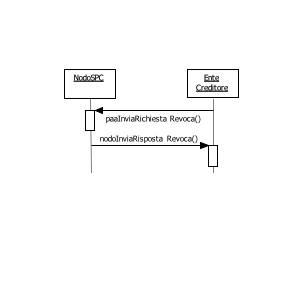

\ **Figura 38 – NodoSPC/EC: Metodi di gestione delle Revoche di RT**

Con riferimento al processo di revoca definito, per la
gestione dei meccanismi di revoca delle RT sono stati ha definiti i
seguenti metodi SOAP, rappresentati nel diagramma di Figura 38:

l. ***paaInviaRichiestaRevoca***, con la quale il NodoSPC comunica
   all'Ente Creditore la richiesta di Revoca di una specifica RT
   precedentemente inviata allo stesso Ente Creditore;

m. ***nodoInviaRispostaRevoca***, con la quale il NodoSPC riceve
   dall'Ente Creditore l'esito del processo di revoca richiesto con la
   primitiva precedente.

Le primitive di richiesta sono da intendersi *end-to-end*, così come le
primitive di esito. Le primitive di richiesta sono però asincrone
rispetto alle primitive di risposta (vedi *sequence* *diagram* di Figura
53 a pagina 186).

**Si tenga presente che, come già indicato in precedenza, i metodi di
gestione della Revoca della RT sotto descritti sono definiti, ma *non
implementati* nelle strutture software del NodoSPC.**

paaInviaRichiestaRevoca
~~~~~~~~~~~~~~~~~~~~~~~

Questa primitiva deve essere esposta dall'Ente Creditore.

Con questa primitiva il NodoSPC comunica all'Ente Creditore la richiesta
di Revoca di una specifica RT precedentemente inviata allo stesso Ente
Creditore.

Parametri di input

1. identificativoDominio

2. identificativoUnivocoVersamento

3. codiceContestoPagamento

4. Richiesta di Revoca (RR): file XML codificato in formato base64
   binary (vedi Tabella 3)

Parametri di output

1. esito

nodoInviaRispostaRevoca
~~~~~~~~~~~~~~~~~~~~~~~

Con questa primitiva l'Ente Creditore invia al NodoSPC l'esito del
processo di revoca richiesto con la primitiva precedente.

*Parametri di input*

1. identificativoIntermediarioPA

2. identificativoStazioneIntermediarioPA

3. password

4. identificativo Dominio

5. identificativoUnivocoVersamento

6. codiceContestoPagamento

7. Esito richiesta di Revoca (ER): file XML codificato in formato base64
   binary (vedi Tabella 4)

Parametri di output

1. esito

Storno del pagamento
~~~~~~~~~~~~~~~~~~~~

.. figure:: media/figura39.png

\ **Figura 39 – NodoSPC/EC: Metodi di gestione dello Storno del pagamento**

Con riferimento al processo di storno del pagamento e per
la gestione dei meccanismi di richiesta e di esito dello storno, il Nodo
dei Pagamenti-SPC rende disponibili i metodi SOAP descritti nel seguito
ed indicati nel diagramma di Figura 39 a pagina 154:

n. ***nodoInviaRichiestaStorno***, con la quale l'Ente Creditore
   comunica al NodoSPC la richiesta di storno da inoltrare al PSP

o. ***paaInviaEsitoStorno***, con la quale il NodoSPC invia all'Ente
   Creditore l'esito del processo di storno presso il PSP, richiesto con
   la primitiva precedente.

Le primitive di richiesta sono da intendersi *end-to-end*, così come le
primitive di esito. Le primitive di richiesta sono però asincrone
rispetto alle primitive di risposta (vedi *sequence* *diagram* di Figura
31 a pagina 130).

Il NodoSPC effettua unicamente un controllo di correttezza sintattica
degli oggetti XML scambiati; nel caso della primitiva
***nodoInviaRichiestaStorno***, viene verificato che la RPT oggetto
della richiesta di storno sia stata accettata dal NodoSPC e dal PSP,
altrimenti restituisce un errore specifico.

nodoInviaRichiestaStorno
~~~~~~~~~~~~~~~~~~~~~~~~

Questa primitiva viene esposta dal Nodo dei Pagamenti-SPC ed è
utilizzata per l'invio al PSP della Richiesta di storno di un pagamento
mediante una Richiesta di Revoca (RR).

Parametri di input

1. identificativoIntermediarioPA

2. identificativoStazioneIntermediarioPA

3. password

4. identificativoDominio

5. identificativoUnivocoVersamento

6. codiceContestoPagamento

7. Richiesta di Revoca (RR): file XML codificato in formato base64
   binary (vedi Tabella 3)

Parametri di output

1. esito: OK oppure KO

***Gestione degli errori ***

in caso di errore: ***faultBean*** emesso da ***NodoSPC*** (faultBean.id
"NodoDeiPagamentiSPC")

Di seguito i possibili valori dell'elemento faultBean.faultCode:

    *PPT\_OPER\_NON\_STORNABILE*

    *PPT\_AUTENTICAZIONE*

    *PPT\_AUTORIZZAZIONE*

    *PPT\_DOMINIO\_SCONOSCIUTO*

    *PPT\_DOMINIO\_DISABILITATO*

    *PPT\_STAZIONE\_INT\_PA\_SCONOSCIUTA*

    *PPT\_STAZIONE\_INT\_PA\_DISABILITATO*

    *PPT\_INTERMEDIARIO\_PA\_SCONOSCIUTO*

    *PPT\_INTERMEDIARIO\_PA\_DISABILITATO*

    *PPT\_PSP\_SCONOSCIUTO*

    *PPT\_PSP\_DISABILITATO*

paaInviaEsitoStorno
~~~~~~~~~~~~~~~~~~~

Questa primitiva non deve essere realizzata ed esposta dall'Ente
Creditore ed è utilizzata per la ricezione dell'esito dello storno (ER).

Parametri header

1. intestazionePPT

a. identificativoIntermediarioPA

b. identificativoStazioneIntermediarioPA

c. identificativoDominio

d. identificativoUnivocoVersamento

e. codiceContestoPagamento

Parametri di input

1. Esito richiesta di Revoca (ER): file XML codificato in formato base64
   binary (vedi Tabella 4)

Parametri di output

1. esito : OK oppure KO

***Gestione degli errori ***

se il parametro esito è diverso da OK: ***faultBean*** emesso da ***Ente
Creditore*** (dove faultBean.id è uguale a <identificativoDominio>)

Di seguito i possibili valori del dato faultBean.faultCode:

    *PAA\_ID\_DOMINIO\_ERRATO*

    *PAA\_ID\_INTERMEDIARIO\_ERRATO*

    *PAA\_STAZIONE\_INT\_ERRATA*

    *PAA\_ER\_DUPLICATA*

    *PAA\_SINTASSI\_XSD*

    *PAA\_SINTASSI\_EXTRAXSD*

    *PAA\_SEMANTICA* (vedi precisazioni dato faultBean.description)

Ricezione del flusso di rendicontazione
~~~~~~~~~~~~~~~~~~~~~~~~~~~~~~~~~~~~~~~

Come indicato nel paragrafo 8.2.5, il flusso di rendicontazione può
essere scaricato dal sistema sia in modalità File Transfer, sia tramite
*web service*. I metodi SOAP che il NodoSPC mette a disposizione
dell'Ente Creditore per la gestione dei flussi di rendicontazione,
riportati in Figura 40, sono i seguenti:

n. ***nodoChiediElencoFlussiRendicontazione***, con la quale l'Ente
   Creditore richiede al NodoSPC l'elenco dei flussi di rendicontazione
   di sua competenza memorizzati presso la piattaforma. Si noti che il
   sistema fornisce l'elenco completo dei flussi dell'ente presenti sul
   NodoSPC al momento della richiesta;

o. ***nodoChiedFlussoRendicontazione***, con la quale l'Ente Creditore
   richiede al NodoSPC uno specifico flusso di rendicontazione presente
   nell'elenco scaricato con la primitiva di cui al punto precedente.

Come già indicato, il NodoSPC non tiene traccia dei singoli flussi di
rendicontazione richiesti dall'Ente Creditore con la primitiva
***nodoChiedFlussoRendicontazione***, pertanto è compito di quest'ultimo
tenere conto dei singoli flussi già richiesti al NodoSPC.

\ **Figura** **40 – NodoSPC/EC: Metodi per la richiesta dei flussi di rendicontazione**

nodoChiediElencoFlussiRendicontazione
~~~~~~~~~~~~~~~~~~~~~~~~~~~~~~~~~~~~~

Con questa primitiva l'Ente Creditore richiede al NodoSPC l'elenco dei
flussi di rendicontazione di sua competenza memorizzati presso la
piattaforma.

Parametri di input

1. identificativoIntermediarioPA

2. identificativoStazioneIntermediarioPA

3. password

4. identificativoDominio

5. identificativoPSP

Parametri di output

1. totRestituiti

2. idRendicontazione: elenco dei flussi di rendicontazione, array di:

   a. identificativoFlusso

   b. dataOraFlusso

***Gestione degli errori ***

in caso di errore: ***faultBean*** emesso da ***NodoSPC*** (faultBean.id
"NodoDeiPagamentiSPC")

Di seguito i possibili valori dell'elemento *faultBean*.faultCode:

    *PPT\_AUTENTICAZIONE*

    *PPT\_AUTORIZZAZIONE*

    *PPT\_DOMINIO\_SCONOSCIUTO*

    *PPT\_DOMINIO\_DISABILITATO*

    *PPT\_STAZIONE\_INT\_PA\_SCONOSCIUTA*

    *PPT\_STAZIONE\_INT\_PA\_DISABILITATO*

    *PPT\_INTERMEDIARIO\_PA\_SCONOSCIUTO*

    *PPT\_INTERMEDIARIO\_PA\_DISABILITATO*

    *PPT\_PSP\_SCONOSCIUTO*

    *PPT\_PSP\_DISABILITATO*

nodoChiediFlussoRendicontazione
~~~~~~~~~~~~~~~~~~~~~~~~~~~~~~~

Con questa primitiva l'Ente Creditore richiede al NodoSPC un file XML
relativo ad uno specifico flusso di rendicontazione presente nell'elenco
scaricato con la primitiva indicata al paragrafo precedente
***nodoChiediElencoFlussiRendicontazione.***

Si fa presente che l'utilizzo di questa primitiva è gestito dal NodoSPC
in fase di configurazione dell'Ente Creditore, che deve comunicare se
vuole utilizzare il servizio via *web service* SOAP oppure via SFTP.

In quest'ultimo caso, la *response* è asincrona rispetto alla
conclusione dell'operazione di trasferimento via SFTP, poiché viene
restituita solo alla presa in carico dell'operazione stessa.

Parametri di input

1. identificativoIntermediarioPA

2. identificativoStazioneIntermediarioPA

3. password

4. identificativoDominio

5. identificativoPSP

6. identificativoFlusso

Parametri di output

diversificati in funzione della configurazione dell'EC sopra indicata: .

    *ricezione via *web service* SOAP*

1. file XML: flusso di rendicontazione in base64 binary (vedi 5.3.5)

    *ricezione via *server* SFTP*

    a differenza della primitiva standard, non viene restituito in
    output alcun file XML

    Una volta accettato il trasferimento (*response* priva di
    ***faultBean***), se il trasferimento tra *client* e *server* SFTP
    si interrompe per motivi tecnici, devono essere seguite le politiche
    di ritrasmissione descritte nel paragrafo 8.7.1.3.

***Gestione degli errori ***

in caso di errore: ***faultBean*** emesso da ***NodoSPC*** (faultBean.id
"NodoDeiPagamentiSPC").

Di seguito i possibili valori dell'elemento *faultBean*.faultCode:

    *PPT\_AUTENTICAZIONE*

    *PPT\_AUTORIZZAZIONE*

    *PPT\_DOMINIO\_SCONOSCIUTO*

    *PPT\_DOMINIO\_DISABILITATO*

    *PPT\_STAZIONE\_INT\_PA\_SCONOSCIUTA*

    *PPT\_STAZIONE\_INT\_PA\_DISABILITATO*

    *PPT\_INTERMEDIARIO\_PA\_SCONOSCIUTO*

    *PPT\_INTERMEDIARIO\_PA\_DISABILITATO*

    *PPT\_PSP\_SCONOSCIUTO*

    *PPT\_PSP\_DISABILITATO*

    *PPT\_ID\_FLUSSO\_SCONOSCIUTO*

Nel caso di ricezione del flusso via *server* SFTP, potrebbe verificarsi
un errore locale presso il NodoSPC nell'inizializzazione del
trasferimento (non riguarda errori verso il *server* SFTP remoto); in
tale occasione sarà emesso il seguente errore

    *PPT\_SYSTEM\_ERROR*

In questo caso ritentare la *request*, se il fault persiste contattare
il gestore del NodoSPC.

Avvisatura digitale *push* (su iniziativa dell'Ente Creditore)
~~~~~~~~~~~~~~~~~~~~~~~~~~~~~~~~~~~~~~~~~~~~~~~~~~~~~~~~~~~~~~

Per la gestione del processo di inoltro da parte dell'ente Creditore
degli avvisi digitali da inviare agli utilizzatori finali , il NodoSPC rende disponibile la seguente interfaccia *Web
service*, riportata in Figura 41:

p. ***nodoInviaAvvisoDigitale*,** con la quale viene sottomessa (da
   parte dell'Ente Creditore) una richiesta di invio di un singolo
   avviso di pagamento digitale. Questo significa che la richiesta è
   veicolata in modalità *push* da parte di Nodo dei Pagamenti-SPC verso
   i PSP aderenti.

.. figure:: media/figura41.png

\ **Figura 41 – NodoSPC/EC: Metodi di interfaccia per l'avvisatura digitale lato Ente Creditore**

nodoInviaAvvisoDigitale
~~~~~~~~~~~~~~~~~~~~~~~

La primitiva ***nodoInviaAvvisoDigitale*** è esposta dal Nodo dei
Pagamenti-SPC, è utilizzata in modalità sincrona e prevede che il
NodoSPC riceva l'avviso digitale, lo inoltro sui canali scelti
dall'utilizzatore finale e restituisca gli esiti [11]_ dell'inoltro
dell'avviso all'Ente Creditore.

Parametri header

1. intestazionePPT

a. identificativoIntermediarioPA

b. identificativoStazioneIntermediarioPA

c. identificativoDominio

Parametri di input

+-----------------------------------------------------------------------------------------------------------------+
| 1. password                                                                                                     |
+=================================================================================================================+
| 1. avvisoDigitaleWS: contiene le informazioni indicate nella Tabella 24 Documento Formato Messaggi XML PagoPA   |
+-----------------------------------------------------------------------------------------------------------------+

Parametri di output

1. esitoOperazione: OK oppure KO

2. esitoAvvisoDigitaleWS: contiene le informazioni indicate nella
   Tabella 25 al Documento Formato Messaggi XML PagoPA

Gestione degli errori

in caso di errore: ***faultBean*** emesso dal ***NodoSPC***.

Di seguito i possibili valori dell'elemento faultBean.faultCode in
funzione di faultBean.id:

1. faultBean.id=<identificativoPSP>:

    *PPT\_CANALE\_ERRORE* (vedi precisazioni dato faultBean.description)

1. faultBean.id="NodoDeiPagamentiSPC":

    *PPT\_SINTASSI\_XSD*

    *PPT\_SINTASSI\_EXTRAXSD*

    *PPT\_AUTENTICAZIONE*

    *PPT\_AUTORIZZAZIONE*

    *PPT\_SEMANTICA*

    *PPT\_DOMINIO\_SCONOSCIUTO*

    *PPT\_DOMINIO\_DISABILITATO*

    *PPT\_STAZIONE\_INT\_PA\_SCONOSCIUTA*

    *PPT\_STAZIONE\_INT\_PA\_DISABILITATA*

Avvisatura digitale *pull* (verifica della posizione debitoria)
~~~~~~~~~~~~~~~~~~~~~~~~~~~~~~~~~~~~~~~~~~~~~~~~~~~~~~~~~~~~~~~

Per la gestione dei meccanismi di consultazione degli avvisi presenti
presso l'Ente Creditore, il NodoSPC rende disponibile la seguente
interfaccia *Web service*, riportata in Figura 42:

q. ***paaChiediElencoAvvisiDigitali*,** con la quale viene sottomessa
   (da parte del NodoSPC) una richiesta di verifica di avvisi di
   pagamento presenti presso l'Ente Creditore. Questo significa che la
   richiesta è veicolata in modalità *pull* da parte di Nodo dei
   Pagamenti-SPC verso gli Enti Creditori aderenti.

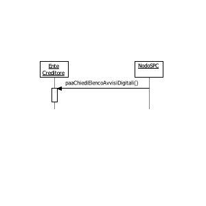

\ **Figura 42 – NodoSPC/EC: Metodi di interfaccia per l'avvisatura digitale lato Ente Creditore**

paaChiediElencoAvvisiDigitali
~~~~~~~~~~~~~~~~~~~~~~~~~~~~~

La primitiva è esposta dall'Ente Creditore ed è utilizzata in modalità
sincrona, prevedendo che il NodoSPC invii la richiesta compilata con il
codice fiscale del cittadino e restituendo le informazioni degli avvisi
sull'archivio dei pagamenti in attesa presso un unico Ente creditore.

Si ricorda che gli Entri Creditori che gestiscono più di un Archivio di
Pagamenti in Attesa (APA) potranno fornire il risultato relativo ad uno
solo di questi.

I parametri opzionali presenti nella primitiva per delimitare il
perimetro della ricerca possono essere ignorati dall'Ente Creditore
qualora lo ritenga opportuno.

Parametri header

1. intestazionePPT

a. identificativoIntermediarioPA

b. identificativoStazioneIntermediarioPA

c. identificativoDominio

Parametri di input

1. identificativoPSP

2. codiceFiscaleDebitore

3. codiceServizio (opzionale): contiene il codice (5 cifre numeriche)
   del servizio classificato all'interno del NodoSPC che si vuole
   selezionare (ad esempio: 00001 'Bollo Auto')

4. periodoRiferimento (opzionale): periodo temporale rispetto al quale
   si vuole restringere la ricerca, è formato da:

   a. annoDA: anno di competenza del debito nel formato YYYY

   b. annoA: anno di competenza del debito nel formato YYYY

Parametri di output

1. esitoOperazione: OK oppure KO

2. elencoAvvisiDigitali: contiene le informazioni indicate in Tabella 28
   al Documento Formato Messaggi XML PagoPA

***Gestione degli errori ***

Se il parametro **esitoOperazione** non è OK, sarà presente un
***faultBean*** nel formato specificato nel capitolo Gestione Errori.

Il ***faultBean*** è emesso da ***Ente Creditore*** (dove faultBean.id è
uguale a <identificativoDominio>).

Di seguito i possibili valori del dato faultBean.faultCode:

    *PAA\_ID\_DOMINIO\_ERRATO*

    *PAA\_ID\_INTERMEDIARIO\_ERRATO*

    *PAA\_STAZIONE\_INT\_ERRATA*

    *PAA\_SINTASSI\_XSD*

    *PAA\_SINTASSI\_EXTRAXSD*

    *PAA\_SEMANTICA* (vedi precisazioni dato faultBean.description)

Interrogazione delle basi dati del NodoSPC
~~~~~~~~~~~~~~~~~~~~~~~~~~~~~~~~~~~~~~~~~~~

Il Nodo dei Pagamenti-SPC, allo scopo di supportare lo scambio
paritetico tra le parti aderenti, rende disponibile agli Enti Creditori
collegati una interfaccia specifica per l'interrogazione del "*Catalogo
Dati Informativi*"  relativo ai servizi erogati
dai PSP aderenti al sistema pagoPA\ :sup:`®`.

Il Nodo dei Pagamenti-SPC fornisce l'informativa valida per la giornata
corrente (00-24).

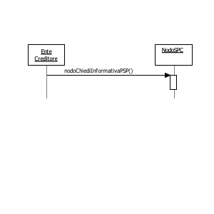

\ **Figura 43 – NodoSPC/EC: Metodo per l'interrogazione del Catalogo Dati Informativi**

Per l'interrogazione del "*Catalogo Dati Informativ*\ i" il NodoSPC
rende disponibile il metodo rappresentato nel diagramma di Figura 43:

r. ***nodoChiediInformativaPSP***, con la quale viene sottomessa a Nodo
   dei Pagamenti-SPC una richiesta di invio del catalogo dei dati
   informativi. Questo significa che l'invio del catalogo, informative
   dei vari PSP comprese, avviene in modalità pull, a seguito di una
   iniziativa diretta da parte dell'Ente Creditore.

Il NodoSPC restituisce un file XML, il cui tracciato è indicato nel Documento Formato Messaggi XML PagoPA.

**L'utilizzo della primitiva è deprecato e mantenuto per retro
compatibilità: cioè non è richiesto per chi sviluppa "ex novo" le
funzionalità presenti in questo documento.**

**In seguito la primitiva sarà disattivata.**

nodoChiediInformativaPSP
~~~~~~~~~~~~~~~~~~~~~~~~

Con questa primitiva L'Ente Creditore richiede al NodoSPC l'invio del
file XML contenente il "*Catalogo Dati Informativi*".

Parametri di input

1. identificativoIntermediarioPA

2. identificativoStazioneIntermediarioPA

3. password

4. identificativo Dominio (opzionale)

5. identificativoPSP (opzionale)

Parametri di output

1. file XML: relativo al "*Catalogo Dati Informativi*" dei PSP in base64
   binary (vedi Tabella 9)

***Gestione degli errori ***

in caso di errore: ***faultBean*** emesso da ***NodoSPC*** (faultBean.id
"NodoDeiPagamentiSPC")

Di seguito i possibili valori dell'elemento *faultBean*.faultCode:

    *PPT\_AUTENTICAZIONE*

    *PPT\_AUTORIZZAZIONE*

    *PPT\_DOMINIO\_SCONOSCIUTO*

    *PPT\_DOMINIO\_DISABILITATO*

    *PPT\_STAZIONE\_INT\_PA\_SCONOSCIUTA*

    *PPT\_STAZIONE\_INT\_PA\_DISABILITATO*

    *PPT\_INTERMEDIARIO\_PA\_SCONOSCIUTO*

    *PPT\_INTERMEDIARIO\_PA\_DISABILITATO*

    *PPT\_PSP\_SCONOSCIUTO*

    *PPT\_PSP\_DISABILITATO*

Ricezione dei Totali di Traffico
~~~~~~~~~~~~~~~~~~~~~~~~~~~~~~~~

Per la gestione dei meccanismi di ricezione dei flussi relativi ai
"Totali di Traffico" il Nodo dei Pagamenti-SPC rende
disponibili i metodi SOAP descritti nel seguito e rappresentati nel
diagramma di Figura 44 a pagina 162:

r. ***nodoChiediElencoQuadraturePA***, con la quale l'Ente Creditore
   richiede al NodoSPC l'elenco dei flussi contenenti i "Totali di
   Traffico" di sua competenza memorizzati presso la piattaforma. Si
   noti che il sistema fornisce l'elenco completo dei flussi dell'ente
   presenti sul NodoSPC al momento della richiesta;

s. ***nodoChiediQuadraturaPA***, con la quale l'Ente Creditore richiede
   al NodoSPC uno specifico flusso, contenente i "Totali di Traffico",
   presente nell'elenco scaricato con la primitiva indicata al punto
   precedente.

\ **Figura 44 – NodoSPC/EC: Metodi di invio dei "Totali di Traffico"**

Il flusso contenente le informazioni in questione è costituito da un
file XML, il cui tracciato è indicato nel documento Formato Messaggi XML PagoPa al paragrafo Totali di traffico degli Enti Creditori. L'origine
riferimento non è stata trovata.** della Sezione II, ed è individuato
dalla coppia di informazioni idDominio e idFlusso.

L'invio del flusso di quadratura avviene in modalità *pull*: è cioè
compito dell'Ente Creditore richiedere al Nodo dei Pagamenti-SPC il file
contenente quadratura di interesse.

Il Nodo dei Pagamenti-SPC non tiene traccia dei singoli flussi
contenenti i "Totali di Traffico" richiesti dal PSP con la primitiva
***nodoChiediElencoQuadraturePA***, pertanto è compito di ogni PSP
tenere conto dei singoli flussi già richiesti al NodoSPC.

nodoChiediElencoQuadraturePA
~~~~~~~~~~~~~~~~~~~~~~~~~~~~

Con questa primitiva l'Ente Creditore richiede al NodoSPC l'elenco dei
flussi contenenti i "Totali di Traffico" di sua competenza memorizzati
presso la piattaforma.

Parametri input

1. identificativoIntermediarioPA

2. identificativoStazioneIntermediarioPA

3. password

4. identificativo Dominio

Parametri di output

1. totRestituiti

2. idQuadratura: elenco dei flussi "Totali di Traffico", array di:

   a. identificativoFlusso

   b. dataOraFlusso

***Gestione degli errori ***

in caso di errore: ***faultBean*** emesso da ***NodoSPC*** (faultBean.id
"NodoDeiPagamentiSPC").

Di seguito i possibili valori dell'elemento faultBean.faultCode:

    *PPT\_AUTENTICAZIONE*

    *PPT\_AUTORIZZAZIONE*

    *PPT\_DOMINIO\_SCONOSCIUTO*

    *PPT\_DOMINIO\_DISABILITATO*

    *PPT\_STAZIONE\_INT\_PA\_SCONOSCIUTA*

    *PPT\_STAZIONE\_INT\_PA\_DISABILITATO*

    *PPT\_INTERMEDIARIO\_PA\_SCONOSCIUTO*

    *PPT\_INTERMEDIARIO\_PA\_DISABILITATO*

    *PPT\_PSP\_SCONOSCIUTO*

    *PPT\_PSP\_DISABILITATO*

nodoChiediQuadraturaPA
~~~~~~~~~~~~~~~~~~~~~~

Con questa primitiva l'Ente Creditore richiede al NodoSPC uno specifico
flusso, contenente i "Totali di Traffico", presente nell'elenco
scaricato con la primitiva indicata al paragrafo precedente.

Parametri input

1. identificativoIntermediarioPA

2. identificativoCanale

3. password

4. identificativoDominio

5. identificativo Flusso

Parametri di output

1. file XML: flusso contenente i "Totali di Traffico" in base64 binary
   (vedi Tabella 13)

***Gestione degli errori ***

in caso di errore: ***faultBean*** emesso da ***NodoSPC*** (faultBean.id
"NodoDeiPagamentiSPC").

Di seguito i possibili valori dell'elemento faultBean.faultCode:

    *PPT\_AUTENTICAZIONE*

    *PPT\_AUTORIZZAZIONE*

    *PPT\_DOMINIO\_SCONOSCIUTO*

    *PPT\_DOMINIO\_DISABILITATO*

    *PPT\_STAZIONE\_INT\_PA\_SCONOSCIUTA*

    *PPT\_STAZIONE\_INT\_PA\_DISABILITATO*

    *PPT\_INTERMEDIARIO\_PA\_SCONOSCIUTO*

    *PPT\_INTERMEDIARIO\_PA\_DISABILITATO*

    *PPT\_PSP\_SCONOSCIUTO*

    *PPT\_PSP\_DISABILITATO*

    *PPT\_id\_FLUSSO\_SCONOSCIUTO*

Interfacce HTTP di re-direzione per il pagamento immediato
-----------------------------------------------------------

Nel presente paragrafo saranno date indicazioni circa i parametri da
utilizzare nella gestione della re-direzione del browser
dell'utilizzatore finale nell'ambito del modello di pagamento con
esecuzione immediata.

Tali indicazioni sono valide anche per la gestione del cosiddetto
"carrello multibeneficiario".

Re-direzion\ *e* dal Portale EC verso il Web-FESP
~~~~~~~~~~~~~~~~~~~~~~~~~~~~~~~~~~~~~~~~~~~~~~~~~~

La sintassi dello URL che il Portale dell'Ente Creditore deve utilizzare
per re-indirizzare il browser dell'utilizzatore finale verso il Web-FESP
è la seguente,

    <URL>[&lang="xyz"]

dove i parametri (tra parentesi quelli opzionali) sono indicati nella
Tabella 36:

\ **Tabella 36 - Parametri di re-direzione verso Web-FESP**

+------------------------+------------------------------------------------------------------------------------------------------------------------------------+------------------------------------------------------------------------------------------------------------------------------------+
| **Parametri**          |     **Descrizione**                                                                                                                |                                                                                                                                    |
+========================+====================================================================================================================================+====================================================================================================================================+
| **URL**                | è la stringa fornita all'Ente Creditore dal NodoSPC nella *response* della primitiva nodoInviaRPT. La stringa è così composta:     |                                                                                                                                    |
|                        |                                                                                                                                    |                                                                                                                                    |
|                        | <URL> = "<urlWeb-FESP>?idSession=<idSession>"                                                                                      |                                                                                                                                    |
+------------------------+------------------------------------------------------------------------------------------------------------------------------------+------------------------------------------------------------------------------------------------------------------------------------+
|                        | dove:                                                                                                                              | è lo URL della componente Web-FESP del Nodo dei Pagamenti-SPC                                                                      |
|                        |                                                                                                                                    |                                                                                                                                    |
|                        | <urlWeb-FESP>                                                                                                                      | è generato dal NodoSPC e identifica in modo univoco l'operazione di re-indirizzamento relativa alla RPT della ***nodoInviaRPT***   |
|                        |                                                                                                                                    |                                                                                                                                    |
|                        | <idSession>                                                                                                                        |                                                                                                                                    |
+------------------------+------------------------------------------------------------------------------------------------------------------------------------+------------------------------------------------------------------------------------------------------------------------------------+
| **lang** (opzionale)   | specifica il linguaggio scelto dall'utilizzatore finale sul Portale dell'Ente Creditore, secondo la codifica standard ISO 693-3.   |                                                                                                                                    |
+------------------------+------------------------------------------------------------------------------------------------------------------------------------+------------------------------------------------------------------------------------------------------------------------------------+

Re-direzione dal Web-FESP verso il Portale EC
~~~~~~~~~~~~~~~~~~~~~~~~~~~~~~~~~~~~~~~~~~~~~

Lo URL restituito dal Web-FESP al browser dell'utilizzatore finale per
il re-indirizzamento verso il Portale dell'Ente Creditore è la seguente,
dove i parametri (tra parentesi quelli opzionali) sono indicati nella
**Tabella 37**:

<urlPortalePA>?[idDominio=<identificativoDominio>]&idSession=<idSession>& esito=<esito>[&<URLesitoPSP>]

	
\ **Tabella 37 - Parametri di re-direzione verso il portale dell'Ente Creditore**

+--------------------------------------------+---------------------------------------------------------------------------------------------------------------------------------------------------------------------------------------------------------+
| **urlPortalePA**                           | URL del Portale dell'Ente Creditore. Ad esempio: http://www.giustizia.it/pagamenti                                                                                                                      |
+--------------------------------------------+---------------------------------------------------------------------------------------------------------------------------------------------------------------------------------------------------------+
| **idDominio**                              | identificativoDominio dell'Ente Creditore che ha eseguito la richiesta di pagamento mediante la RPT. Coincide necessariamente con quello contenuto nella RPT stessa.                                    |
| (opzionale)                                | **Il parametro è obbligatorio nel caso di utilizzo della primitiva *nodoInviaRPT*, mentre *non deve* essere presente nel caso di utilizzo della primitiva *nodoInviaCarrelloRPT*.**                     |
+--------------------------------------------+---------------------------------------------------------------------------------------------------------------------------------------------------------------------------------------------------------+
| **idSession**                              | E' generato dal NodoSPC e identifica univocamente l'operazione di re-indirizzamento per il pagamento associato alla RPT della ***nodoInviaRPT***.                                                       |
+--------------------------------------------+---------------------------------------------------------------------------------------------------------------------------------------------------------------------------------------------------------+
| **esito**                                  | Corrisponde alla traduzione dell'esito della transazione on-line fornito dal Portale PSP nella *re-direzione* di ritorno al Web-FESP, dopo che l'utilizzatore finale ha interagito con il Portale PSP.  |
|                                            | Può essere utilizzato opzionalmente dal Portale dell'Ente Creditore per scegliere automaticamente una pagina da presentare all'utilizzatore finale in base all'esito della transazione.                 |
|                                            | In ogni caso l'esito certo del pagamento è dato dalla RT. I valori di **esito** ammessi sono:                                                                                                           |
|                                            | **OK** il pagamento presso il Portale PSP è stato eseguito con successo; quest'ultimo fornirà a breve una RT positiva.                                                                                  |
|                                            | **ERROR** il pagamento presso il Portale PSP non è stato eseguito con successo; quest'ultimo ha segnalato al Web-FESP l'esito negativo.                                                                 |
|                                            | **DIFFERITO**  l'esito del pagamento eseguito dall'utilizzatore finale presso il Portale PSP sarà noto solo al ricevimento della RT.                                                                    |
+--------------------------------------------+---------------------------------------------------------------------------------------------------------------------------------------------------------------------------------------------------------+
| **URLesitoPSP** (opzionale, a richiesta)   | E' tutta la *query string* dei parametri passati dal Portale PSP al Web-FESP senza traduzione in idSession ed esito. Esempio per uno specifico PSP:                                                     |
|                                            | "idBruciatura=abc1d4e7f3a8&idCarrello=123456789&codiceRitorno=KO\_02"                                                                                                                                   |
+--------------------------------------------+---------------------------------------------------------------------------------------------------------------------------------------------------------------------------------------------------------+

.. rubric:: Interfacce HTTP per il servizio WISP   |image17|
   :name: interfacce-http-per-il-servizio-wisp     

Interfacce HTTP per il servizio WISP
------------------------------------

Nel presente paragrafo saranno date indicazioni circa i parametri da
utilizzare nella gestione della re-direzione del browser
dell'utilizzatore finale nell'ambito del processo di utilizzo del
servizio WISP versione 1.3, messo a disposizione dal Nodo dei
Pagamenti-SPC.

**L'utilizzo dell'interfaccia WISP è deprecato e mantenuto per retro
compatibilità: cioè non è richiesto per chi sviluppa "ex novo" le
funzionalità presenti in questo documento.**

**In seguito la primitiva sarà disattivata.**

+------------------------------------------------------------------------------------------+----+
| .. rubric:: Re-direzione HTTP dal Portale dell'Ente Creditore verso la componente WISP   |    |
|    :name: re-direzione-http-dal-portale-dellente-creditore-verso-la-componente-wisp      |    |
+------------------------------------------------------------------------------------------+----+

Il primo passo che il Portale dell'Ente Creditore deve compiere per
poter accedere alle pagine del componente WISP è invocare l'indirizzo
URL del WISP. La re-direzione deve avvenire attraverso HTTP POST. Il
messaggio di avvio del processo di selezione del PSP contiene i dati
indicati in Tabella 38.

\ **Tabella 38 - Dati del Messaggio HTTP-POST**

+---------------------------+--------------+-----------+-----------+------------------------------------------------------------------------------------------------------------------------------------------------------------------+
| **Dato**                  | **Genere**   | **Occ**   | **Len**   | **Contenuto**                                                                                                                                                    |
+===========================+==============+===========+===========+==================================================================================================================================================================+
| idDominio                 | an           | 1..1      | 35        | Identificativo dell'ente che sta richiedendo le funzionalità WISP.                                                                                               |
+---------------------------+--------------+-----------+-----------+------------------------------------------------------------------------------------------------------------------------------------------------------------------+
| enteCreditore             | an           | 1..1      | 140       | Stringa alfanumerica contenente la denominazione dell'ente che sta richiedendo le funzionalità WISP.                                                             |
+---------------------------+--------------+-----------+-----------+------------------------------------------------------------------------------------------------------------------------------------------------------------------+
| keyPA                     | an           | 1..1      | 40        | Token generato dall'Ente Creditore rappresentativo della sessione di scelta del PSP da parte dell'utente. Deve essere univoco nel dominio dell'Ente Creditore.   |
+---------------------------+--------------+-----------+-----------+------------------------------------------------------------------------------------------------------------------------------------------------------------------+
| urlReturn                 | an           | 1..1      | 255       | URL a cui il portale WISP deve ritornare l'esito in caso di scelta del PSP effettuata con successo.                                                              |
+---------------------------+--------------+-----------+-----------+------------------------------------------------------------------------------------------------------------------------------------------------------------------+
| urlBack                   | an           | 1..1      | 255       | URL a cui il portale WISP deve ritornare il controllo in caso di annullamento o timeout della transazione.                                                       |
+---------------------------+--------------+-----------+-----------+------------------------------------------------------------------------------------------------------------------------------------------------------------------+
| primitiva                 | an           | 1..1      | 30        | Primitiva che verrà utilizzata per effettuare il pagamento.                                                                                                      |
+---------------------------+--------------+-----------+-----------+------------------------------------------------------------------------------------------------------------------------------------------------------------------+
| numPagamentiRPT           | n            | 1..1      | 1         | Numero dei pagamenti presenti nella RPT.                                                                                                                         |
+---------------------------+--------------+-----------+-----------+------------------------------------------------------------------------------------------------------------------------------------------------------------------+
| stornoPagamento           | an           | 1..1      | 2         | Indica se mostrare solo i PSP che consentono lo storno del pagamento immediato.                                                                                  |
+---------------------------+--------------+-----------+-----------+------------------------------------------------------------------------------------------------------------------------------------------------------------------+
| bolloDigitale             | an           | 1..1      | 2         | Richiesta del pagamento della marca da bollo digitale.                                                                                                           |
+---------------------------+--------------+-----------+-----------+------------------------------------------------------------------------------------------------------------------------------------------------------------------+
| terzoModelloPagamento     | an           | 1..1      | 2         | Indica se mostrare o meno i servizi dei PSP che consentono il pagamento attivato presso i PSP (cosiddetto modello 3 delle SANP)                                  |
+---------------------------+--------------+-----------+-----------+------------------------------------------------------------------------------------------------------------------------------------------------------------------+
| idPSP                     | an           | 0..1      | 35        | Identificativo del PSP, eventualmente selezionato dall'utente in sessioni precedenti e memorizzato a cura dell'Ente Creditore.                                   |
+---------------------------+--------------+-----------+-----------+------------------------------------------------------------------------------------------------------------------------------------------------------------------+
| tipoVersamento            | an           | 0..1      | 4         | Identificativo del tipo di versamento eventualmente selezionato dall'utente in sessioni precedenti e memorizzato a cura dell'Ente Creditore.                     |
+---------------------------+--------------+-----------+-----------+------------------------------------------------------------------------------------------------------------------------------------------------------------------+
| importoTransazione        | an           | 1..1      | 3..12     | Importo relativo alla transazione oggetto della scelta di pagamento.                                                                                             |
+---------------------------+--------------+-----------+-----------+------------------------------------------------------------------------------------------------------------------------------------------------------------------+
| versioneInterfacciaWISP   | an           | 1..1      | 3         | Indica la versione di interfaccia utilizzata per il WISP.                                                                                                        |
+---------------------------+--------------+-----------+-----------+------------------------------------------------------------------------------------------------------------------------------------------------------------------+
| ibanAccredito             | an           | 0..1      | 27        | Indica il codice IBAN che sarà presente nella RPT e verso il quale sarà effettuato il pagamento.                                                                 |
+---------------------------+--------------+-----------+-----------+------------------------------------------------------------------------------------------------------------------------------------------------------------------+
| contoPoste                | an           | 1..1      | 2         | Indica se mostrare o meno gli strumenti di pagamento di Poste Italiane.                                                                                          |
+---------------------------+--------------+-----------+-----------+------------------------------------------------------------------------------------------------------------------------------------------------------------------+
| pagamentiModello2         | an           | 1..1      | 2         | Indica se mostrare o meno i servizi dei PSP che consentono il pagamento con esecuzione differita (cosiddetto modello 2).                                         |
+---------------------------+--------------+-----------+-----------+------------------------------------------------------------------------------------------------------------------------------------------------------------------+
| codiceLingua              | an           | 0..1      | 2         | Indica il codice della lingua da utilizzare per l'esposizione delle pagine web.                                                                                  |
+---------------------------+--------------+-----------+-----------+------------------------------------------------------------------------------------------------------------------------------------------------------------------+

Tenuto presente che il significato dei dati richiesti per il "messaggio
di avvio del processo di selezione del PSP" è riportato nella colonna
"contenuto" della tabella sopra riportata, di seguito sono fornite
alcune precisazioni sui dati presenti da utilizzare:

+-----------------------------------------------------------------------------------------------------------------------------------------------------------------------------------------------------------------------------------------------------------------------------------------------------------------------------------------------------------+
| **idDominio:**                                                                                                                                                                                                                                                                                                                                            |
+===========================================================================================================================================================================================================================================================================================================================================================+
|     Identificativo del soggetto che sta richiedendo l'accesso al portale WISP. Nel caso in cui il parametro primitiva assuma il valore ***nodoInviaRPT***, va indicato il valore del dato idDominio presente nella RPT che deve essere inviata.                                                                                                           |
|     Invece, nel caso in cui il parametro primitiva assuma il valore ***nodoInviaCarrelloRPT***, va indicato il valore del dato idDominio presente nella prima RPT che compone il "carrello" di RPT.                                                                                                                                                       |
+-----------------------------------------------------------------------------------------------------------------------------------------------------------------------------------------------------------------------------------------------------------------------------------------------------------------------------------------------------------+
| **enteCreditore:**                                                                                                                                                                                                                                                                                                                                        |
+-----------------------------------------------------------------------------------------------------------------------------------------------------------------------------------------------------------------------------------------------------------------------------------------------------------------------------------------------------------+
|     Stringa alfanumerica contenente la denominazione del soggetto che sta richiedendo l'accesso al portale WISP. nel caso in cui il parametro primitiva assuma il valore ***nodoInviaRPT***, va indicato la denominazione dell'Ente Creditore che invia la RPT.                                                                                           |
|     Invece, nel caso in cui il parametro primitiva assuma il valore ***nodoInviaCarrelloRPT***, va indicata la denominazione della piattaforma che compone il "carrello" di RPT (ad esempio: quello della piattaforma regionale).                                                                                                                         |
+-----------------------------------------------------------------------------------------------------------------------------------------------------------------------------------------------------------------------------------------------------------------------------------------------------------------------------------------------------------+
| **keyPA:**                                                                                                                                                                                                                                                                                                                                                |
+-----------------------------------------------------------------------------------------------------------------------------------------------------------------------------------------------------------------------------------------------------------------------------------------------------------------------------------------------------------+
|     Token generato dall'Ente Creditore rappresentativo della sessione di scelta del PSP da parte dell'utente.                                                                                                                                                                                                                                             |
|     *Controlli:* deve essere univoco nel dominio dell'Ente Creditore.                                                                                                                                                                                                                                                                                     |
+-----------------------------------------------------------------------------------------------------------------------------------------------------------------------------------------------------------------------------------------------------------------------------------------------------------------------------------------------------------+
| **urlReturn:**                                                                                                                                                                                                                                                                                                                                            |
+-----------------------------------------------------------------------------------------------------------------------------------------------------------------------------------------------------------------------------------------------------------------------------------------------------------------------------------------------------------+
|     URL a cui il portale WISP deve ritornare l'esito in caso di scelta del PSP effettuata con successo.                                                                                                                                                                                                                                                   |
+-----------------------------------------------------------------------------------------------------------------------------------------------------------------------------------------------------------------------------------------------------------------------------------------------------------------------------------------------------------+
| **urlBack:**                                                                                                                                                                                                                                                                                                                                              |
+-----------------------------------------------------------------------------------------------------------------------------------------------------------------------------------------------------------------------------------------------------------------------------------------------------------------------------------------------------------+
|     URL a cui il portale WISP deve ritornare il controllo in caso di annullamento, *timeout* della transazione oppure parametro ibanAccredito non corretto per quell'Ente Creditore.                                                                                                                                                                      |
+-----------------------------------------------------------------------------------------------------------------------------------------------------------------------------------------------------------------------------------------------------------------------------------------------------------------------------------------------------------+
| **primitiva:**                                                                                                                                                                                                                                                                                                                                            |
+-----------------------------------------------------------------------------------------------------------------------------------------------------------------------------------------------------------------------------------------------------------------------------------------------------------------------------------------------------------+
|     Primitiva che verrà utilizzata per effettuare il pagamento.                                                                                                                                                                                                                                                                                           |
|     *Valori ammessi:*                                                                                                                                                                                                                                                                                                                                     |
| -  ***nodoInviaRPT***                                                                                                                                                                                                                                                                                                                                     |
| -  ***nodoInviaCarrelloRPT***                                                                                                                                                                                                                                                                                                                             |
|     *Filtri attivati*: Nel caso in cui sia impostato il valore ***nodoInviaCarrello***, saranno selezionati solo i servizi di pagamento dei PSP in grado di gestire tale primitiva e di trattare più di un versamento nella stessa richiesta: pertanto, i servizi di pagamento MyBank non saranno visualizzati.                                           |
+-----------------------------------------------------------------------------------------------------------------------------------------------------------------------------------------------------------------------------------------------------------------------------------------------------------------------------------------------------------+
| **numPagamentiRPT:**                                                                                                                                                                                                                                                                                                                                      |
+-----------------------------------------------------------------------------------------------------------------------------------------------------------------------------------------------------------------------------------------------------------------------------------------------------------------------------------------------------------+
|     Numero dei pagamenti presenti nella singola RPT nel caso in cui il parametro primitiva assuma il valore ***nodoInviaRPT*** oppure numero complessivo dei pagamenti presenti in tutte le RPT costituenti il "carrello" nel caso in cui il parametro primitiva assuma il valore ***nodoInviaCarrelloRPT***.                                             |
|     *Valori ammessi:* maggiore o uguale a 1.                                                                                                                                                                                                                                                                                                              |
+-----------------------------------------------------------------------------------------------------------------------------------------------------------------------------------------------------------------------------------------------------------------------------------------------------------------------------------------------------------+
| **stornoPagamento:**                                                                                                                                                                                                                                                                                                                                      |
+-----------------------------------------------------------------------------------------------------------------------------------------------------------------------------------------------------------------------------------------------------------------------------------------------------------------------------------------------------------+
|     Filtro per mostrare solo i PSP che consentono lo storno del pagamento immediato.                                                                                                                                                                                                                                                                      |
|     *Valori ammessi*:                                                                                                                                                                                                                                                                                                                                     |
|     **SI** l'Ente Creditore ***ha implementato*** la gestione dello storno                                                                                                                                                                                                                                                                                |
|     **NO** l'Ente Creditore ***non** **ha implementato*** la gestione dello storno                                                                                                                                                                                                                                                                        |
+-----------------------------------------------------------------------------------------------------------------------------------------------------------------------------------------------------------------------------------------------------------------------------------------------------------------------------------------------------------+
| **bolloDigitale**                                                                                                                                                                                                                                                                                                                                         |
+-----------------------------------------------------------------------------------------------------------------------------------------------------------------------------------------------------------------------------------------------------------------------------------------------------------------------------------------------------------+
|     Filtro per mostrare solo i PSP che consentono il pagamento della marca da bollo digitale.                                                                                                                                                                                                                                                             |
|     *Valori ammessi*:                                                                                                                                                                                                                                                                                                                                     |
|     **SI** la RPT ***si riferisce*** al pagamento della marca da bollo digitale                                                                                                                                                                                                                                                                           |
|     **NO** la RPT ***non si riferisce*** al pagamento della marca da bollo digitale                                                                                                                                                                                                                                                                       |
+-----------------------------------------------------------------------------------------------------------------------------------------------------------------------------------------------------------------------------------------------------------------------------------------------------------------------------------------------------------+
| **terzoModelloPagamento:**                                                                                                                                                                                                                                                                                                                                |
+-----------------------------------------------------------------------------------------------------------------------------------------------------------------------------------------------------------------------------------------------------------------------------------------------------------------------------------------------------------+
|     Indica se mostrare o meno i servizi dei PSP che consentono il pagamento attivato presso i PSP (cosiddetto modello 3 delle SANP).                                                                                                                                                                                                                      |
|     *Note*: Nella versione corrente delle funzionalità WISP, il parametro è ignorato.                                                                                                                                                                                                                                                                     |
+-----------------------------------------------------------------------------------------------------------------------------------------------------------------------------------------------------------------------------------------------------------------------------------------------------------------------------------------------------------+
| **idPSP:**                                                                                                                                                                                                                                                                                                                                                |
+-----------------------------------------------------------------------------------------------------------------------------------------------------------------------------------------------------------------------------------------------------------------------------------------------------------------------------------------------------------+
|     Identificativo del PSP, eventualmente selezionato dall'utente in sessioni precedenti e memorizzato a cura dell'Ente Creditore. Corrisponde al parametro O-2 della primitiva ***nodoChiediSceltaWISP*** .                                                                                                                                              |
+-----------------------------------------------------------------------------------------------------------------------------------------------------------------------------------------------------------------------------------------------------------------------------------------------------------------------------------------------------------+
| **tipoVersamento**                                                                                                                                                                                                                                                                                                                                        |
+-----------------------------------------------------------------------------------------------------------------------------------------------------------------------------------------------------------------------------------------------------------------------------------------------------------------------------------------------------------+
|     Identificativo del tipo di versamento eventualmente selezionato dall'utente in sessioni precedenti e memorizzato a cura dell'Ente Creditore. Corrisponde al parametro O-5 della primitiva ***nodoChiediSceltaWISP***.                                                                                                                                 |
|     *Controlli*: Può assumere gli stessi valori dell'omologo campo della RPT .                                                                                                                                                                                                                                                                            |
+-----------------------------------------------------------------------------------------------------------------------------------------------------------------------------------------------------------------------------------------------------------------------------------------------------------------------------------------------------------+
| **importoTransazione**                                                                                                                                                                                                                                                                                                                                    |
+-----------------------------------------------------------------------------------------------------------------------------------------------------------------------------------------------------------------------------------------------------------------------------------------------------------------------------------------------------------+
|     Campo alfanumerico (due cifre per la parte decimale, il separatore dei centesimi è il punto "."), indicante l'importo relativo alla transazione oggetto della scelta di pagamento.                                                                                                                                                                    |
|     *Controlli*: Deve essere diverso da "0.00". È obbligatorio se il parametro **versioneInterfacciaWISP** assume il valore **1.3**.                                                                                                                                                                                                                      |
+-----------------------------------------------------------------------------------------------------------------------------------------------------------------------------------------------------------------------------------------------------------------------------------------------------------------------------------------------------------+
|     *Note*: Questo campo deve essere valorizzato correttamente anche dagli Enti Creditori che utilizzano la versione 1.2 dell'interfaccia WISP, ossia nel caso in cui il parametro **versioneInterfacciaWISP** assuma il valore **1.2**.                                                                                                                  |
+-----------------------------------------------------------------------------------------------------------------------------------------------------------------------------------------------------------------------------------------------------------------------------------------------------------------------------------------------------------+
| **versioneInterfacciaWISP **                                                                                                                                                                                                                                                                                                                              |
+-----------------------------------------------------------------------------------------------------------------------------------------------------------------------------------------------------------------------------------------------------------------------------------------------------------------------------------------------------------+
|     Indica la versione di interfaccia utilizzata per il WISP.                                                                                                                                                                                                                                                                                             |
|     *Valori ammessi*:                                                                                                                                                                                                                                                                                                                                     |
|     **1.2** La versione 1.2 è deprecata in quanto l'utente riceverebbe un errore dal WISP in assenza di indicazioni del parametro **importoTransazione** (vedi parametro precedente).                                                                                                                                                                     |
|     **1.3** versione da utilizzare.                                                                                                                                                                                                                                                                                                                       |
+-----------------------------------------------------------------------------------------------------------------------------------------------------------------------------------------------------------------------------------------------------------------------------------------------------------------------------------------------------------+
| **ibanAccredito **                                                                                                                                                                                                                                                                                                                                        |
+-----------------------------------------------------------------------------------------------------------------------------------------------------------------------------------------------------------------------------------------------------------------------------------------------------------------------------------------------------------+
|     Indica il codice IBAN che sarà presente nella RPT e verso il quale sarà effettuato il pagamento.                                                                                                                                                                                                                                                      |
|     *Controlli*: Se il parametro primitiva è impostato a ***'nodoInviaCarrelloRPT*** ' oppure il parametro numPagamentiRPT è maggiore di 1, il parametro viene ignorato.                                                                                                                                                                                  |
+-----------------------------------------------------------------------------------------------------------------------------------------------------------------------------------------------------------------------------------------------------------------------------------------------------------------------------------------------------------+
| **contoPoste **                                                                                                                                                                                                                                                                                                                                           |
+-----------------------------------------------------------------------------------------------------------------------------------------------------------------------------------------------------------------------------------------------------------------------------------------------------------------------------------------------------------+
|     Indica se l'Ente Creditore beneficiario del pagamento dispone di almeno un c/c postale censito nella Tabella dei c/c di accredito.                                                                                                                                                                                                                    |
|     *Valori ammessi*:                                                                                                                                                                                                                                                                                                                                     |
|     **SI** l'Ente Creditore ***gestisce*** per quel pagamento conti correnti postali                                                                                                                                                                                                                                                                      |
|     **NO** l'Ente Creditore ***non gestisce*** conti correnti postali                                                                                                                                                                                                                                                                                     |
|     *Note:* Il parametro è obbligatorio ed efficace solo nel caso in cui il campo ibanAccredito non sia valorizzato\ *.*                                                                                                                                                                                                                                  |
|     Nel caso in cui il parametro primitiva (vedi sopra) assuma il valore ***nodoInviaCarrelloRPT*** ("carrello" di RPT), per impostare a **SI** il parametro contoPoste ***è necessario che tutti*** gli Enti Creditori beneficiari dei pagamenti presenti nel "carrello" dispongano di almeno un c/c postale censito nella Tabella dei c/c di accredito. |
|     In caso contrario (anche uno solo degli Enti Creditori presenti nel "carrello" non dispone di un c/c postale) potrebbe essere scelto il PSP Poste, che non potrebbe eseguire la transazione.                                                                                                                                                          |
+-----------------------------------------------------------------------------------------------------------------------------------------------------------------------------------------------------------------------------------------------------------------------------------------------------------------------------------------------------------+
| **pagamentiModello2 **                                                                                                                                                                                                                                                                                                                                    |
+-----------------------------------------------------------------------------------------------------------------------------------------------------------------------------------------------------------------------------------------------------------------------------------------------------------------------------------------------------------+
|     Indica se mostrare o meno i servizi dei PSP che consentono il pagamento con esecuzione differita (cosiddetto modello 2 delle SANP).                                                                                                                                                                                                                   |
+-----------------------------------------------------------------------------------------------------------------------------------------------------------------------------------------------------------------------------------------------------------------------------------------------------------------------------------------------------------+
| **codiceLingua:**                                                                                                                                                                                                                                                                                                                                         |
+-----------------------------------------------------------------------------------------------------------------------------------------------------------------------------------------------------------------------------------------------------------------------------------------------------------------------------------------------------------+
|     Indica il codice della lingua da utilizzare per l'esposizione delle pagine web.                                                                                                                                                                                                                                                                       |
|     *Valori ammessi*: vedi Tabella 11 a pagina 89.                                                                                                                                                                                                                                                                                                        |
|     *Valore di default:* **IT**                                                                                                                                                                                                                                                                                                                           |
|     *Note:* Il parametro è facoltativo, tuttavia **si raccomanda di impostarlo correttamente**, sia per garantire la visualizzazione della lingua coerente con il sito dell'Ente Creditore, sia per consentire di visualizzare i PSP che offrono e descrivono i loro servizi di pagamento nella lingua scelta dall'utilizzatore finale.                   |
+-----------------------------------------------------------------------------------------------------------------------------------------------------------------------------------------------------------------------------------------------------------------------------------------------------------------------------------------------------------+

Gli elementi opzionali idPSP e tipoVersamento rappresentano le scelte di
pagamento dell'utente già profilato nel contesto del Portale dell'Ente
Creditore e servono per verificare se la scelta preselezionata è ancora
presente nel catalogo dati informativi. In caso positivo, tali parametri
di preferenza comunicano al WISP come predisporre la pagina di scelta di
pagamento da presentare all'utilizzatore finale.

Re-direzione HTTP da WISP verso il Portale dell'Ente Creditore – urlBack
~~~~~~~~~~~~~~~~~~~~~~~~~~~~~~~~~~~~~~~~~~~~~~~~~~~~~~~~~~~~~~~~~~~~~~~~~

Atterrato sulle pagine del WISP, l'utente può svolgere in ogni momento
l'operazione di annullamento, con conseguente re-indirizzamento del
browser dell'utente all'URL del Portale dell'Ente Creditore indicato in
fase di attivazione nel parametro urlBack. Il messaggio di chiusura del
processo di selezione del PSP viene trasferito in POST e contiene i dati
indicati in **Tabella 39**.

\ **Tabella 39 - Dati forniti nella *re-direct* su urlBack**

+-------------+--------------+-----------+-----------+--------------------------------------------------------------------------------------------------------------------------------------------------------------+
| **Dato**    | **Genere**   | **Occ**   | **Len**   | **Contenuto**                                                                                                                                                |
+=============+==============+===========+===========+==============================================================================================================================================================+
| idDominio   | an           | 1..1      | 35        | Identificativo dell'Ente Creditore che sta richiedendo l'accesso in re-direzione al portale WISP.                                                            |
+-------------+--------------+-----------+-----------+--------------------------------------------------------------------------------------------------------------------------------------------------------------+
| keyPA       | an           | 1..1      | 40        | Token generato dall'Ente Creditore. Contiene l'identificativo della sessione di scelta del PSP attivata dell'utente.                                         |
+-------------+--------------+-----------+-----------+--------------------------------------------------------------------------------------------------------------------------------------------------------------+
| type        | an           | 1..1      | 10        | **ANNULLO**, qualora l'utente abbia cliccato in modo esplicito sul bottone di ritorno esposto dal WISP                                                       |
|             |              |           |           |                                                                                                                                                              |
|             |              |           |           | **TIMEOUT**, qualora dalla re-direzione verso il WISP sia trascorso il periodo di tempo previsto per il parametro <timeout Navigazione WISP>.                |
|             |              |           |           |                                                                                                                                                              |
|             |              |           |           | **IBAN**, qualora il parametro ibanAccredito sia presente e il codice IBAN ivi specificato non sia presente nella White List del NodoSPC .>.                 |
+-------------+--------------+-----------+-----------+--------------------------------------------------------------------------------------------------------------------------------------------------------------+

 Re-direzione HTTP da WISP verso il Portale dell'Ente Creditore - urlReturn
~~~~~~~~~~~~~~~~~~~~~~~~~~~~~~~~~~~~~~~~~~~~~~~~~~~~~~~~~~~~~~~~~~~~~~~~~~~

Effettuata la scelta sulle pagine del WISP, il processo si conclude con
il re-indirizzamento del browser dell'utente all'URL del Portale
dell'Ente Creditore indicato, in fase di attivazione, nel parametro
urlReturn. Il messaggio di chiusura del processo di selezione del PSP
viene trasferito in POST e contiene i dati indicati in Tabella 40.

\ **Tabella 40 - Dati forniti nella *re-direct* su urlReturn**

+-------------+--------------+-----------+-----------+------------------------------------------------------------------------------------------------------------------------+
| **Dato**    | **Genere**   | **Occ**   | **Len**   | **Contenuto**                                                                                                          |
+=============+==============+===========+===========+========================================================================================================================+
| idDominio   | an           | 1..1      | 35        | Identificativo dell'Ente Creditore che sta richiedendo l'accesso in re-direzione al portale WISP.                      |
+-------------+--------------+-----------+-----------+------------------------------------------------------------------------------------------------------------------------+
| keyPA       | an           | 1..1      | 40        | Token generato dall'Ente Creditore. Contiene l'identificativo della sessione di scelta del PSP attivata dell'utente.   |
+-------------+--------------+-----------+-----------+------------------------------------------------------------------------------------------------------------------------+
| keyWISP     | an           | 1..1      | 40        | Token generato dalla componente WISP del NodoSPC al momento della chiusura del processo di scelta del PSP.             |
+-------------+--------------+-----------+-----------+------------------------------------------------------------------------------------------------------------------------+

Interfacce per il servizio di File Transfer Sicuro
--------------------------------------------------

In questo paragrafo sono indicate le interfacce per i servizi di file
transfer (SFTP) che il sistema pagoPA mette a disposizione degli Enti
Creditori.

Specifiche di interfaccia per il trasferimento dei flussi di rendicontazione
~~~~~~~~~~~~~~~~~~~~~~~~~~~~~~~~~~~~~~~~~~~~~~~~~~~~~~~~~~~~~~~~~~~~~~~~~~~~

Il *work flow* del processo di riconciliazione dei pagamenti eseguiti è
indicato al Paragrafo Processo di Riconciliazione dei documenti eseguiti (vedi anche Figura 32).

L'effettiva operazione di trasmissione del file di rendicontazione dal
NodoSPC all'EC avverrà secondo questa modalità: l'EC riceverà il flusso
richiesto direttamente sulle proprie macchine, per cui agirà da
***server***; sarà il NodoSPC a svolgere il ruolo di ***client***
**SFTP**.

Dati tecnici
~~~~~~~~~~~~

Il *client* SFTP del Nodo dei Pagamenti-SPC si collegherà al *server*
SFTP dell'Ente Creditore utilizzando i seguenti dati:

    Protocollo: SFTP

    Indirizzo IP pubblico del *server* SFTP: fornito dall'Ente Creditore

    Porta TCP : 22

Utenza e password saranno fornite dall'Ente Creditore in modo riservato.

L'utente *client* SFTP del NodoSPC deve avere i diritti per eseguire il
trasferimento del file.

Convenzioni dei nomi file e formato file
~~~~~~~~~~~~~~~~~~~~~~~~~~~~~~~~~~~~~~~~

Indipendentemente dalla posizione di salvataggio del file, esso verrà
depositato in formato compresso (ZIP). Non viene fatto un controllo di
completezza del file dall'applicazione *client*, quindi l'integrità del
file deve essere controllata dall'applicazione ricevente.

Il nome del file completo nella cartella di destinazione è uguale al
nome logico del flusso di rendicontazione (parametro I-6 della primitiva
***nodoChiediFlussoRendicontazione***) con un suffisso
".XML.ZIP".

***Nome del file***:

*nomeFlussoRendicontazione*.XML.ZIP

Politica di ritrasmissione
~~~~~~~~~~~~~~~~~~~~~~~~~~

Se, per qualsiasi motivo tecnico, il trasferimento si interrompe o
comunque il file non viene depositato correttamente sul *server* SFTP
dell'Ente Creditore, l'applicazione *client* non esegue alcun tentativo
di ritrasmissione.

Per ottenere una ritrasmissione di un file non integro oppure completo,
l'applicazione EC può richiedere nuovamente il trasferimento con la
primitiva ***nodoChiediFlussoRendicontazione***.

Specifiche di interfaccia per il trasferimento delle richieste di Avviso Digitale
~~~~~~~~~~~~~~~~~~~~~~~~~~~~~~~~~~~~~~~~~~~~~~~~~~~~~~~~~~~~~~~~~~~~~~~~~~~~~~~~~

Il *work flow* del processo di avvisatura digitale *push* via File
Transfer è schematizzato in Figura 33 a pagina 133.

I flussi sono inviati dall'Ente Creditore al NodoSPC nel caso di
richieste di inoltro di avviso digitale, mentre sono inviati nel senso
contrario gli esiti delle singole operazioni di inoltro.

Il soggetto mittente, ovvero colui che invia i flussi agisce, nella fase
di trasferimento delle informazioni, in qualità di *client SFTP*, mentre
il soggetto destinatario deve rendere disponibile un *server SFTP* e la
relativa struttura di *File* *System* per la ricezione dei file.

Ogni soggetto, sia Ente Creditore, sia Nodo dei Pagamenti-SPC deve
disporre di un *server SFTP* opportunamente configurato e strutturato,
con cartelle di *File System* predisposte per ricevere i file inviati
dalla controparte.

Allo stesso modo ogni soggetto deve utilizzare un *client SFTP*
pre-configurato con la coppia userID e password per ogni controparte,
necessari per inviare i file ai destinatari predefiniti.

I flussi scambiati devono essere compressi con l'algoritmo gzip
(estensione ".zip").

Convenzioni di nomenclatura dei file scambiati
~~~~~~~~~~~~~~~~~~~~~~~~~~~~~~~~~~~~~~~~~~~~~~

Nello scambio SFTP dei flussi tra Enti Creditori e Nodo dei
Pagamenti-SPC è necessario adottare una convenzione di nomenclatura in
modo che il flusso sia individuato in modo univoco:

**<idIntermediario>\_<idDominio>\_<idSessioneTrasmissione>\_<progressivoFile>\_<tipoFlusso>**

nel quale le varie componenti assumono il seguente significato:

a) idIntermediario è il codice fiscale del soggetto intermediario
   mittente, può coincidere con il dato <idDominio>;

b) idDominio è il codice fiscale del soggetto mittente del flusso; deve
   coincidere con il dato identificativoDominio presente nel flusso;

c) idSessioneTrasmissione: è la data di invio del flusso, nel formato
   YYYYMMDD;

d) progressivoFile: è un numero di due cifre rappresentativo del file
   inviato nell'ambito della stessa sessione:‘00' per il primo, ‘01' per
   il secondo, ecc. [12]_;

e) tipoFlusso: può assumere uno dei seguenti valori:

   -  "AV" per la richiesta avviso,

   -  "AV\_ACK" per l'ack di presa in carico della richiesta di avviso,

   -  "ESITO" per il file di esito,

   -  "ESITO\_ACK", per l'ack di ricezione dell'esito.

Di seguito si riportano alcuni esempi di nomenclatura di flussi:

12345678901\_10987654321\_20170101\_00\_AV.zip

12345678901\_10987654321\_20170101\_00\_AV\_ACK.zip

12345678901\_10987654321\_20170101\_00\_ESITO.zip

12345678901\_10987654321\_20170101\_00\_ESITO\_ACK.zip

Invio delle richieste di avviso da EC al Nodo dei Pagamenti-SPC
~~~~~~~~~~~~~~~~~~~~~~~~~~~~~~~~~~~~~~~~~~~~~~~~~~~~~~~~~~~~~~~

La struttura ed il contenuto dei file trasferiti sono indicati in
**Tabella 21 - Tracciato XML per comunicazione "\ *Lista Avvisi
digitali"***, in **Tabella 22 - Tracciato XML per comunicazione
"\ *Lista esito inoltro Avvisi digitali"*** e in **Tabella 23 -
Tracciato XML per la segnalazione di "\ *Presa in carico*\ " (File di
ACK)**,

L'Ente Creditore può attivare una sola trasmissione al giorno composta
da:

a) un solo file se il numero degli avvisi è inferiore al massimo
       previsto per ogni file (al momento pari a 100.000 avvisi);

b) il numero di file strettamente necessari a contenere tutte le
   richieste di avviso (ad esempio, se devo trasferire 250.000, saranno
   inviati 3 file).

Interazione tra Nodo dei Pagamenti-SPC e PSP
============================================

Questo capitolo descrive le interfacce utilizzate nella cooperazione tra
Nodo dei Pagamenti-SPC e prestatori dei servizi di pagamento. L'uso
combinato di tali interfacce consente l'erogazione dei servizi di
pagamento secondo i modelli di pagamento previsti dalle presenti
specifiche.

Workflow dei modelli di pagamento e dei processi accessori
----------------------------------------------------------

Come già indicato nei precedenti capitoli, il Nodo dei Pagamenti-SPC
pone a fattor comune le infrastrutture tecniche di comunicazione, agendo
quindi come normalizzatore dei protocolli di accesso ai servizi di
pagamento.

I prestatori di servizi di pagamento aderenti, di conseguenza, devono
implementare solamente i protocolli di accesso al Nodo dei Pagamenti-SPC
come definiti dagli *Web service* relativi e utilizzarli nei diversi
modelli di pagamento.

Tenuto conto che la descrizione dettagliata del *workflow* dei processi
di pagamento è stata in larga parte effettuata nel paragrafo 8.2, nei
seguenti paragrafi verranno descritte le specificità legate alla
gestione di tali processi da parte dei PSP.

Pagamenti attivati presso l'Ente Creditore
~~~~~~~~~~~~~~~~~~~~~~~~~~~~~~~~~~~~~~~~~~~

Questi modelli di pagamento, già descritti ai paragrafi 2.1.1 e 2.1.2, i
prestatori dei servizi di pagamento devono consentire il pagamento
presso i propri sistemi.

Per la descrizione completa del flusso di lavoro si rimanda a quanto
indicato al Paragrafo Pagamenti attivati presso l'Ente Creditore.

Generazione e invio della Ricevuta Telematica
~~~~~~~~~~~~~~~~~~~~~~~~~~~~~~~~~~~~~~~~~~~~~~

Per la generazione delle RT non è previsto dal Nodo dei Pagamenti-SPC
alcuno specifico metodo, pertanto il PSP, una volta completato il
pagamento con uno dei modelli previsti, è tenuto a generare
immediatamente la RT con le modalità previste dalle presenti specifiche
e rispettando le indicazioni presenti nel documento "*Indicatori di
qualità per i Soggetti Aderenti*", pubblicato sul sito dell'Agenzia.

Per i pagamenti eseguiti con presso l'Ente Creditore, l'invio delle
Ricevute Telematiche è consentito esclusivamente in modalità *push*
(primitiva ***nodoInviaRT***), così come indicato nel *Workflow* di
chiusura della transazione presso EC .
Per l'invio della RT in modalità *push* si veda anche il Paragrafo nodoInviaRPT.

Si tenga presente che nel caso in cui il PSP riceva un carrello di RPT
dovrà generare un insieme di RT e inviarle tutte con la primitiva
***nodoInviaRT***, ciclando fino a raggiungere la numerosità del
carrello stesso.

Casi di errore e strategie di ripristino
~~~~~~~~~~~~~~~~~~~~~~~~~~~~~~~~~~~~~~~~

Dall'analisi dell'interazione complessiva è possibile individuare i
punti dove è necessario trattare un esito negativo: alcuni di questi
sono dovuti ad errori di natura applicativa o relativi ai formati (RPT o
RT mal formate), sono quindi permanenti o ripristinabili solo con
l'intervento manuale; altri casi di errore sono invece relativi alla
interazione tra i vari soggetti e possono consentire politiche di
recupero automatico

A tale scopo il PSP partecipa alle operazioni di ripristino di eventuali
errori mettendo a disposizione le primitive previste dal protocollo di
colloquio per l'allineamento dello stato, quali
***pspChiediAvanzamentoRPT*** e ***pspChiediListaRT***.

Pagamenti attivati presso il PSP
~~~~~~~~~~~~~~~~~~~~~~~~~~~~~~~~~

Questo modello di pagamento, conosciuto anche come "Modello 3" e già
descritto in precedenza, presuppone che l'utilizzatore finale sia
in possesso di un avviso (analogico o digitale) contenente le
indicazioni necessarie per effettuare il pagamento.

Gli Enti Creditori devono mettere a disposizione:

a) l'archivio dei pagamenti in attesa (APA), contenente tutte le
   informazioni, associate ad un identificativo univoco, necessarie per
   effettuare il pagamento;

b) un'applicazione "\ *server*\ " dedicata necessaria per trattare le
   richieste provenienti dai PSP;

Il *workflow* di questo modello di pagamento è dettagliatamente
analizzato nel presente paragrafo e in quelli successivi. A tal
proposito si rimanda allo schema di *activity diagram* di Figura 45 a
pagina 173.

|PlantUML diagram|

\ **Figura 45 – *Activity diagram* del modello di pagamento attivato presso il PSP**

Il flusso principale delle attività, rappresentato dallo *activity
diagram* di Figura 45, contempla due percorsi alternativi che hanno in
comune i seguenti passi:

1) *Presentazione dell'Avviso*: l'utilizzatore finale presenta l'avviso
   analogico o digitale presso il *Front-End* del PSP rappresentato
   dalle sue strutture sul territorio (sportelli fisici, punti di
   presenza, ATM, ecc.) oppure dalle applicazioni di *home banking*
   o *mobile app* rese disponibili dal PSP;

6) *Chiusura della transazione*: completato il pagamento, il *Front-end*
   del PSP rilascia la ricevuta all'utilizzatore finale e
   contemporaneamente il *Back-end* genera la RT e la recapita,
   attraverso il NodoSPC, al *Back-end* dell'Ente Creditore.

Il percorso standard (vedi il *workflow* di dettaglio al Paragrafo Percorso Standard (SANP 2.0) per il modello 3), che
sarà adottato con le attuali specifiche una volta a regime e che sarà
l'unico utilizzato nel futuro, prevede i seguenti passi:

2) *Avvio del pagamento*: il *Back-end* del PSP, attraverso il NodoSPC,
   invia al *Back-end* dell'Ente Creditore la richiesta di allegare
   la RPT relativa all'avviso richiesto;

3) *Conferma del pagamento*: in questa fase l'utilizzatore finale
   interagisce con il *Front-End* del PSP e decide se effettuare o
   meno il pagamento la transazione. In caso di consenso al
   pagamento, il *Back-end* del PSP si predispone per generare un RT
   positiva, in caso di abbandono si predispone per generare una RT
   negativa;

Il percorso alternativo (vedi il *workflow* di dettaglio al paragrafo Percorso Alternativo (SANP 1.7) per il Modello 3), che si mantiene in via
temporanea per retro compatibilità, prevede i seguenti passi:

1) *Verifica del pagamento in attesa*: in questa fase del processo,
   attraverso il NodoSPC, il interagisce con il *Back-end* dell'Ente
   Creditore che verifica la consistenza della richiesta e ne
   fornisce l'esito;

2) *Conferma del pagamento*: in questa fase l'utilizzatore finale
  interagisce con il *Front-End* del PSP e decide se effettuare il
  pagamento o abbandonare la transazione;

3) *Attivazione del pagamento*: il *Back-end* del PSP, attraverso il
  NodoSPC, invia al *Back-end* dell'Ente Creditore la richiesta di
  ricevere dal Nodo la RPT associata all'avviso verificato;

4) *Attesa della RPT*: il *Back-end* del PSP resta in attesa di
  ricevere, attraverso il NodoSPC, la RPT richiesta al punto
  precedente; una volta ricevuta la associa all'avviso verificato;

Nel seguito i due percorsi saranno analizzati separatamente.

Da ultimo, si segnala che riveste particolare importanza in tutte le
fasi del processo di pagamento in questione un identificativo univoco,
generato in proprio dal PSP, che questi associa ad una data attività di
pagamento (CCP, codiceContestoPagamento) e successivamente alla RPT che
riceverà dall'Ente Creditore.

La valorizzazione del codiceContestoPagamento garantisce, a parità di
Ente Creditore, che l'istanza della RPT generata per il codice IUV
specificato risulti univoca.

Presentazione dell'avviso e transcodifica dei dati per il pagamento
~~~~~~~~~~~~~~~~~~~~~~~~~~~~~~~~~~~~~~~~~~~~~~~~~~~~~~~~~~~~~~~~~~~~

In questa fase il *Front-end* del PSP prende in carico i dati
dell'avviso che dovranno essere forniti al NodoSPC attraverso le
previste.

Tutti *workflow* che saranno esaminati prevedono che il PSP fornisca le
informazioni necessarie ad identificare il pagamento in attesa, specificando anche il tipo di parametri forniti alle varie
primitive via via utilizzate.

In particolare, l'identificativo della codifica utilizzata per il dato
InfrastrutturaPSP [13]_ consente al NodoSPC la transcodifica del codice
indicato sull'avviso di pagamento nel formato standard dei parametri
necessari ad identificare univocamente l'Ente Creditore.

Si tenga presente che, nella configurazione del NodoSPC, ad ogni
identificativo di codifica previsto per il dato InfrastrutturaPSP
corrisponde uno schema XSD di validazione e una regola di traduzione.

Percorso "Standard" (SANP 2.0) per il Modello 3
~~~~~~~~~~~~~~~~~~~~~~~~~~~~~~~~~~~~~~~~~~~~~~~

Il *workflow* di questo percorso è stato modificato al fine di gestire
al meglio alcune possibili condizioni di errore che si verificano con i
processi previsti dalle precedenti specifiche: la modifica riguarda le
attuali primitive ***nodoIAttivaRPT e paaAttivaRPT***, che saranno
sostituite a regime dalle primitive ***nodoAllegaRPT*** e
***paaAllegaRPT***.

Nel diagramma di Figura 46 a pagina 175 è rappresentato il *workflow*
relativo alla fase di "*Avvio del pagamento*" nella configurazione a
regime. Nel transitorio, per motivi di retro compatibilità, per il
percorso "Standard" potranno essere utilizzate le primitive
***nodoAttivaRPT*** e ***paaAttivaRPT*** (per l'utilizzo delle quali si
veda il *workflow* di Figura 48 a pagina 178).

|PlantUML diagram|

\ **Figura** **46 – Sequence diagram della fase di Avvio del pagamento**

Il *workflow* di questa fase è stato modificato, come sopra indicato,
prevedendo i seguenti passi:

1) il *Front-End* del PSP prende in carico i dati dell'avviso, imputati in maniera automatica o manuale,
       e li invia alla componente di *Back-end* del PSP\ *;*

2) la componente di *Back-end* del PSP invoca la primitiva
       ***nodoAllegaRPT***, (vedi Paragrafo nodoAllegaRPT componendo i dati richiesti
       e la completa con un proprio identificativo di attività di
       pagamento (CCP), il quale lega l'attività di pagamento alla RPT
       che sarà generata dall'Ente Creditore;

3) la componente FESP del NodoSPC si attiva per validare la richiesta;

**in caso di richiesta validata;**

1) la componente FESP del NodoSPC converte i dati ricevuti dal
       *Back-end* del PSP passando dalla codifica specifica agli
       identificatori standard del sistema pagoPA e, sulla base di tali
       dati, provvede all'inoltro della richiesta alla componente di
       *Back-end* dell'Ente Creditore con la primitiva
       ***paaAllegaRPT***;

2) la componente di *Back-end* dell'Ente Creditore verifica lo stato del
       pagamento in attesa; se il pagamento risulta ancora non pagato,
       la verifica ha esito positivo; viceversa, la verifica ha esito
       negativo nel caso in cui il pagamento richiesto presentasse
       situazioni anomale (sconosciuto, già pagato, annullato, scaduto,
       ecc.);

3) se la verifica è positiva, la componente di *Back-end* dell'Ente
   Creditore:

   a. genera la relativa RPT utilizzando il codice IUV, il
      codiceContestoPagamento e gli altri dati previsti.

   b. invia una *response* OK alla primitiva ***paaAllegaRPT***,
      allegando la RPT richiesta, nonché indicando eventuali
      informazioni accessorie sul pagamento nel parametro O-2.f
      causaleVersamento;

4) se la verifica è negativa, la componente di *Back-end* dell'Ente
   Creditore invia una *response* KO alla primitiva
   ***paaAllegaRPT***, indicando anche in questo caso eventuali
   informazioni accessorie sul pagamento;

5) la componente FESP del NodoSPC inoltra l'esito della richiesta alla
   componente di *Back-end* del PSP, trasportando l'eventuale errore
   emesso dall'EC nell'apposita struttura indicata al Capitolo
   Gestione degli Errori. L'origine riferimento non è stata trovata.** (vedi
   Tabella 51 - Elementi che compongono la struttura
   ***faultBean***);

**caso di richiesta non validata:**

1) la componente FESP del NodoSPC invia una *response* KO alla primitiva
   ***nodoAllegaRPT*** con esito negativo;

**in ogni caso:**

1) l'esito viene inoltrato al *Front-End* del PSP;

2) il *Front-End* del PSP comunica all'utilizzatore finale l'esito
   dell'operazione e le eventuali informazioni accessorie.

Con riferimento allo *activity diagram* di Figura 45 a pagina 173,
l'utilizzatore finale ha in questo momento in mano tutte le informazioni
necessarie per decidere se effettuare il pagamento o meno.

Qualora l'utilizzatore finale decida di pagare l'avviso sarà attivata la
fase di "*Chiusura della transazione*", fornendo
l'indicazione di generare e inviare all'EC una RT positiva; in caso
contrario l'indicazione sarà quella di generare e inviare una RT
negativa all'Ente Creditore.

Percorso "Alternativo" (SANP 1.7) per il Modello 3
~~~~~~~~~~~~~~~~~~~~~~~~~~~~~~~~~~~~~~~~~~~~~~~~~~

Il *workflow* di questo percorso ripercorre il processo previsto dalle
precedenti specifiche e si compone di due fasi, la prima delle quali fa
riferimento allo schema di Figura 47 a pagina 177, che si compone dei
seguenti passi:

1) vedi passo 1 del *workflow* di Figura 46 a pagina 175;

2) la componente di *Back-end* del PSP invoca la primitiva
   ***nodoVerificaRPT***  componendo i dati
   richiesti e la completa con un proprio identificativo di attività
   (CCP, codiceContestoPagamento), il quale lega detta attività alla
   RPT che sarà generata dall'Ente Creditore;

3) la componente FESP del NodoSPC valida la richiesta;

**caso di richiesta validata:**

1) la componente FESP del NodoSPC converte i dati ricevuti dal
   *Back-end* del PSP passando dalla codifica specifica agli
   identificatori standard del sistema pagoPA e, sulla base di tali
   dati, provvede all'inoltro della richiesta di verifica della RPT
   alla componente di *Back-end* dell'Ente Creditore con la
   primitiva ***paaVerificaRPT***;

2) vedi passo 5 del *workflow* di Figura 46;

3) la componente di *Back-end* dell'Ente Creditore restituisce l'esito
   della richiesta, indicando eventuali informazioni accessorie sul
   pagamento [14]_ nel parametro O-2.f causaleVersamento, soprattutto in occasione di errori circa lo stato del
   pagamento (pagato, scaduto, in corso, ecc.). A tal proposito, si
   veda quanto indicato al Capitolo Gestione degli Errori. L'origine riferimento
   non è stata trovata.**;

4) la componente FESP del NodoSPC inoltra l'esito della primitiva
   ***nodoVerificaRPT*** alla componente di *Back-end* del PSP,
   trasportando l'eventuale errore emesso dall'EC nell'apposita
   struttura indicata al Capitolo Gestione degli Errori. L'origine riferimento
   non è stata trovata.** (vedi Tabella 51 - Elementi che compongono
   la struttura ***faultBean***);

**caso di richiesta non validata:**

1) la componente FESP del NodoSPC invia una *response* KO alla primitiva
   ***nodoVerificaRPT***;

**in ogni caso:**

1) vedi passo 10 del *workflow* di Figura 46;

2) vedi passo 11 del *workflow* di Figura 46.

|PlantUML diagram|

\ **Figura 47 – Sequence diagram della fase di verifica del pagamento in attesa**

Con riferimento allo *activity diagram* di Figura 45 a pagina 173,
l'utilizzatore finale ha in questo momento in mano tutte le informazioni
necessarie per decidere se effettuare il pagamento o meno.

Qualora l'utilizzatore finale decida di non pagare l'avviso, il flusso
termina e dovrà essere inizializzato da capo. In caso contrario, sarà
attivata la seconda fase del percorso "*Alternativo*", riportata nello
schema di Figura 48 a pagina 178, che prevede i seguenti passi:

11) vedi passo 1 del *workflow* di Figura 46 a pagina 175;

12) la componente di *Back-end* del PSP invoca la primitiva
    ***nodoAttivaRPT***, componendo i dati
    richiesti e la completa con un proprio identificativo di
    attività di pagamento (CCP, codiceContestoPagamento), il quale
    lega l'attività alla RPT che sarà generata dall'Ente Creditore.
    Si consiglia di utilizzare lo stesso CCP usato per la fase di
    verifica;

13) la componente FESP del NodoSPC valida la richiesta;

**caso di richiesta validata;**

11) la componente FESP del NodoSPC converte i dati ricevuti dal
    *Back-end* del PSP passando dalla codifica specifica agli
    identificatori standard del sistema pagoPA e, sulla base di tali
    dati, provvede all'inoltro della richiesta di verifica della RPT
    alla componente di *Back-end* dell'Ente Creditore con la
    primitiva ***paaAttivaRPT***;

12) vedi passo 5 del *workflow* "standard" (Figura 46);

13) se la verifica è positiva, la componente di *Back-end* dell'Ente
    Creditore:

    a. genera la relativa RPT utilizzando il codice IUV, il
       codiceContestoPagamento e gli altri dati previsti.

    b. predispone una *response* OK alla primitiva ***paaAttivaRPT***,
       indicando eventuali informazioni accessorie sul pagamento nel
       parametro O-2.f causaleVersamento;

    c. schedula un task che invocherà la primitiva ***nodoInviaRPT***,
       per far pervenire al *Back-end* del PSP la RPT richiesta,
       utilizzando gli stessi dati di cui al punto a);

14) in ogni caso, la componente di *Back-end* dell'Ente Creditore invia
    una *response* positiva o negativa per la primitiva
    ***paaAttivaRPT***, in funzione dell'esito della verifica;

15) la componente FESP del NodoSPC inoltra l'esito della primitiva
    ***paaAttivaRPT*** alla componente di *Back-end* del PSP,
    trasportando l'eventuale errore emesso dall'Ente Creditore
    nell'apposita struttura indicata al Capitolo Gestione degli Errori. L'origine
    riferimento non è stata trovata.** (vedi Tabella 51 - Elementi
    che compongono la struttura ***faultBean***);

**caso di richiesta non validata:**

11) la componente FESP del NodoSPC invia una *response* KO alla
    primitiva ***nodoAttivaRPT*** con esito negativo;

Se l'esito complessivo è positivo, la componente di *Back-end* del PSP
si pone in attesa dell'arrivo della RPT che sarà abbinata in funzione
di: id Dominio dell'EC, codice IUV e Codice Contesto Pagamento (CCP). In
caso contrario vedere il paragrafo 9.1.2.6.

|PlantUML diagram|

\ **Figura 48 – Sequence diagram della fase di Attivazione del pagamento**

Chiusura della transazione presso il PSP
~~~~~~~~~~~~~~~~~~~~~~~~~~~~~~~~~~~~~~~~

L'ultimo passo del processo di pagamento attivato presso il PSP, come
indicato dallo *activity diagram* di Figura 45 a pagina 173, è
rappresentato dalla fase di generazione della RT e del suo invio
all'Ente Creditore attraverso il NodoSPC.

In questa fase, la componente di *Back-end* del PSP sa che dovrà
generare e inviare all'Ente Creditore una RT: positiva o negativa, in
funzione dell'esito delle fasi precedenti.

Il meccanismo di invio delle RT al NodoSPC presentato in questo
paragrafo è denominato **"RT *pull*"** in quanto è il NodoSPC stesso che
richiede ai vari PSP le RT pronte per essere inviate agli Enti
Creditori.

Il *workflow* del processo in esame ("RT *pull*") è indicato in Figura
49 a pagina 180 e prevede i seguenti passi:

1) la componente di *Back-end* del PSP riceve, come output delle fasi
   precedenti, la RPT e l'esito del pagamento;

2) la componente di *Back-end* del PSP genera la RT in questione,
   componendo i dati richiesti, la archivia nella base dati e
   aggiorna l'elenco delle RT da spedire;

3) a tempo, la componente FESP del Nodo dei Pagamenti-SPC attiva la
   *request* della primitiva ***pspChiediListaRT*** verso la
   componente di *Back-end* del PSP;

4) la componente di *Back-end* del PSP compone la lista delle RT da
   spedire e la inserisce nella *response* della primitiva
   ***pspChiediListaRT***;

    la componente FESP del NodoSPC attiva un ciclo fino ad esaurimento
    della lista delle RT pronte per essere inviate all'EC:

1) la componente FESP del Nodo SPC attiva la *request* della primitiva
   ***pspChiediRT*** verso la componente di *Back-end* del PSP;

2) la componente di *Back-end* del PSP predispone la *response* alla
   primitiva ***pspChiediRT*** allegando la RT richiesta;

3) la componente FESP del Nodo valida la RT;

**caso di RT OK:**

1) la componente FESP del Nodo SPC attiva la *request* della primitiva
   ***pspInviaAckRT*** verso la componente di *Back-end* del PSP
   contenente il valore **ACTC** (accettato);

2) la componente di *Back-end* del PSP elimina la RT in questione
   dall'elenco delle RT da spedire all'EC;

3) la componente di *Back-end* del PSP predispone la *response* alla
   primitiva ***pspInviaAckRT***;

4) la componente FESP del Nodo SPC attiva la *request* della primitiva
   ***paaInviaRT*** verso la componente di *Back-end* dell'Ente
   Creditore, con in allegato la RT in questione;

5) la componente di *Back-end* dell'Ente Creditore del PSP predispone la
   *response* alla primitiva ***paaInviaRT***;

**caso di RT KO:**

1) la componente FESP del Nodo SPC attiva la *request* della primitiva
   ***pspInviaAckRT*** verso la componente di *Back-end* del PSP
   contenente il valore **RJCT** (rifiutato);

2) la componente di *Back-end* del PSP predispone la *response* alla
   primitiva ***pspInviaAckRT***;

|PlantUML diagram|

\ **Figura 49 – Sequence diagram della fase di chiusura della transazione presso il PSP**

**Questo meccanismo non può essere usato per tutti i pagamenti attivati
presso l'Ente Creditore, per i quali deve essere tassativamente usato il
meccanismo "RT *push*". **

**Il meccanismo "RT *pull*" è deprecato e mantenuto per retro
compatibilità; in futuro sarà sostituito dal meccanismo "RT *push*".**

Pagamento spontaneo presso il PSP
~~~~~~~~~~~~~~~~~~~~~~~~~~~~~~~~~

Nel modello di pagamento attivato presso il PSP, l'utilizzatore finale,
se sprovvisto del Numero Avviso (che contiene il codice IUV), non
risulta in grado di avviare il pagamento desiderato. Tale situazione
rappresenta una limitazione sia per l'utilizzatore finale, sia per il
sistema in generale.

Al fine di superare tali limitazioni è stato attivato il modello di
pagamento illustrato dallo *Activity diagram* Figura 50 a pagina 181,
sostanzialmente simile al processo di pagamento attivato presso i PSP
presentato in precedenza.

L'applicazione del modello sarà riservata a specifici servizi, di
interesse generale, caratterizzati da un insieme di dati in possesso
dell'utilizzatore finale che permettono di identificare univocamente il
tipo di pagamento da effettuare.

|PlantUML diagram|

\ **Figura 50 – *Activity diagram* del modello di pagamento attivato presso il PSP**

Il flusso principale delle attività prevede ancora due percorsi
alternativi che hanno in comune i seguenti passi:

1) *Input dati alternativi*: l'utilizzatore finale, che non dispone
   dell'avviso analogico o digitale, ma che possiede informazioni
   facilmente disponibili (ad esempio: la targa del proprio veicolo,
   il proprio codice fiscale, ecc.) utilizza il *Front-End* del PSP
   rappresentato dalle sue strutture sul territorio (sportelli
   fisici, punti di presenza, ATM, ecc.) oppure dalle applicazioni
   di *home banking* o *mobile app*;

2) *Richiesta del Numero Avviso*: il *Back-end* del PSP, attraverso il
   NodoSPC, invia al *Back-end* dell'Ente Creditore la richiesta di
   conoscere il numero avviso per poter procedere in seconda battuta
   con il flusso standard previsto per il modello 3;

6) *Chiusura della transazione*: vedi stesso passo al Pagamenti Attivati Presso il PSP.

Per il resto del *workflow*, i due percorsi "*Standard*" e
"*Alternativo*" risultano invariati.

|PlantUML diagram|

\ **Figura 51 – Sequence diagram della fase di richiesta del Numero Avviso**

Il *workflow* del processo della richiesta del Numero Avviso è indicato
in **Figura 51** a pagina 182 e prevede i seguenti passi:

1) la componente di *Front-end* del PSP inoltra i dati specifici del
   servizio (ad esempio. targa del veicolo e Regione di residenza),
   inseriti dall'utilizzatore finale, alla componente di *Back-end*
   del PSP che predispone l'apposito file XML dedicato al servizio;

2) la componente di *Back-end* del PSP invoca la primitiva
   ***nodoChiediNumeroAvviso*** fornendo i file XML
   sopra indicato;

3) la componente FESP del NodoSPC valida la richiesta;

**caso di richiesta validata:**

1) la componente FESP del NodoSPC provvede all'inoltro della richiesta
   di Numero Avviso alla componente di *Back-end* dell'Ente
   Creditore con la primitiva ***paaChiediNumeroAvviso***;

2) la componente di *Back-end* dell'Ente Creditore verifica la presenza
   del dovuto sugli archivi dello specifico servizio invocato;

    *Caso di dovuto presente su DB servizio*

1) la componente di *Back-end* dell'EC verifica che il dovuto sia
   presente sull'Archivio dei Pagamenti in Attesa (APA);

2) qualora il dovuto fosse presente sul DB APA, la componente di
   *Back-end* dell'Ente Creditore genera il record sul DB,
   attribuendogli codice IUV e Numero Avviso;

3) la componente di *Back-end* dell'Ente Creditore invia una *response*
   positiva per la primitiva ***nodoChiediNumeroAvviso***;

    *Caso di dovuto NON presente su DB servizio*

1) la componente di *Back-end* dell'Ente Creditore invia una *response*
   *negativa* per la primitiva ***nodoChiediNumeroAvviso***;

2) la componente FESP del Nodo dei Pagamenti-SPC inoltra l'esito della
   primitiva ***nodoChiediNumeroAvviso*** alla componente di
   *Back-end* del PSP, trasportando l'eventuale errore emesso
   dall'EC nell'apposita struttura indicata al Capitolo Gestione degli Errori.
   L'origine riferimento non è stata trovata.** (vedi Tabella 51 -
   Elementi che compongono la struttura ***faultBean***);

**caso di richiesta non validata:**

1) la componente FESP del NodoSPC invia una *response* negativa alla
   invocazione della primitiva ***nodoChiediNumeroAvviso***;

**in ogni caso:**

1) l'esito viene inoltrato al *Front-End* del PSP;

1) il *Front-End* del PSP comunica all'utilizzatore finale l'esito
   dell'operazione e le eventuali informazioni accessorie.

   1. .. rubric:: Casi di errore e strategie di ripristino
         :name: casi-di-errore-e-strategie-di-ripristino-2
         :class: Titolo4n

Dall'analisi degli *activity diagram* di Figura 45 a pagina 173 e di
Figura 50 a pagina 181, si evince che, nel caso del percorso
"*Standard*" (SANP 2.), lo stato del pagamento è sempre definito in
quanto il PSP ha in mano la RPT che a questo punto può essere pagata o
respinta.

Il problema si potrebbe porre qualora il PSP non rispetti le indicazioni
per la generazione della RT presenti nel documento "*Indicatori di
qualità per i Soggetti Aderenti*". In questo caso, l'Ente Creditore, una
volta contattato il PSP, deve sollecitare l'invio della RT e deve
assolutamente evitare di inviare una successiva RPT con un codice
contesto pagamento diverso da quello accettato dal sistema pagoPA.

Più complessa è la situazione nel caso del percorso "Alternativo" (SANP
1.7) per il quale il pagamento può essere in stati diversi in momenti
diversi, come risulta dallo *state diagram* di Figura 52 a pagina 184.
Evidenti sono i punti in cui il pagamento è in errore e il PSP deve
ritentare l'azione nei confronti della PA.

Le criticità potrebbero verificarsi in funzione del momento nel quale il
PSP riceve i fondi dal proprio cliente, soprattutto se si tratta di un
cliente occasionale, verso il quale ha concrete difficoltà per
rimborsare l'importo incassato.

Infatti se il PSP riceve i fondi prima che la transazione raggiunga lo
stato di "pagabile", si potrebbero verificare errori che, se non
ricoverati attraversi tentativi coordinati con la controparte, danno
luogo ad una situazione di "stallo". In questo caso, l'unica soluzione
per comunicare all'Ente Creditore l'avvenuto pagamento è quella di
segnalare detta operazione tra quelle incassate nella giornata
all'interno del flusso di Rendicontazione standard (vedi Capitolo 7
delle SACI) indicando nell'apposito elemento codiceEsitoSingoloPagamento
il valore 9 (Pagamento eseguito in assenza di RPT).

|PlantUML diagram|

\ **Figura 52 – *State diagram* del processo di pagamento attivato presso il PSP**

Processo di revoca della Ricevuta Telematica
~~~~~~~~~~~~~~~~~~~~~~~~~~~~~~~~~~~~~~~~~~~~

Il NodoSPC permette di gestire i servizi telematici per le richieste di
annullamento di pagamenti già effettuati e per i quali è già stata
restituita la Ricevuta Telematica corrispondente, rendendo, a questo
scopo, disponibile un'interfaccia specifica, ad uso dei PSP, per
richiedere all'Ente Creditore di riferimento la revoca di una RT
specifica.

Il Sequence diagram del processo di Revoca della RT è riportato in
Figura 53 a pagina 186, nella quale:

1) il *Back-office* del PSP riceve la richiesta di revocare un pagamento
   effettuato da un proprio cliente e la inoltra alla componente di
   *Back-end* del PSP;

2) la componente di *Back-end* del PSP richiede la revoca di una RT
   inviando al NodoSPC la Richiesta Revoca (RR) tramite la primitiva
   ***nodoInviaRichiestaRevoca***;

3) il NodoSPC valida la richiesta di revoca;

4) se la richiesta non è valida, il NodoSPC invia una *response*
   negativa e chiude la transazione:

5) se la richiesta è valida, il NodoSPC la inoltra alla componente di
   *Back-end* dell'Ente Creditore per mezzo della primitiva
   ***paaInviaRichiestaRevoca***;

6) la componente di *Back-end* dell'Ente Creditore conferma al NodoSPC
   la ricezione della RR;

7) il NodoSPC conferma alla componente di *Back-end* del PSP l'invio
   della richiesta all'EC;

8) la componente di *Back-end* dell'EC inoltra la richiesta al proprio
   *Back-office*;

***Attività non tracciate:*** il *Back-office* dell'Ente Creditore
verifica la richiesta dal punto di vista amministrativo e decide se
accettarla o rifiutarla;

1) il *Back-office* dell'Ente Creditore predispone l'esito e lo invia
   alla componente di *Back-end* dell'EC;

2) la componente di *Back-end* dell'Ente Creditore predispone il
   messaggio di Esito Revoca (ER) e lo invia al NodoSPC utilizzando
   l'apposita primitiva ***nodoInviaRispostaRevoca***;

3) il NodoSPC verifica l'esito della richiesta di revoca;

4) se la richiesta non è valida, il NodoSPC invia una *response*
   negativa e chiude la transazione:

5) se la richiesta è valida, il NodoSPC la inoltra alla componente di
   *Back-end* del PSP per mezzo della primitiva
   ***pspInviaRispostaRevoca***;

6) la componente di *Back-end* del PSP conferma al NodoSPC la ricezione
   del messaggio di Esito della Revoca;

7) il Nodo dei Pagamenti-SPC conferma alla componente di *Back-end*
   dell'l'avvenuto invio del messaggio ER al PSP;

8) la componente di *Back-end* del PSP inoltra al proprio *Back-office*
   l'esito della Richiesta di Revoca.

|PlantUML diagram|

\ **Figura 53 - Sequence diagram del processo di revoca della RT**

**Si tenga presente che, come già indicato in precedenza, i metodi di
gestione della Revoca della RT sopra indicati sono definiti, ma *non
implementati* nelle strutture software del NodoSPC.**

Processo di storno del pagamento eseguito
~~~~~~~~~~~~~~~~~~~~~~~~~~~~~~~~~~~~~~~~~

Qualora l'utilizzatore finale, a vario titolo, chieda la cancellazione
di un pagamento all'Ente Creditore presso il quale questo è stato
disposto (c.d. storno), il Nodo dei Pagamenti-SPC mette a disposizione i
servizi telematici necessari per gestire le richieste di storno di
pagamenti già effettuati e per i quali potrebbe essere già stata
restituita la Ricevuta Telematica corrispondente.

Poiché il processo di storno del pagamento prende avvio presso l'Ente
Creditore, per il *workflow* dettagliato si faccia riferimento al paragrafo Processo di storno del pagamento eseguito.

Processo di avvisatura digitale *push* (su iniziativa dell'Ente Creditore)
~~~~~~~~~~~~~~~~~~~~~~~~~~~~~~~~~~~~~~~~~~~~~~~~~~~~~~~~~~~~~~~~~~~~~~~~~~

La funzione di avvisatura digitale su iniziativa dell'Ente Creditore
consente di inviare agli apparati elettronici degli
utilizzatori finali avvisi di pagamento in formato elettronico, in modo
che il correlato pagamento possa essere effettuato in modalità semplice
e con i modelli di pagamento già illustrati (c.d. modello 3).

Poiché il processo di avvisatura digitale su iniziativa dell'Ente
Creditore prende avvio presso l'Ente Creditore, per il *workflow*
dettagliato si faccia riferimento al Paragrafo Processo di Avvisatura digitale PUSH.

Processo di avvisatura digitale *pull* (verifica della posizione debitoria)
~~~~~~~~~~~~~~~~~~~~~~~~~~~~~~~~~~~~~~~~~~~~~~~~~~~~~~~~~~~~~~~~~~~~~~~~~~~

Il sistema mette a disposizione apposite funzioni affinché la "posizione
debitoria" di un soggetto pagatore presso un singolo Ente Creditore
possa essere interrogata dall'utilizzatore finale attraverso le funzioni
messe a disposizione dai PSP aderenti all'iniziativa.

Tenuto conto delle limitazioni definite, il *Sequence
diagram* del processo di avvisatura digitale *pull* è riportato in
Figura 54, per il quale sono previsti i seguenti passi:

1) attraverso il *Front-end* del PSP, l'utilizzatore finale richiede di
   conoscere la propria posizione debitoria nei confronti di un
   determinato Ente Creditore;

2) se l'Ente Creditore è tra quelli che offrono questo servizio
   (informazione reperibile dal PSP sulla Tabella delle Controparti, il *Front-end* del PSP inoltra la richiesta
   alla componente di *Back-end* del PSP;

3) la componente di *Back-end* del PSP richiede la posizione debitoria
   al NodoSPC tramite la primitiva ***nodoChiediElencoAvvisiDigitali***;

4) il NodoSPC valida la posizione debitoria;

**caso di richiesta validata:**

1) la componente FESP del NodoSPC inoltra la richiesta alla componente
   di *Back-end* dell'Ente Creditore per mezzo della primitiva
   ***paaChiediElencoAvvisiDigitali***;

2) la componente di *Back-end* dell'Ente Creditore elabora la richiesta
   e compone l'elenco degli avvisi digitali presenti presso i propri
   archivi. A seconda della complessità della posizione del debitore,
   potrebbero essere restituiti solo una parte degli avvisi che
   interessano quel particolare utilizzatore finale: tale situazione è
   indicata nella risposta dell'EC;

3) la componente di *Back-end* dell'Ente Creditore invia al NodoSPC la
   *response* positiva per la primitiva
   ***paaChiediElencoAvvisiDigitali***;

4) la componente FESP del NodoSPC inoltra alla componente di *Back-end*
   dell'Ente Creditore la *response* positiva per la primitiva
   ***paaChiediElencoAvvisiDigitali***;

**caso di richiesta NON validata:**

1) la componente di *Back-end* dell'Ente Creditore invia al NodoSPC la
   *response* positiva per la primitiva
   ***paaChiediElencoAvvisiDigitali***;

**in ogni caso:**

1) l'elenco degli avvisi e dei dovuti in essere viene inoltrato al
   *Front-End* del PSP;

1) il *Front-End* del PSP comunica all'utilizzatore finale la posizione
   debitoria risultante.

|PlantUML diagram|

\ **Figura 54 - Sequence diagram del processo di avvisatura digitale pull**

Al termine di questo processo ed al di fuori dello stesso,
l'utilizzatore finale potrà utilizzare le normali procedure previste per
il modello 3 per eseguire uno più pagamenti presenti nella posizione
debitoria appena interrogata.

Processo di notifica di chiusura delle operazioni pendenti
~~~~~~~~~~~~~~~~~~~~~~~~~~~~~~~~~~~~~~~~~~~~~~~~~~~~~~~~~~

Per "operazioni pendenti" si intendono quelle operazioni associate a RPT
positivamente inviate al PSP a cui non corrisponde la ricezione di una
RT correlata. Per queste operazioni, il NodoSPC provvede a generare
automaticamente, trascorso il periodo di ritenzione previsto, una RT di
chiusura dell'operazione verso l'Ente Creditore ed a notificare l'evento
al PSP.

Il processo di notifica di chiusura delle operazioni pendenti è
descritto in Figura 55 a pagina 189, viene attivato una volta trascorso
il periodo di ritenzione previsto e si articola nei seguenti passi:

1) la funzione di *timer* del sistema attiva il processo;

2) la componente FESP del NodoSPC genera una RT adeguatamente
   predisposta per indicare il segnale di cancellazione della RPT in
   questione [15]_ ed eventualmente firmata, se richiesto dall'Ente
   Creditore;

3) la componente FESP del NodoSPC invia alla componente di *Back-end*
   dell'Ente Creditore, per mezzo della primitiva *paaInviaRT*, la RT
   contente la notifica dell'avvenuta cancellazione della RPT generata
   al punto precedente;

4) la componente di *Back-end* dell'Ente Creditore invia alla componente
   FESP del NodoSPC *response* positiva per la primitiva *paaInviaRT*;

5) la componente FESP del NodoSPC invia alla componente di *Back-end*
   del PSP, per mezzo della primitiva *pspNotificaCancellazioneRPT*, le
   informazioni necessarie all'individuazione univoca della RPT da
   cancellare;

6) la componente di *Back-end* del PSP elimina la RPT indicata al punto
   precedente dalla lista delle RPT per le quali deve essere generata
   una RT;

7) la componente di *Back-end* del PSP invia alla componente FESP del
   NodoSPC *response* positiva per la primitiva
   *pspNotificaCancellazioneRPT*.

|PlantUML diagram|

\ **Figura 55 – Sequence diagram del processo di notifica di chiusura delle "operazioni pendenti"**

Una volta terminato il processo, di notifica, qualsiasi RT fornita dal
PSP al NodoSPC a fronte di una RPT cancellata sarà scartata, garantendo
il rispetto della regola generale del NodoSPC per cui RT non
corrispondenti a RPT presenti sul Nodo dei Pagamenti-SPC non devono
essere elaborate.

Interfacce Web service e dettaglio azioni SOAP
----------------------------------------------

Per gestire l'interazione Prestatori di servizi di pagamento e Nodo dei
Pagamenti-SPC sono previsti i metodi indicati nei paragrafi successivi e
raccolti nelle interfacce *Web service* indicate nei WSDL di cui al
paragrafo 14.2 dell'Appendice 1.

Tutti i metodi utilizzano la modalità sincrona del paradigma SOAP e
utilizzano il protocollo *https* per il trasporto.

Si rammenta, infine, che gli oggetti legati all'esecuzione dei pagamenti
scambiati nel sistema [Richiesta di Pagamento Telematico (RPT), Ricevuta
Telematica (RT), Richiesta Revoca (RR) ed Esito Revoca (ER)] sono
univocamente identificati secondo quanto indicato al Paragrafo Identificazione degli oggetti scambiati nel sistama PagoPA.

Per ogni primitiva saranno indicati i parametri della *request*
(***Parametri di input***), della *response* (***Parametri di
output***), nonché eventuali parametri presenti nella testata della
primitiva (***Parametri header***). Ove non diversamente specificato i
parametri indicati sono obbligatori.

Per la ***Gestione degli errori*** sarà utilizzata una struttura
***faultBean*** composta così come indicato in Tabella 51.

Il PSP, nel caso in cui predisponga la struttura fautlBean, deve tenere
presente l'elenco dei codici di errore indicato nella Tabella 52.

Con riferimento all'elemento faultBean.description (vedi Tabella 51 a
pagina 229), si precisa che, nel caso di faultBean.faultCode uguale a:

-  *PPT\_ERRORE\_EMESSO\_DA\_PAA*, il campo è valorizzato con il
       contenuto del ***faultBean*** generato dall'Ente Creditore,
       convertito in formato stringa;

-  *CANALE\_SEMANTICA*, il PSP dovrà indicare lo specifico errore del
       singolo canale relativo, ad esempio, ad una particolare
       diagnostica legata ad elaborazioni tipiche dei PSP.

Infine, per quanto riguarda la sintassi delle *query string* presenti
nei paragrafi successivi, si tenga presente che sarà utilizzato lo
standard "de facto" degli URL http:

"parametro1=valore1&parametro2=valore2 .... &parametroN=valoreN"

Invio delle Richieste di pagamento al PSP
~~~~~~~~~~~~~~~~~~~~~~~~~~~~~~~~~~~~~~~~~

\ **Figura 56 – NodoSPC/PSP: Metodi di invio delle RPT al PSP e funzioni ancillari**

Il protocollo di gestione dei flussi dei Pagamenti Telematici tra il PSP
e la componente FESP del Nodo dei Pagamenti-SPC è costituito da tre
*SoapAction* di base più una ancillare. Il servizio è previsto presso il
*Back-end* del PSP, mentre il Nodo dei Pagamenti-SPC ha il compito di
invocare i metodi del *web service* per inviare i flussi applicativi.

Tutte le interazioni sono di tipo sincrono, prevedono l'invocazione con
l'invio di parametri e dati applicativi e la risposta conseguente con la
restituzione degli esiti e delle informazioni richieste.

I metodi realizzati per le interazioni tra i PSP e il NodoSPC
relativamente all'invio delle RPT e delle funzioni ancillari sono
rappresentati nel diagramma di Figura 56:

a. *pspInviaRPT*, con il quale il Nodo dei Pagamenti-SPC invia al PSP
   una RPT. Il PSP verifica l'univocità e la correttezza formale della
   RPT e risponde in modo sincrono con il *payload* di ACK definito
   dall'apposito XSD;

b. *pspInviaCarrelloRPT*, con il quale il Nodo dei Pagamenti-SPC invia
   al PSP un insieme di RPT, detto anche "carrello". Il
   PSP verifica l'univocità e la correttezza formale delle RPT e, come
   per la primitiva precedente, risponde in modo sincrono con il payload
   di ACK definito dall'apposito XSD;

c. *pspInviaCarrelloRptCarte*, con il quale il Nodo dei Pagamenti-SPC
   invia al PSP un insieme di RPT, detto anche "carrello"
   dedicato alle operazioni con carta di credito. Il PSP verifica
   l'univocità e la correttezza formale delle RPT e, come per la
   primitiva precedente, risponde in modo sincrono con il payload di ACK
   definito dall'apposito XSD;

d. *pspChiediAvanzamentoRPT*, con il quale il Nodo dei Pagamenti-SPC
   interroga il PSP sullo stato di avanzamento della RPT. Il PSP
   risponderà in modo sincrono fornendo l'elenco degli eventi
   intercorsi. Dove previsto, potranno essere restituiti anche gli
   avanzamenti dei singoli pagamenti generati dalla RPT di riferimento
   ed eventuali altri segnali destinati all'ordinante e/o al
   beneficiario.

Questa interfaccia *Web service* definisce i meccanismi di comunicazione
tra il Nodo dei Pagamenti-SPC e i PSP, pone l'onere di avviare le
opera\ **z**\ ioni sul Nodo dei Pagamenti-SPC che trasmette le RPT al
PSP di riferimento, i PSP rispondono alle richieste.

+---------------------------+----+
| .. rubric:: pspInviaRPT   |    |
|    :name: pspinviarpt     |    |
|    :class: Titolo4n       |    |
+---------------------------+----+

Con questa primitiva il NodoSPC invia al PSP la RPT ricevuta dall'Ente
Creditore.

Parametri di input

1. identificativoDominio

2. identificativoPSP

3. identificativoIntermediarioPSP

4. identificativoCanale

5. modelloPagamento

6. elementoListaRPT [16]_: array di:

+-------------------------------------------------------------------------------------------------------------------------------------------------------------------------------------------------------------------------------------+
| a. identificativoUnivocoVersamento                                                                                                                                                                                                  |
+=====================================================================================================================================================================================================================================+
| a. codiceContestoPagamento                                                                                                                                                                                                          |
+-------------------------------------------------------------------------------------------------------------------------------------------------------------------------------------------------------------------------------------+
| a. parametriProfiloPagamento (opzionale): *query string* contenente parametri ricavati dal NodoSPC su informazioni fornite dall'Ente Creditore e che consentono al PSP di individuare il profilo di pagamento da utilizzare [17]_   |
+-------------------------------------------------------------------------------------------------------------------------------------------------------------------------------------------------------------------------------------+
| a. tipoFirma (opzionale): da non utilizzare [18]_                                                                                                                                                                                   |
+-------------------------------------------------------------------------------------------------------------------------------------------------------------------------------------------------------------------------------------+
| a. RPT: file XML, codificato in formato base64 binary                                                                                                                                                                               |
+-------------------------------------------------------------------------------------------------------------------------------------------------------------------------------------------------------------------------------------+

Parametri di output

1. esitoComplessivoOperazione: OK oppure KO

2. identificativoCarrello (opzionale, per gestire il caso dei PSP che
   non usano il carrello)

3. parametriPagamentoImmediato: *query string* contenente parametri
   specifici del PSP a supporto della re-direzione, nel caso di
   pagamento online immediato [19]_

4. listaErroriRPT: lista costituita da elementi faultBean, dove può
   essere presente il dato opzionale serial (obbligatorio quando la
   lista contiene più di un elemento).

***Gestione degli errori ***

Se il parametro esitoComplessivoOperazione non è OK, sarà presente un
singolo ***faultBean*** nel formato specificato in Tabella 51, oppure
sarà presente la struttura ***listaErroriRPT*** costituita da elementi
faultBean, dove può essere presente l'elemento opzionale serial
(obbligatorio quando la lista contiene più di un elemento).

Il ***faultBean*** è emesso dal ***PSP*** (faultBean.id =<
identificativoPSP >).

Di seguito i possibili valori del dato *faultBean*.faultCode:

    *CANALE\_RPT\_DUPLICATA*

    *CANALE\_SINTASSI\_XSD*

    *CANALE\_SINTASSI\_EXTRAXSD*

    *CANALE\_FIRMA\_SCONOSCIUTA*

    *CANALE\_BUSTA\_ERRATA*

    *CANALE\_SEMANTICA* (vedi precisazioni dato faultBean.description)

pspInviaCarrelloRPT
~~~~~~~~~~~~~~~~~~~~

Con questa primitiva il Nodo dei Pagamenti-SPC invia al PSP un insieme
di RPT, detto anche "carrello" .

*Si precisa che la primitiva si applica al solo modello di pagamento con
re indirizzamento on-line* .

Parametri di input

1. identificativoPSP

2. identificativoIntermediarioPSP

3. identificativoCanale

4. modelloPagamento

5. parametriProfiloPagamento (opzionale): *query string* contenente
   parametri ricavati dal NodoSPC su informazioni fornite dall'Ente
   Creditore, che consentono al PSP di individuare il profilo di
   pagamento da utilizzarsi. Poiché tali parametri possono essere
   diversi da PSP a PSP, non è possibile darne una modellazione
   dettagliata valida per tutti i casi. Si preferisce pertanto
   rappresentarli come stringa di formato concordato tra Nodo e PSP.

6. listaRPT: lista di

   a. identificativoDominio

   b. identificativoUnivocoVersamento

   c. codiceContestoPagamento

+------------------------------------------------------------------------------------------------------------+
| a. tipoFirma: indica la modalità di firma applicata alla RPT. Si precisa che il parametro è sempre vuoto   |
+============================================================================================================+
| a. RPT: file XML codificato in formato base64 binary                                                       |
+------------------------------------------------------------------------------------------------------------+

Parametri di output

1. esitoComplessivoOperazione: OK oppure KO

2. identificativoCarrello (opzionale)

3. parametriPagamentoImmediato: *query string* contenente parametri
   specifici del PSP a supporto della re-direzione (vedi parametro di
   output O-3 della primitiva ***pspInviaRPT***)

Si tenga presente che il parametro O-3 (parametriPagamentoImmediato),
anche in combinazione con il parametro opzionale O-2
(identificativoCarrello), deve consentire di riconoscere in modo univoco
l'insieme di pagamenti (RPT) inviati al PSP per la sessione di pagamento
in oggetto.

***Gestione degli errori***

Se il parametro esitoComplessivoOperazione non è OK, sarà presente un
singolo ***faultBean*** nel formato specificato in Tabella 51, oppure
sarà presente la struttura ***listaErroriRPT*** costituita da elementi
faultBean, dove può essere presente l'elemento opzionale serial
(obbligatorio quando la lista contiene più di un elemento).

Il ***faultBean*** è emesso dal ***PSP*** (faultBean.id =<
identificativoPSP >).

Di seguito i possibili valori del dato *faultBean*.faultCode:

    *CANALE\_RPT\_DUPLICATA*

    *CANALE\_SINTASSI\_XSD*

    *CANALE\_SINTASSI\_EXTRAXSD*

    *CANALE\_FIRMA\_SCONOSCIUTA*

    *CANALE\_BUSTA\_ERRATA*

    *CANALE\_SEMANTICA* (vedi precisazioni dato faultBean.description)

pspInviaCarrelloRPTCarte
~~~~~~~~~~~~~~~~~~~~~~~~

Con questa primitiva il Nodo dei Pagamenti-SPC invia al PSP un insieme
di RPT, detto anche "carrello", il cui esito è già noto in quanto il
pagamento è già stato effettuato attraverso il POS virtuale del NodoSPC.

*La primitiva si applica in caso di pagamento con carte.*

Parametri di input

1. identificativoPSP

2. identificativoIntermediarioPSP

3. identificativoCanale

4. modelloPagamento

5. rrn

6. esitoTransazioneCarta

7. parametriProfiloPagamento (opzionale): *query string* contenente
   parametri ricavati dal NodoSPC su informazioni fornite dall'Ente
   Creditore, che consentono al PSP di individuare il profilo di
   pagamento da utilizzarsi. Poiché tali parametri possono essere
   diversi da PSP a PSP, non è possibile darne una modellazione
   dettagliata valida per tutti i casi. Si preferisce pertanto
   rappresentarli come stringa di formato concordato tra Nodo e PSP.

8. listaRPT: lista di

   a. identificativoDominio

   b. identificativoUnivocoVersamento

   c. codiceContestoPagamento

+------------------------------------------------------------------------------------------------------------+
| a. tipoFirma: indica la modalità di firma applicata alla RPT. Si precisa che il parametro è sempre vuoto   |
+============================================================================================================+
| a. RPT: file XML codificato in formato base64 binary                                                       |
+------------------------------------------------------------------------------------------------------------+

Parametri di output

1. esitoComplessivoOperazione: OK oppure KO

2. identificativoCarrello (opzionale)

3. parametriPagamentoImmediato: *query string* contenente parametri
   specifici del PSP a supporto della re-direzione (vedi parametro di
   output O-3 della primitiva ***pspInviaRPT***)

Si tenga presente che il parametro O-3 (parametriPagamentoImmediato),
anche in combinazione con il parametro opzionale O-2
(identificativoCarrello), deve consentire di riconoscere in modo univoco
l'insieme di pagamenti (RPT) inviati al PSP per la sessione di pagamento
in oggetto.

***Gestione degli errori***

Se il parametro esitoComplessivoOperazione non è OK, sarà presente un
singolo ***faultBean*** nel formato specificato in Tabella 51, oppure
sarà presente la struttura ***listaErroriRPT*** costituita da elementi
faultBean, dove può essere presente l'elemento opzionale serial
(obbligatorio quando la lista contiene più di un elemento).

Il ***faultBean*** è emesso dal ***PSP*** (faultBean.id =<
identificativoPSP >).

Di seguito i possibili valori del dato ***faultBean***.faultCode:

    *CANALE\_RPT\_DUPLICATA*

    *CANALE\_SINTASSI\_XSD*

    *CANALE\_SINTASSI\_EXTRAXSD*

    *CANALE\_FIRMA\_SCONOSCIUTA*

    *CANALE\_BUSTA\_ERRATA*

    *CANALE\_SEMANTICA* (vedi precisazioni dato faultBean.description)

pspChiediAvanzamentoRPT
~~~~~~~~~~~~~~~~~~~~~~~

Con questa primitiva il Nodo dei Pagamenti-SPC interroga il PSP sullo
stato di avanzamento della RPT.

Parametri di input

1. identificativoDominio

2. identificativoUnivocoVersamento

3. codiceContestoPagamento

***Parametri di output***

1. Value: Valore descrittivo dello stato della lavorazione della RPT
   presso il PSP, secondo le specifiche caratteristiche di processo
   attuate presso il PSP stesso, al solo scopo di tracciatura degli
   eventi [20]_.

    La valorizzazione di questo campo e l'assenza della struttura
    FaultBean indica che la RPT è in carico al PSP ed è in corso di
    lavorazione; l'esecuzione del processo terminerà con la generazione
    della RT positiva o negativa.

***Gestione degli errori ***

in caso di errore: ***faultBean*** emesso da ***PSP*** (faultBean.id =<
identificativoPSP >).

Di seguito valori da codificare negli elementi *faultBean*.faultCode e
faultBean.faultString nel caso di:

A. RPT non trovata per la chiave indicata dai parametri di Input (I-1,
   I-2, I-3):

    faultCode: *CANALE\_RPT\_SCONOSCIUTA*

    Fault String: *Richiesta RPT: non trovata per la chiave
    identificativoDominio = <identificativoDominio>,
    identificativoUnivocoVersamento= <identificativoUnivocoVersamento>,
    codiceContestoPagamento= <codiceContestoPagamento> specificata*

A. RPT ricevuta per la chiave indicata dai parametri di Input (I-1, I-2,
   I-3), ma rifiutata dal PSP:

    faultCode: *CANALE\_RPT\_RIFIUTATA*

    Fault String: *Richiesta RPT: rifiutata per la chiave
    identificativoDominio = <identificativoDominio>,
    identificativoUnivocoVersamento= <identificativoUnivocoVersamento>,
    codiceContestoPagamento= <codiceContestoPagamento> specificata*

Generazione e inoltro delle RT al Nodo dei Pagamenti-SPC
~~~~~~~~~~~~~~~~~~~~~~~~~~~~~~~~~~~~~~~~~~~~~~~~~~~~~~~~

**Figura 57 – NodoSPC/PSP: Metodi di inoltro delle RT al NodoSPC**

Come già anticipato e tranne alcuni casi particolari in cui le RT sono
generate dal NodoSPC, il PSP è tenuto a generare la Ricevute Telematiche
con le modalità previste dalle presenti specifiche e con i tempi
indicati nel documento "*Indicatori di qualità per i Soggetti
Aderenti*".

Per ciò che attiene al protocollo di gestione dei flussi di invio delle
Ricevute Telematiche al Nodo dei Pagamenti-SPC, sono previsti due tipi
di meccanismi diversi, che dovranno essere adottati secondo quanto
indicato ai Paragrafi Generazione e Invio della Ricevuta Telematica  e Chiusura delle transazioni presso il PSP.

Tutte le interazioni sono di tipo sincrono, prevedono l'invocazione con
l'invio di parametri e dati applicativi e la risposta conseguente con la
restituzione degli esiti e delle informazioni richieste.

I metodi realizzati per le interazioni tra i PSP e il NodoSPC
relativamente alla ricezione delle RT sono rappresentati nel diagramma
di Figura 56:

**Meccanismo in modalità "*push*", cioè su iniziativa del PSP:**

a. *nodoInviaRT*, con la quale la componente di *Back-end* del PSP invia
   al NodoSPC la RT che ha generato a fronte dell'esecuzione di una RPT
   ricevuta in precedenza. Il
   meccanismo deve essere utilizzato per i pagamenti del cosiddetto
   modello 1;

**Meccanismo in modalità "pull", cioè su iniziativa del Nodo dei
pagamenti-SPC**\ **:**

a. *pspChiediRT*, con il quale il Nodo dei Pagamenti-SPC chiede al PSP
   la RT generata a fronte dell'esecuzione di una RPT inviata in
   precedenza.;

b. *pspInviaAckRT*, con il quale il Nodo dei Pagamenti-SPC invia al PSP
   il messaggio di ACK di ricezione della RT richiesta
   in precedenza;

c. *pspChiediListaRT*, con il quale il Nodo interroga il PSP per avere
   la lista delle RT pronte (già generate) e per le quali il PSP non ha
   ancora ricevuto un'invocazione *pspChiediRT* e il conseguente ACK
   positivo inviato mediante il metodo *pspInviaAckRT*.

nodoInviaRT
~~~~~~~~~~~

Nell'ambito del meccanismo di "RT *push*", la primitiva sottomette al
Nodo dei Pagamenti-SPC una RT. Il processo di invio è sincrono e la RT è
accettata ed inoltrata con successo alla PA, oppure respinta con errore.

Parametri di input:

1. identificativoIntermediarioPSP

2. identificativoCanale

3. password

4. identificativoPSP

5. identificativoDominio

6. identificativoUnivocoVersamento

7. codiceContestoPagamento

8. tipoFirma: indica la modalità di firma applicata alla RT

9. RT: file xml base 64, eventualmente firmato

Parametri di output

1. esito: OK oppure KO

oppure, in caso di errori:

***Gestione degli errori ***

in caso di errore: **faultBean** emesso ***NodoSPC***.

Di seguito i possibili valori dell'elemento faultBean.faultCode in
funzione di faultBean.id:

**1. faultBean.id=<identificativoDominio>: **

    *PPT\_ERRORE\_EMESSO\_DA\_PAA* (vedi contenuto dato
    faultBean.description)

**2. faultBean.id="NodoDeiPagamentiSPC": **

    *PPT\_SINTASSI\_XSD*

    *PPT\_SINTASSI\_EXTRAXSD*

    *PPT\_AUTENTICAZIONE*

    *PPT\_AUTORIZZAZIONE*

    *PPT\_SEMANTICA*

    *PPT\_DOMINIO\_SCONOSCIUTO*

    *PPT\_DOMINIO\_DISABILITATO*

    *PPT\_CANALE\_SCONOSCIUTO*

    *PPT\_CANALE\_DISABILITATO*

    *PPT\_INTERMEDIARIO\_PSP\_SCONOSCIUTO*

    *PPT\_INTERMEDIARIO\_PSP\_DISABILITATO*

    *PPT\_PSP\_SCONOSCIUTO*

    *PPT\_PSP\_DISABILITATO*

    *PPT\_TIPOFIRMA\_SCONOSCIUTO*

    *PPT\_ERRORE\_FORMATO\_BUSTA\_FIRMATA*

    *PPT\_FIRMA\_INDISPONIBILE*

    *PPT\_STAZIONE\_INT\_PA\_IRRAGGIUNGIBILE*

    *PPT\_STAZIONE\_INT\_PA\_SERVIZIO\_NONATTIVO*

    *PPT\_STAZIONE\_INT\_PA\_ERRORE\_RESPONSE*

    *PPT\_RT\_DUPLICATA *

I parametri sono tutti obbligatori.

pspChiediRT
~~~~~~~~~~~

Nell'ambito del meccanismo di "RT *pull*", con questa primitiva il Nodo
dei Pagamenti-SPC chiede al PSP la RT generata a fronte dell'esecuzione
di una RPT inviata in precedenza.

Parametri di input:

1. identificativoDominio

2. identificativoUnivocoVersamento

3. codiceContestoPagamento

Parametri di output

1. RT: file XML codificato in formato base64 binary, eventualmente
   firmato

2. tipoFirma: indica la modalità di firma applicata alla RT

***Gestione degli errori ***

in caso di errore: ***faultBean*** emesso da ***PSP*** (faultBean.id =<
identificativoPSP >).

Di seguito valori da codificare negli elementi faultBean.faultCode e
faultBean.faultString nel caso di:

A. RPT non trovata per la chiave indicata dai parametri di Input (I-1,
   I-2, I-3):

    faultCode: *CANALE\_RPT\_SCONOSCIUTA*

    Fault String: *Richiesta RPT: non trovata per la chiave
    identificativoDominio = <identificativoDominio>,
    identificativoUnivocoVersamento= <identificativoUnivocoVersamento>,
    codiceContestoPagamento= <codiceContestoPagamento> specificata*

A. RPT trovata per la chiave indicata dai parametri di Input (I-1, I-2,
   I-3), ma RT non ancora disponibile

    faultCode: *CANALE\_RT\_NON\_DISPONIBILE*

    Fault String: *Richiesta RPT: RT non disponibile per la chiave
    identificativoDominio = <identificativoDominio>,
    identificativoUnivocoVersamento= <identificativoUnivocoVersamento>,
    codiceContestoPagamento= <codiceContestoPagamento> specificata*

pspInviaAckRT
~~~~~~~~~~~~~

Nell'ambito del meccanismo di "RT *pull*", con questa primitiva il Nodo
dei Pagamenti-SPC invia al PSP il messaggio di conferma (ACK) della
avvenuta ricezione della RT.

Si fa presente che, nel caso in cui un PSP invii un RT riferita ad una
RPT eliminata dal sistema per "decorrenza termini", la primitiva si
concluderà con un rifiuto da parte del NodoSPC in quanto il messaggio di
ackRT riporterà nel dato statoMessaggioReferenziato il valore RJCT,
mentre il dato codiceErrore assumerà il valore *CANCTMOUT*.

Request:

1. identificativoDominio

2. identificativoUnivocoVersamento

3. codiceContestoPagamento

4. ackRT: messaggio di conferma ricezione RT, file XML in formato base64

Come indicato in Tabella 15 a pagina 95, la struttura XML del messaggio
ackRT prevede due esiti principali (elemento
statoMessaggioReferenziato):

-  ACTC: RT accettata e in carico al Nodo dei Pagamenti SPC. In questo
       caso la RT deve essere esclusa dalla lista di RT disponibili del
       PSP (restituita dalla primitiva *pspChiediListaRT*)

-  RJCT: RT rifiutata; l'operazione di pagamento rimane sospesa in
       attesa di ulteriori azioni, anche con intervento manuale. La RT
       rimane a disposizione presso il PSP per indagini in uno stato che
       la esclude dall'elenco delle RT (restituite con la primitiva
       *pspChiediListaRT*); più tardi la RT potrebbe tornare visibile
       dopo una correzione.

Parametri di output

1. esito: OK oppure KO.

***Gestione degli errori ***

se il parametro esito è diverso da OK: ***faultBean*** emesso da
***PSP*** (dove faultBean.id è uguale a <identificativoDominio>).

Di seguito i possibili valori del dato faultBean.faultCode:

    *CANALE\_SINTASSI\_XSD*

    *CANALE\_SINTASSI\_EXTRAXSD *

    *CANALE\_FIRMA\_SCONOSCIUTA*

    *CANALE\_BUSTA\_ERRATA*

    *CANALE\_SEMANTICA* (vedi precisazioni dato faultBean.description)

+--------------------------------+----+
| .. rubric:: pspChiediListaRT   |    |
|    :name: pspchiedilistart     |    |
|    :class: Titolo4n            |    |
+--------------------------------+----+

Nell'ambito del meccanismo di "RT *pull*", con questa primitiva il Nodo
dei Pagamenti-SPC interroga il PSP per avere la lista delle RT pronte
(già generate) e per le quali il PSP non ha ancora ricevuto
un'invocazione ***pspChiediRT*** e il conseguente messaggio di ACK
positivo inviato mediante il metodo ***pspInviaAckRT***.

Parametri di input

1. identificativoRichiedente

2. identificativoIntermediarioPSP

3. identificativoCanale

4. modelloPagamento

Parametri di output

1. valoreListaRT: elenco delle RPT per le quali è disponibile la
   relativa RT. Si tratta di un array dei seguenti elementi:

   a. identificativoDominio

   b. identificativoUnivocoVersamento

   c. codiceContestoPagamento

***Gestione degli errori ***

in caso di errore: ***faultBean*** emesso da ***PSP*** (faultBean.id =<
identificativoPSP >).

Di seguito valori da codificare negli elementi faultBean.faultCode e faultBean.faultString nel caso di:

A. Nessuna RT pronta per essere prelevata:

    faultCode: *CANALE\_RT\_NON\_DISPONIBILE*

    Fault String: *Nessuna RT disponibile al momento*

A. Richiedente non valido:

    faultCode: *CANALE\_RICHIEDENTE\_ERRATO*

Fault String: *Identificativo richiedente non valido*

Pagamenti in attesa e richiesta di generazione della RPT
~~~~~~~~~~~~~~~~~~~~~~~~~~~~~~~~~~~~~~~~~~~~~~~~~~~~~~~~

Con riferimento a quanto indicato al Paragrafo Pagamenti Attivati presoo il PSP per la gestione dei meccanismi di richiesta di generazione della RPT per i pagamenti in
attesa, il Nodo dei Pagamenti-SPC rende disponibili i metodi SOAP descritti nel corso del paragrafo e riportati in Figura 58:

a. *nodoAllegaRPT*, con la quale viene richiesta dal PSP al Nodo dei Pagamenti-SPC l'inoltro all'Ente Creditore aderente della richiesta di generazione della RPT. L'esito della richiesta, generato dall'Ente Creditore, è restituito al PSP da parte del Nodo dei Pagamenti-SPC e, se positivo, contiene la RPT predisposta dall'EC;

b. *nodoVerificaRPT*, con la quale viene richiesta dal PSP al Nodo dei
   Pagamenti-SPC la verifica dell'esistenza e dello stato del pagamento
   in attesa presso l'Ente Creditore. L'esito della verifica, generato
   dall'Ente Creditore, è restituito al PSP da parte del NodoSPC;

c. *nodoAttivaRPT*, con la quale viene richiesta dal PSP al Nodo dei
   Pagamenti-SPC l'inoltro all'Ente Creditore aderente della richiesta
   di generazione della RPT per un pagamento in attesa presso l'ente.
   L'esito della richiesta, generato dall'Ente Creditore, è restituito
   al PSP da parte del Nodo dei Pagamenti-SPC;

d. *nodoChiediNumeroAvviso*, con la quale il PSP richiede al Nodo dei
   Pagamenti-SPC il Numero Avviso di un pagamento in attesa presso
   l'Ente Creditore, relativo ad un servizio generalizzato, sulla base
   di informazioni diverse dal Numero avviso.

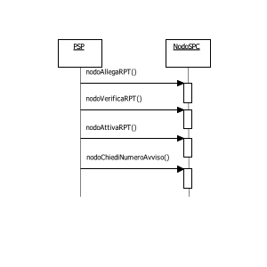

\ **Figura 58 – NodoSPC/PSP: Metodi per la gestione dei pagamenti attivati presso il PSP**

nodoAllegaRPT
~~~~~~~~~~~~~

Con questa primitiva il PSP richiede al Nodo dei Pagamenti-SPC l'inoltro
all'Ente Creditore della richiesta di generazione della RPT per un
pagamento in attesa presso l'ente stesso.

Parametri di input

1. identificativoPSP

2. identificativoIntermediarioPSP

3. identificativoCanale

4. password

5. codiceContestoPagamento

6. codificaInfrastrutturaPSP

7. codiceIdRPT

8. datiPagamentoPSP: parametro a sua volta composto da:

   a. importoSingoloVersamento

   b. ibanAppoggio (opzionale)

   c. bicAppoggio (opzionale)

   d. soggettoVersante (opzionale; raggruppa dati anagrafici)

   e. ibanAddebito (opzionale)

   f. bicAddebito (opzionale)

   g. soggettoPagatore (opzionale; raggruppa dati anagrafici)

Parametri di output

1. Esito: OK oppure KO

2. RPT: file XML codificato in formato base64 binary

***Gestione degli errori ***

in caso di errore: ***faultBean*** emesso ***NodoSPC***.

Di seguito i possibili valori dell'elemento ***faultBean***.faultCode in
funzione di faultBean.id:

1. faultBean.id=<identificativoDominio>:

    *PPT\_ERRORE\_EMESSO\_DA\_PAA* (vedi contenuto dato
    faultBean.description)

1. faultBean.id="NodoDeiPagamentiSPC":

    *PPT\_AUTENTICAZIONE*

    *PPT\_AUTORIZZAZIONE*

    *PPT\_SINTASSI\_XSD*

    *PPT\_SINTASSI\_EXTRAXSD*

    *PPT\_SEMANTICA*

    *PPT\_DOMINIO\_SCONOSCIUTO*

    *PPT\_DOMINIO\_DISABILITATO*

    *PPT\_INTERMEDIARIO\_PA\_SCONOSCIUTO*

    *PPT\_INTERMEDIARIO\_PA\_DISABILITATO*

    *PPT\_STAZIONE\_INT\_PA\_SCONOSCIUTA*

    *PPT\_STAZIONE\_INT\_PA\_DISABILITATA*

    *PPT\_STAZIONE\_INT\_PA\_IRRAGGIUNGIBILE*

    *PPT\_STAZIONE\_INT\_PA\_SERVIZIO\_NONATTIVO*

    *PPT\_INTERMEDIARIO\_PSP\_SCONOSCIUTO*

    *PPT\_INTERMEDIARIO\_PSP\_DISABILITATO*

    *PPT\_CANALE\_SCONOSCIUTO*

    *PPT\_CANALE\_DISABILITATO*

    *PPT\_PSP\_SCONOSCIUTO*

    *PPT\_PSP\_DISABILITATO*

    *PPT\_CODIFICA\_PSP\_SCONOSCIUTA *

+-------------------------------+----+
| .. rubric:: nodoVerificaRPT   |    |
|    :name: nodoverificarpt     |    |
|    :class: Titolo4n           |    |
+-------------------------------+----+

Il PSP, a fronte della richiesta di pagamento ricevuta dall'utilizzatore
finale, genera una richiesta di verifica della RPT per lo specifico IUV;
per tale richiesta, il PSP genera un proprio identificativo univoco di
attività (codiceContestoPagamento, CCP) che lega l'attività di
pagamento, richiesta dal dall'utilizzatore finale, alla RPT che sarà
generata dall'Ente Creditore.

Parametri di input

1. identificativoPSP

2. identificativoIntermediarioPSP (Richiedente)

3. identificativoCanale (Richiedente)

4. password (Richiedente)

5. codiceContestoPagamento

6. codificaInfrastrutturaPSP: è un identificativo che consente al
   NodoSPC di recuperare la regola di transcodifica dei dati contenuti
   in codiceIdRPT. I valori di attualmente previsti sono riportati al capitolo Identificazione RPT in attesa.

7. codiceIdRPT: parametro di tipo polimorfico che contiene i dati in
   formato XML che identificano la RPT. La sua composizione varia in
   funzione del codice grafico utilizzato dal PSP per acquisire dette
   informazioni. I nomi degli XSD da utilizzare, in funzione del tipo di
   codice grafico letto sull'avviso di pagamento, sono riportati nel capitolo Identificazione RPT in attesa.

Parametri di output

1. esito: OK oppure KO

2. datiPagamentoPA: parametro a sua volta composto da:

   a. importoSingoloVersamento

   b. ibanAccredito: è divenuto obbligatorio, contiene l'IBAN sul quale
      accreditare le somme indicate dall'Ente Creditore

   c. bicAccredito (opzionale)

   d. enteBeneficiario (opzionale; raggruppa dati anagrafici)

   e. credenzialiPagatore (opzionale)

   f. causaleVersamento: il formato della causale di versamento deve
          essere conforme a quanto indicato

***Gestione degli errori ***

in caso di errore: ***faultBean*** emesso da ***NodoSPC***.

Di seguito i possibili valori dell'elemento faultBean.faultCode in
funzione di faultBean.id:

1. faultBean.id=<identificativoDominio>:

    *PPT\_ERRORE\_EMESSO\_DA\_PAA* (vedi contenuto dato
    faultBean.description)

1. faultBean.id="NodoDeiPagamentiSPC":

    *PPT\_AUTENTICAZIONE*

    *PPT\_AUTORIZZAZIONE*

    *PPT\_SINTASSI\_XSD*

    *PPT\_SINTASSI\_EXTRAXSD*

    *PPT\_SEMANTICA*

    *PPT\_DOMINIO\_SCONOSCIUTO*

    *PPT\_DOMINIO\_DISABILITATO*

    *PPT\_INTERMEDIARIO\_PA\_SCONOSCIUTO*

    *PPT\_INTERMEDIARIO\_PA\_DISABILITATO*

    *PPT\_STAZIONE\_INT\_PA\_SCONOSCIUTA*

    *PPT\_STAZIONE\_INT\_PA\_DISABILITATA*

    *PPT\_STAZIONE\_INT\_PA\_IRRAGGIUNGIBILE*

    *PPT\_STAZIONE\_INT\_PA\_SERVIZIO\_NONATTIVO*

    *PPT\_INTERMEDIARIO\_PSP\_SCONOSCIUTO*

    *PPT\_INTERMEDIARIO\_PSP\_DISABILITATO*

    *PPT\_CANALE\_SCONOSCIUTO*

    *PPT\_CANALE\_DISABILITATO*

    *PPT\_PSP\_SCONOSCIUTO*

    *PPT\_PSP\_DISABILITATO*

    *PPT\_CODIFICA\_PSP\_SCONOSCIUTA*

+-----------------------------+----+
| .. rubric:: nodoAttivaRPT   |    |
|    :name: nodoattivarpt     |    |
|    :class: Titolo4n         |    |
+-----------------------------+----+

Con questa primitiva il PSP richiede al Nodo dei Pagamenti-SPC l'inoltro
all'Ente Creditore della richiesta di generazione della RPT per un
pagamento in attesa presso l'ente stesso.

In caso di esito positivo della primitiva ***nodoAttivaRPT***, il PSP
rimane in attesa della successiva RPT generata dall'Ente Creditore che
potrà agganciare alla propria attività attraverso il dato
codiceContestoPagamento. Una volta ricevuta la RPT richiesta, il PSP è
tenuto a generare la RT.

In caso di esito negativo della primitiva ***nodoAttivaRPT*** e qualora
il pagamento nei confronti dell'utilizzatore finale sia già stato
eseguito, il PSP è tenuto a reiterare la richiesta di attivazione della
RPT sino a che non riceva un esito positivo all'invocazione della
primitiva stessa.

Parametri di input

1.  identificativoPSP

2.  identificativoIntermediarioPSP

3.  identificativoCanale

4.  password

5.  codiceContestoPagamento

6.  identificativoIntermediarioPSPPagamento

7.  identificativoCanalePagamento

8.  codificaInfrastrutturaPSP: vedi parametro I-6 della primitiva
    ***nodoVerificaRPT***

9.  codiceIdRPT: vedi parametro I-7 della primitiva
    ***nodoVerificaRPT***

10. datiPagamentoPSP: parametro a sua volta composto da:

    a. importoSingoloVersamento

    b. ibanAppoggio (opzionale)

    c. bicAppoggio (opzionale)

    d. soggettoVersante (opzionale; raggruppa dati anagrafici)

    e. ibanAddebito (opzionale)

    f. bicAddebito (opzionale)

    g. soggettoPagatore (opzionale; raggruppa dati anagrafici)

Parametri di output

1. Esito: OK oppure KO

2. datiPagamentoPA: parametro a sua volta composto da

   a. importoSingoloVersamento

   b. ibanAccredito è divenuto obbligatorio, contiene l'IBAN sul quale
      accreditare le somme indicate dall'Ente Creditore

   c. bicAccredito (opzionale)

   d. enteBeneficiario (opzionale; raggruppa dati anagrafici)

   e. credenzialiPagatore (opzionale)

   f. causaleVersamento: il formato della causale di versamento deve
      essere conforme a quanto indicato

***Gestione degli errori ***

in caso di errore: ***faultBean*** emesso ***NodoSPC***.

Di seguito i possibili valori dell'elemento faultBean.faultCode in
funzione di faultBean.id:

1. faultBean.id=<identificativoDominio>:

    *PPT\_ERRORE\_EMESSO\_DA\_PAA* (vedi contenuto dato
    faultBean.description)

1. faultBean.id="NodoDeiPagamentiSPC":

    *PPT\_AUTENTICAZIONE*

    *PPT\_AUTORIZZAZIONE*

    *PPT\_SINTASSI\_XSD*

    *PPT\_SINTASSI\_EXTRAXSD*

    *PPT\_SEMANTICA*

    *PPT\_DOMINIO\_SCONOSCIUTO*

    *PPT\_DOMINIO\_DISABILITATO*

    *PPT\_INTERMEDIARIO\_PA\_SCONOSCIUTO*

    *PPT\_INTERMEDIARIO\_PA\_DISABILITATO*

    *PPT\_STAZIONE\_INT\_PA\_SCONOSCIUTA*

    *PPT\_STAZIONE\_INT\_PA\_DISABILITATA*

    *PPT\_STAZIONE\_INT\_PA\_IRRAGGIUNGIBILE*

    *PPT\_STAZIONE\_INT\_PA\_SERVIZIO\_NONATTIVO*

    *PPT\_INTERMEDIARIO\_PSP\_SCONOSCIUTO*

    *PPT\_INTERMEDIARIO\_PSP\_DISABILITATO*

    *PPT\_CANALE\_SCONOSCIUTO*

    *PPT\_CANALE\_DISABILITATO*

    *PPT\_PSP\_SCONOSCIUTO*

    *PPT\_PSP\_DISABILITATO*

    *PPT\_CODIFICA\_PSP\_SCONOSCIUTA *

nodoChiediNumeroAvviso
~~~~~~~~~~~~~~~~~~~~~~

Con questa primitiva il PSP richiede al Nodo dei Pagamenti-SPC il Numero
Avviso di un pagamento in attesa presso l'Ente Creditore.

Parametri di input

1. identificativoPSP

2. identificativoIntermediarioPSP (Richiedente)

3. identificativoCanale (Richiedente)

4. password (Richiedente)

5. idServizio: è il codice presente nel Catalogo dei Servizi relativo al
   servizio richiesto

6. datiSpecificiServizio: file XML che contiene le informazioni
   specifiche del servizio richiesto.

Parametri di output

1. esito: OK oppure KO

2. identificativoDominio: codice fiscale dell'Ente Creditore che
   gestisce il pagamento

3. numeroAvviso: contiene il Numero Avviso secondo la struttura esposta

4. datiPagamentoPA: parametro a sua volta composto da:

   a. importoSingoloVersamento

   b. ibanAccredito

   c. bicAccredito (opzionale)

   d. enteBeneficiario (opzionale; raggruppa dati anagrafici)

   a. credenzialiPagatore (opzionale)

   b. causaleVersamento: il formato della causale di versamento deve
      essere conforme a quanto indicato

***Gestione degli errori ***

in caso di errore: ***faultBean*** emesso da ***NodoSPC***.

Di seguito i possibili valori dell'elemento ***faultBean***.faultCode in
funzione di faultBean.id:

1. faultBean.id=<identificativoDominio>:

    *PPT\_ERRORE\_EMESSO\_DA\_PAA* (vedi contenuto dato
    faultBean.description)

1. faultBean.id="NodoDeiPagamentiSPC":

    *PPT\_AUTENTICAZIONE*

    *PPT\_AUTORIZZAZIONE*

    *PPT\_SINTASSI\_XSD*

    *PPT\_SINTASSI\_EXTRAXSD*

    *PPT\_SEMANTICA*

    *PPT\_DOMINIO\_SCONOSCIUTO*

    *PPT\_DOMINIO\_DISABILITATO*

    *PPT\_INTERMEDIARIO\_PA\_SCONOSCIUTO*

    *PPT\_INTERMEDIARIO\_PA\_DISABILITATO*

    *PPT\_STAZIONE\_INT\_PA\_SCONOSCIUTA*

    *PPT\_STAZIONE\_INT\_PA\_DISABILITATA*

    *PPT\_STAZIONE\_INT\_PA\_IRRAGGIUNGIBILE*

    *PPT\_STAZIONE\_INT\_PA\_SERVIZIO\_NONATTIVO*

    *PPT\_INTERMEDIARIO\_PSP\_SCONOSCIUTO*

    *PPT\_INTERMEDIARIO\_PSP\_DISABILITATO*

    *PPT\_CANALE\_SCONOSCIUTO*

    *PPT\_CANALE\_DISABILITATO*

    *PPT\_PSP\_SCONOSCIUTO*

    *PPT\_PSP\_DISABILITATO*

    *PPT\_CODIFICA\_PSP\_SCONOSCIUTA*

Revoca delle RT
~~~~~~~~~~~~~~~

Il Nodo dei Pagamenti-SPC permette di gestire i servizi telematici per
le richieste di annullamento di pagamenti già effettuati e per i quali è
già stata restituita la Ricevuta Telematica corrispondente, rendendo, a
questo scopo, disponibile un'interfaccia specifica, ad uso dei PSP, per
richiedere all'Ente Creditore di riferimento la revoca di una RT
specifica.

Per la definizione del processo di Revoca di una RT si faccia
riferimento al Processo di Revoca della Ricevuta Telematica.

Le primitive di richiesta sono da intendersi *end-to-end*, così come le
primitive di risposta. Le primitive di richiesta sono però asincrone
rispetto alle primitive di risposta (vedi Sequence diagram di cui alla
Figura 53 a pagina 186:

a. *nodoInviaRichiestaRevoca*, con la quale il Nodo riceve dal PSP la
   richiesta di revoca di una specifica RT

b. *pspInviaRispostaRevoca*, con la quale il PSP riceve dal Nodo l'esito
   del processo di revoca richiesto con la primitiva precedente.

**Si tenga presente che, come già indicato in precedenza, i metodi di
gestione della Revoca della RT sopra indicati sono definiti, ma *non
implementati* nelle strutture software del NodoSPC.**

nodoInviaRichiestaRevoca
~~~~~~~~~~~~~~~~~~~~~~~~

Con questa primitiva il Nodo dei Pagamenti-SPC riceve dal PSP la
richiesta di revoca di una specifica RT.

Parametri di input

1. identificativoPSP

2. identificativoIntermediarioPSP

3. identificativoCanale

4. password

5. RR: file XML in formato base64 binary contenente la Richiesta di
   Revoca

Parametri di output

1. esito : OK oppure KO

pspInviaRispostaRevoca
~~~~~~~~~~~~~~~~~~~~~~

Con questa primitiva il PSP riceve dal Nodo dei Pagamenti-SPC l'esito
del processo di revoca richiesto con la primitiva precedente
***nodoInviaRichiestaRevoca***.

Parametri di input

1. identificativo Dominio

2. identificativoUnivocoVersamento

3. codiceContestoPagamento

4. ER: file XML in formato base64 binary contenente l'Esito della
   richiesta di Revoca

Parametri di output

esito : OK oppure KO

Storno del pagamento
~~~~~~~~~~~~~~~~~~~~

Il Nodo dei Pagamenti-SPC permette di gestire i servizi telematici per
le richieste di storno di pagamenti già effettuati e per i quali
potrebbe essere già stata restituita la Ricevuta Telematica
corrispondente.

Il PSP potrà quindi verificare lo stato del pagamento nei suoi archivi
ed in quelli dei servizi collegati, decidendo se accettare la richiesta
di storno o rifiutarla. In entrambi i casi il Nodo dei Pagamenti-SPC
provvederà a inoltrare e registrare lo scambio che interviene tra le
parti.

Per la definizione del processo di storno si faccia riferimento al Processo di Revoca della Ricevuta Telematica(vedi anche Sequence diagram di cui alla Figura 31).

Le primitive di richiesta che devono utilizzare i PSP sono da intendersi
*end-to-end*, così come le primitive di risposta. Le primitive di
risposta sono però asincrone rispetto alle primitive di richiesta.

Le primitive di competenza dei PSP sono riportate nello schema di Figura
59.

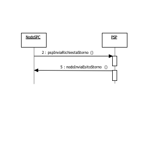

\ **Figura 59 – NodoSPC/PSP: Metodi per la gestione dello storno di un pagamento**

a. *pspInviaRichiestaStorno*, con la quale il PSP riceve dal NodoSPC la
   richiesta di storno di uno specifico pagamento;

b. *nodoInviaEsitoStorno*, con la quale il NodoSPC riceve dal PSP
   l'esito dello storno del pagamento richiesto con la primitiva
   precedente.

Il NodoSPC effettua unicamente un controllo di correttezza sintattica
del documento XML scambiato; nel caso di ***nodoInviaRichiestaStorno***,
si verifica che la RPT, oggetto della richiesta di storno, sia stata
accettata dal NodoSPC e dal PSP, altrimenti viene restituito un errore
specifico.

pspInviaRichiestaStorno
~~~~~~~~~~~~~~~~~~~~~~~

Con questa primitiva il PSP riceve dal Nodo dei Pagamenti-SPC la
richiesta di storno di uno specifico pagamento.

La primitiva è utilizzata per inoltrare al PSP la richiesta di storno
dell'Ente Creditore.

La Richiesta di Revoca (RR) è accettata dal oppure respinta con un
fault, che il Nodo provvederà ad inoltrare all'Ente Creditore in
modalità sincrona.

Parametri di input

1. identificativoDominio

2. identificativoUnivocoVersamento

3. codiceContestoPagamento

4. RR: file XML in formato base64 binary contenente la Richiesta di
   Revoca che trasporta la richiesta di storno

Parametri di output

1. esito : OK oppure KO

***Gestione degli errori ***

se il parametro esito è diverso da OK: ***faultBean*** emesso da
***PSP*** (dove faultBean.id è uguale a <identificativoPSP>).

Di seguito i possibili valori del dato faultBean.faultCode:

    *CANALE\_RT\_SCONOSCIUTA*

    *CANALE\_SINTASSI\_XSD*

    *CANALE\_SINTASSI\_EXTRAXSD*

    *CANALE\_SEMANTICA* (vedi precisazioni dato faultBean.description)

nodoInviaEsitoStorno
~~~~~~~~~~~~~~~~~~~~

Con questa primitiva il NodoSPC riceve dal PSP l'esito dello storno del
pagamento richiesto con la primitiva precedente.

La primitiva è utilizzata per l'invio dell'esito dello storno (ER) che
il NodoSPC inoltra in modo sincrono all'Ente Creditore.

Parametri di input

1. identificativoPSP

2. identificativoIntermediarioPSP

3. identificativoCanale

4. password

5. identificativoDominio

6. identificativoUnivocoVersamento

7. codiceContestoPagamento

8. ER: file XML in formato base64 binary contenente l'Esito della
   richiesta di Revoca che veicola l'esito dello storno

Parametri di output

1. esito : OK oppure KO.

***Gestione degli errori ***

in caso di errore: ***faultBean*** emesso dal ***NodoSPC***.

Di seguito i possibili valori dell'elemento faultBean.faultCode in
funzione di faultBean.id:

1. faultBean.id=< identificativoDominio >:

    *PPT\_ERRORE\_EMESSO\_DA\_PAA* (vedi contenuto dato
    faultBean.description)

1. faultBean.id="NodoDeiPagamentiSPC":

    *PPT\_AUTENTICAZIONE*

    *PPT\_AUTORIZZAZIONE*

    *PPT\_SINTASSI\_XSD*

    *PPT\_SINTASSI\_EXTRAXSD*

    *PPT\_SEMANTICA*

    *PPT\_INTERMEDIARIO\_PSP\_SCONOSCIUTO*

    *PPT\_INTERMEDIARIO\_PSP\_DISABILITATO*

    *PPT\_CANALE\_SCONOSCIUTO*

    *PPT\_CANALE\_DISABILITATO*

    *PPT\_PSP\_SCONOSCIUTO*

    *PPT\_PSP\_DISABILITATO*

    *PPT\_DOMINIO\_SCONOSCIUTO*

    *PPT\_DOMINIO\_DISABILITATO*

Invio flusso di rendicontazione
~~~~~~~~~~~~~~~~~~~~~~~~~~~~~~~

Per favorire la massima efficienza ed efficacia della piattaforma dei
pagamenti, si è previsto di affiancare alle interfacce di gestione delle
Richieste di Pagamento Telematico e delle Ricevute Telematiche, altre
interfacce per il trasporto dei flussi di rendicontazione relativi ai
pagamenti trattati dal Nodo dei Pagamenti-SPC.

La gestione dei flussi di rendicontazione fa parte del processo di
riconciliazione dei pagamenti eseguiti esposto al paragrafo 8.2.5 e
rappresentato nel diagramma di Figura 32 a pagina 131.

La primitiva che deve utilizzare il PSP è da intendersi *end-to-end* ed
è riportata nello schema di Figura 60.

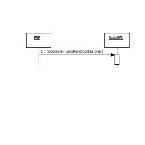

\ **Figura 60 – NodoSPC/PSP: Metodi per l'invio del flusso di rendicontazione**

a. *nodoInviaFlussoRendicontazione*, con la quale il Nodo dei
   Pagamenti-SPC riceve dal PSP uno specifico flusso di rendicontazione.

nodoInviaFlussoRendicontazione
~~~~~~~~~~~~~~~~~~~~~~~~~~~~~~

Con questa primitiva il Nodo dei Pagamenti-SPC riceve dal PSP uno
specifico flusso di rendicontazione.

Parametri di input

1. identificativoPSP

2. identificativoIntermediarioPSP

3. identificativoCanale

4. password

5. identificativoDominio

6. identificativoFlusso

7. dataOraFlusso (di generazione, non di spedizione)

8. xmlRendicontazione: file XML contenente il flusso di rendicontazione
   in formato base64 binary

Parametri di output

1. esito: OK oppure KO

***Gestione degli errori ***

se il parametro esito è diverso da OK: ***faultBean*** emesso da
***NodoSPC*** (dove faultBean.id è uguale a "NodoDeiPagamentiSPC").

Di seguito i possibili valori del dato faultBean.faultCode:

    *PPT\_AUTENTICAZIONE*

    *PPT\_AUTORIZZAZIONE*

    *PPT\_SINTASSI\_XSD*

    *PPT\_SINTASSI\_EXTRAXSD*

    *PPT\_SEMANTICA*

    *PPT\_INTERMEDIARIO\_PSP\_SCONOSCIUTO*

    *PPT\_INTERMEDIARIO\_PSP\_DISABILITATO*

    *PPT\_CANALE\_SCONOSCIUTO*

    *PPT\_CANALE\_DISABILITATO*

    *PPT\_PSP\_SCONOSCIUTO*

    *PPT\_PSP\_DISABILITATO*

    *PPT\_DOMINIO\_SCONOSCIUTO*

    *PPT\_DOMINIO\_DISABILITATO*

Avvisatura digitale *push* (su iniziativa dell'Ente Creditore)
~~~~~~~~~~~~~~~~~~~~~~~~~~~~~~~~~~~~~~~~~~~~~~~~~~~~~~~~~~~~~~

La funzione di avvisatura digitale in modalità *push* è un servizio
messo a disposizione dal Nodo dei Pagamenti-SPC che consente di inviare
agli apparati elettronici degli utilizzatori finali avvisi di cortesia
in formato elettronico. in modo che il correlato pagamento possa essere
effettuato in modalità semplice e sicura su pagoPA\ :sup:`®`.

Per il *workflow* dell'intero processo di avvisatura su iniziativa
dell'Ente Creditore si rimanda al paragrafo 8.3.7.

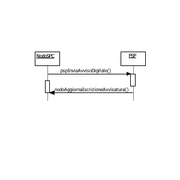

\ **Figura 61 – NodoSPC/PSP: Metodi di interfaccia della componente avvisatura push**

Per la gestione dei meccanismi di avvisatura, il Nodo dei Pagamenti-SPC
e i Prestatori di servizi di pagamento rendono disponibili i metodi SOAP
riportati in Figura 61:

a. *pspInviaAvvisoDigitale*, metodo esposto dal PSP con il quale il Nodo
   dei Pagamenti-SPC invia l'avviso di pagamento digitale
   all'utilizzatore finale usufruendo del canale messo a disposizione
   dal PSP;

b. *nodoAggiornaIscrizioneAvvisatura*, metodo esposto dal NodoSPC che
   consente ai canali "mobile" di segnalare gli utilizzatori finali che
   hanno sottoscritto il servizio di avvisatura presso il PSP e
   intendono ricevere gli avvisi di pagamento digitali.

Tutti i metodi utilizzano la modalità sincrona del paradigma SOAP e
utilizzano il protocollo *https* per il trasporto.

pspInviaAvvisoDigitale
~~~~~~~~~~~~~~~~~~~~~~

La primitiva ***pspInviaAvvisoDigitale*** fa parte del servizio (web
service) esposto dal PSP che eroga il servizio di avvisatura sui propri
sistemi mobile con i quali raggiunge i cittadini suoi clienti che hanno
richiesto al PSP stesso di ricevere gli avvisi di pagamento mediante
questo canale.

La primitiva è di tipo sincrono e prevede che il NodoSPC invii la
richiesta compilata con le informazioni dell'avviso di pagamento a cui
il PSP risponde valorizzando l'esito.

Parametri di input

1. IdentificativoPSP

2. identificativoIntermediarioPSP

3. identificativoCanale

4. avvisoDigitale: contiene le informazioni indicate nel Documento Formato Messaggi XML PagoPA

Parametri di output

1. esitoOperazione: OK oppure KO

***Gestione degli errori ***

Se il parametro **esitoOperazione** non è OK, sarà presente un
***faultBean*** nel formato specificato nel paragrafo la Struttura faultBean.

Il ***faultBean*** è emesso dal ***PSP*** (faultBean.id =<
identificativoPSP >).

Di seguito i possibili valori del dato faultBean.faultCode:

    *CANALE\_AVVISO\_DUPLICATO* (valutare se esito positivo con warning)

    *CANALE\_SINTASSI\_XSD*

    *CANALE\_SINTASSI\_EXTRAXSD*

    *CANALE\_SEMANTICA* (vedi precisazioni dato faultBean.description)

nodoAggiornaIscrizioniAvvisatura
~~~~~~~~~~~~~~~~~~~~~~~~~~~~~~~~

La primitiva è di tipo sincrono e prevede che il PSP invii le iscrizioni
e le cancellazioni relative al servizio di avvisatura a cui risponde il
NodoSPC valorizzando l'esito.

Parametri di input

1. identificativoPSP

2. identificativoIntermediarioPSP

3. identificativoCanale

4. password

5. datiNotifica : vedi Formato Messaggi XML PagoPA

Parametri di output

1. Esito: OK oppure KO

***Gestione degli errori ***

in caso di errore: ***faultBean*** emesso ***NodoSPC***.

Di seguito i possibili valori dell'elemento faultBean.faultCode in
funzione di faultBean.id:

1. faultBean.id="NodoDeiPagamentiSPC":

    *PPT\_AUTENTICAZIONE*

    *PPT\_AUTORIZZAZIONE*

    *PPT\_SINTASSI\_XSD*

    *PPT\_SINTASSI\_EXTRAXSD*

    *PPT\_SEMANTICA*

    *PPT\_DOMINIO\_SCONOSCIUTO*

    *PPT\_DOMINIO\_DISABILITATO*

    *PPT\_ISCRIZIONE\_NON\_PRESENTE*

    *PPT\_INTERMEDIARIO\_PSP\_SCONOSCIUTO*

    *PPT\_INTERMEDIARIO\_PSP\_DISABILITATO*

    *PPT\_CANALE\_SCONOSCIUTO*

    *PPT\_CANALE\_DISABILITATO*

    *PPT\_PSP\_SCONOSCIUTO*

    *PPT\_PSP\_DISABILITATO*

    *PPT\_ULTERIORE\_ISCRIZIONE* (nella description del faultBean è
    indicato in chiaro il PSP presso il quale è stata effettuata la
    iscrizione precedente)

Avvisatura digitale *pull* (verifica della posizione debitoria)
~~~~~~~~~~~~~~~~~~~~~~~~~~~~~~~~~~~~~~~~~~~~~~~~~~~~~~~~~~~~~~~

Il sistema mette a disposizione apposite funzioni affinché la "posizione
debitoria" di un soggetto pagatore presso un singolo Ente Creditore
possa essere interrogata dall'utilizzatore finale attraverso le funzioni
messe a disposizione dai PSP aderenti all'iniziativa .

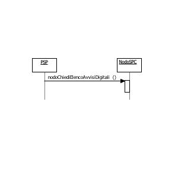

**Figura 62 – NodoSPC/PSP: Metodi di interfaccia della componente avvisatura pull**

Per la gestione dei meccanismi di avvisatura, il Nodo dei Pagamenti-SPC
e i Prestatori di servizi di pagamento rendono disponibili i metodi SOAP
riportati in Figura 61:

a. *nodoChiediElencoAvvisiDigitali*, metodo utilizzato dal PSP per
   richiedere ad un Ente Creditore l'elenco degli avvisi di uno
   specifico cittadino;

Il metodo utilizza la modalità sincrona del paradigma SOAP e il
protocollo *https* per il trasporto.

**Per l'utilizzo di questo web service si tenga conto delle limitazioni
definite

nodoChiediElencoAvvisiDigitali
~~~~~~~~~~~~~~~~~~~~~~~~~~~~~~~

La primitiva ***nodoChiediElencoAvvisiDigitali*** fa parte del servizio
(web service) esposto dal NodoSPC che consente ad un PSP di richiedere
ad un Ente l'elenco degli avvisi di uno specifico cittadino.

Parametri di input

1. IdentificativoPSP

2. identificativoIntermediarioPSP

3. identificativoCanale

4. codiceFiscaleUtente

5. codiceFiscalePA

6. codiceServizio (opzionale): contiene il codice (5 cifre numeriche)
   del servizio classificato all'interno del NodoSPC che si vuole
   selezionare (ad esempio: 00001 'Bollo Auto')

7. periodoRiferimento (opzionale): periodo temporale rispetto al quale
   si vuole restringere la ricerca, è formato da:

   a. annoDA: anno di competenza del debito nel formato YYYY

a. annoA: anno di competenza del debito nel formato YYYY

Parametri di output

1. esitoOperazione: OK oppure KO

2. elencoAvvisiDigitali: contiene le informazioni indicate nel Documento di Formato Messaggi XML di PagoPA

***Gestione degli errori ***

Se il parametro **esitoOperazione** non è OK, sarà presente un
***faultBean*** nel formato specificato nel paragrafo Interfacce Web Service e dettaglio Azioni SOAP.

Di seguito i possibili valori dell'elemento
***faultBean***.faultCode in funzione di faultBean.id:

1. faultBean.id=<identificativoPSP>:

    *PPT\_ERRORE\_EMESSO\_DA\_PAA* (vedi contenuto dato
    faultBean.description).

1. faultBean.id="NodoDeiPagamentiSPC":

    *PPT\_AUTENTICAZIONE*

    *PPT\_AUTORIZZAZIONE*

    *PPT\_SINTASSI\_XSD*

    *PPT\_SINTASSI\_EXTRAXSD*

    *PPT\_SEMANTICA*

    *PPT\_DOMINIO\_SCONOSCIUTO*

    *PPT\_DOMINIO\_DISABILITATO*

    *PPT\_INTERMEDIARIO\_PA\_SCONOSCIUTO*

    *PPT\_INTERMEDIARIO\_PA\_DISABILITATO*

    *PPT\_STAZIONE\_INT\_PA\_SCONOSCIUTA*

    *PPT\_STAZIONE\_INT\_PA\_DISABILITATA*

    *PPT\_STAZIONE\_INT\_PA\_IRRAGGIUNGIBILE*

    *PPT\_STAZIONE\_INT\_PA\_SERVIZIO\_NONATTIVO*

    *PPT\_INTERMEDIARIO\_PSP\_SCONOSCIUTO*

    *PPT\_INTERMEDIARIO\_PSP\_DISABILITATO*

    *PPT\_CANALE\_SCONOSCIUTO*

    *PPT\_CANALE\_DISABILITATO*

    *PPT\_PSP\_SCONOSCIUTO*

    *PPT\_PSP\_DISABILITATO*

    *PPT\_CODIFICA\_PSP\_SCONOSCIUTA*

Notifica di chiusura delle operazioni pendenti
~~~~~~~~~~~~~~~~~~~~~~~~~~~~~~~~~~~~~~~~~~~~~~

Per la "notifica di chiusura" delle operazioni pendenti, intese come
operazioni associate ad RPT inviate positivamente a cui non corrisponde
la ricezione di una RT, il Nodo dei Pagamenti-SPC provvede a generare
automaticamente, trascorso il periodo di ritenzione previsto, una RT di
chiusura dell'operazione verso l'Ente Creditore ed a notificare l'evento
al PSP.

Il processo di chiusura delle operazioni pendenti è descritto nel Processo di notifica chiusura delle operazioni pendenti; il NodoSPC rende disponibili i metodi SOAP necessari alla
gestione del processo.

Le primitive di competenza dei PSP sono riportate nello schema di Figura
63.

a. *pspNotificaCancellazioneRPT*, con la quale il Nodo dei Pagamenti-SPC
   comunica al PSP l'avvenuta cancellazione della RPT originaria, a
   seguito della scadenza del periodo di tempo entro cui la RPT avrebbe
   dovuto ricevere dal PSP la corrispondente RT;

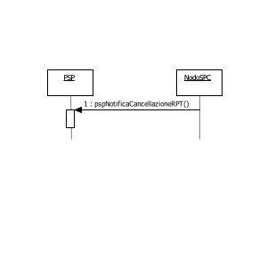

\ **Figura 63 – NodoSPC/PSP: Metodi di gestione notifica chiusura operazioni pendenti**

pspNotificaCancellazioneRPT
~~~~~~~~~~~~~~~~~~~~~~~~~~~

Con questa primitiva il Nodo dei Pagamenti-SPC comunica al PSP
l'avvenuta cancellazione della RPT originaria, a seguito della scadenza
del periodo di tempo entro cui la RPT avrebbe dovuto ricevere dal PSP la
corrispondente RT.

Parametri di input

1. identificativoDominio

2. identificativoUnivocoVersamento

3. codiceContestoPagamento

Parametri di output

1. Esito : OK oppure KO.

***Gestione degli errori ***

oppure, in caso di errore: ***faultBean*** emesso da ***PSP***
(faultBean.id =< identificativoPSP >).

Qualsiasi faultBean.faultCode presente nella Tabella 52 - Valori da
utilizzare nella struttura faultBean è accettato (e comunque ignorato
dal NodoSPC).

La *response* ha valore come conferma (ACK) di ricezione della notifica
di cancellazione della RPT.

Interrogazione delle basi dati del NodoSPC
~~~~~~~~~~~~~~~~~~~~~~~~~~~~~~~~~~~~~~~~~~

In questo paragrafo sono specificati i metodi che il nodo dei Pagamenti
SPC mette a disposizione per l'interrogazione delle basi dati gestite
dal sistema e di interesse dei PSP.

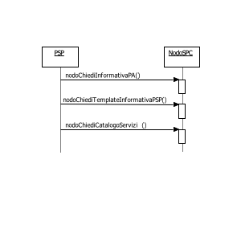

\ **Figura 64 – NodoSPC/PSP: Metodi di Interrogazione delle basi dati del NodoSPC**

I metodi realizzati per l'interrogazione delle basi dati del NodoSPC e
di interesse dei PSP sono rappresentati in Figura 64 e prevede le
seguenti primitive:

a. *nodoChiediInformativaPA*, che permette di reperire le informazioni
   legate all'erogazione dei servizi, nonché l'elenco dei codici IBAN di
   accredito degli Enti Creditori;

b. *nodoChiediTemplateInformativaPSP*, con la quale il PSP può scaricare
   dagli archivi del NodoSPC (Esercizio o Collaudo) l'ultima versione
   del *"Catalogo Dati Informativi"* di propria competenza

c. *nodoChiediCatalogoServizi*, con la quale il PSP può scaricare dagli
   archivi del NodoSPC l'ultima versione del *"Catalogo Servizi"* degli
   Enti Creditori e da utilizzare nell'ambito del pagamento spontaneo
   presso i PSP;

nodoChiediInformativaPA
~~~~~~~~~~~~~~~~~~~~~~~

Con questa primitiva il PSP richiede al NodoSPC le informazioni legate
all'erogazione dei servizi, nonché l'elenco dei codici IBAN di accredito
degli Enti Creditori.

Parametri di input

1. identificativoPSP (opzionale)

2. identificativoIntermediarioPSP

3. identificativoCanale

4. password

5. identificativoDominio (opzionale)

Parametri di output

1. xmlInformativa: file XML in formato base64 binary contenente la
   tabella delle controparti, descrittiva degli Enti Creditori

***Gestione degli errori ***

in caso di errore: ***faultBean*** emesso da ***NodoSPC*** (faultBean.id
"NodoDeiPagamentiSPC").

Di seguito i possibili valori dell'elemento faultBean.faultCode:

    *PPT\_AUTENTICAZIONE*

    *PPT\_AUTORIZZAZIONE*

    *PPT\_INTERMEDIARIO\_PSP\_SCONOSCIUTO*

    *PPT\_INTERMEDIARIO\_PSP\_DISABILITATO*

    *PPT\_CANALE\_SCONOSCIUTO*

    *PPT\_CANALE\_DISABILITATO*

    *PPT\_PSP\_SCONOSCIUTO*

    *PPT\_PSP\_DISABILITATO*

    *PPT\_DOMINIO\_SCONOSCIUTO*

    *PPT\_DOMINIO\_DISABILITATO*

nodoChiediTemplateInformativaPSP
~~~~~~~~~~~~~~~~~~~~~~~~~~~~~~~~

Con questa primitiva il PSP può scaricare dagli archivi del NodoSPC
(Esercizio o Collaudo) l'ultima versione del *"Catalogo Dati
Informativi"* di propria competenza.

Il *template* è costituito da un documento XML, compilato in tutte le
parti relative alla configurazione del PSP stesso, tranne che nelle
parti che descrivono le condizioni economiche e le priorità di scelta in
caso di mancata indicazione del canale.

Qualora non sia presente una versione corrente del "*Catalogo Dati Informativi*" per l'ambiente indicato, il NodoSPC restituirà un *template* vuoto.

Parametri di input

1. identificativoPSP

2. identificativoIntermediarioPSP

3. identificativoCanale

4. password

Parametri di output

1. xmlTemplateInformativa: file XML in formato base64 binary contenente
   il *"Catalogo Dati Informativi"* del PSP attualmente memorizzato sul
   NodoSPC. Il PSP deve utilizzare questo file compilando i *tag* di
   propria competenza ed inviarlo al Nodo SPC secondo le modalità
   indicate dall'Agenzia per l'Italia Digitale. L'XSD corrispondente è
   descritta nel documento Formato Messaggi XML PagoPa).

***Gestione degli errori ***

in caso di errore: ***faultBean*** emesso da ***NodoSPC*** (faultBean.id
"NodoDeiPagamentiSPC")

Di seguito i possibili valori dell'elemento faultBean.faultCode:

    *PPT\_AUTENTICAZIONE*

    *PPT\_AUTORIZZAZIONE*

    *PPT\_INTERMEDIARIO\_PSP\_SCONOSCIUTO*

    *PPT\_INTERMEDIARIO\_PSP\_DISABILITATO*

    *PPT\_CANALE\_SCONOSCIUTO*

    *PPT\_CANALE\_DISABILITATO*

    *PPT\_PSP\_SCONOSCIUTO*

    *PPT\_PSP\_DISABILITATO*

nodoChiediCatalogoServizi
~~~~~~~~~~~~~~~~~~~~~~~~~

Con questa primitiva il PSP richiede al NodoSPC il Catalogo dei Servizi
degli Enti Creditori utilizzato nell'ambito del pagamento spontaneo
presso i PSP.

Parametri di input

1. identificativoPSP (opzionale)

2. identificativoIntermediarioPSP

3. identificativoCanale

4. password

5. identificativoDominio (opzionale)

Parametri di output

1. xmlCatalogoServizi: file XML in formato base64 binary contenente il
   Catalogo dei Servizi degli Enti Creditori (vedi Documento Formato Messaggi XML PagoPA e Tabella
   16, Tabella 17)

***Gestione degli errori ***

in caso di errore: ***faultBean*** emesso da ***NodoSPC*** (faultBean.id
"NodoDeiPagamentiSPC").

Di seguito i possibili valori dell'elemento ***faultBean***.faultCode:

    *PPT\_AUTENTICAZIONE*

    *PPT\_AUTORIZZAZIONE*

    *PPT\_INTERMEDIARIO\_PSP\_SCONOSCIUTO*

    *PPT\_INTERMEDIARIO\_PSP\_DISABILITATO*

    *PPT\_CANALE\_SCONOSCIUTO*

    *PPT\_CANALE\_DISABILITATO*

    *PPT\_PSP\_SCONOSCIUTO*

    *PPT\_PSP\_DISABILITATO*

    *PPT\_DOMINIO\_SCONOSCIUTO*

    *PPT\_DOMINIO\_DISABILITATO*

+--------------------------------------------+----+
| .. rubric:: Ricezione Totali di Traffico   |    |
|    :name: ricezione-totali-di-traffico     |    |
+--------------------------------------------+----+

Per la gestione dei meccanismi di invio dei flussi relativi ai "Totali
di Traffico" il Nodo dei Pagamenti-SPC rende disponibili
i metodi SOAP descritti nel seguito e rappresentati nel diagramma di
Figura 65.

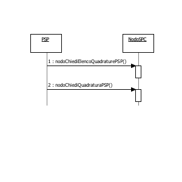

\ **Figura 65 – NodoSPC/PSP: Metodi di invio dei "Totali di Traffico"**

Il flusso contenente le informazioni in questione è costituito da un
file XML, il cui tracciato è indicato al Documento Formato Messaggi XML PagoPA, ed è
individuato dalla coppia di informazioni idDominio e idFlusso.

L'invio del flusso contenenti i "Totali di Traffico" avviene in modalità
*pull*: è cioè compito del PSP richiedere al Nodo dei Pagamenti-SPC il
file contenente le informazioni di interesse.

a. *nodoChiediElencoQuadraturePSP*, con la quale il PSP richiede al
   NodoSPC l'elenco dei flussi contenenti i "Totali di Traffico" di sua
   competenza memorizzati presso la piattaforma. Si noti che il sistema
   fornisce l'elenco completo dei flussi del PSP presenti sul NodoSPC al
   momento della richiesta;

b. *nodoChiediQuadraturaPSP*, con la quale il PSP richiede al NodoSPC
   uno specifico flusso contenente i "Totali di Traffico" selezionato in
   base ai parametri idDominio e idFlusso.

Il Nodo dei Pagamenti-SPC non tiene traccia dei singoli flussi
contenenti i "Totali di Traffico" richiesti dal PSP con la primitiva
***nodoChiediElencoQuadraturePSP***, pertanto è compito di ogni PSP
tenere conto dei singoli flussi già richiesti al NodoSPC.

Nei successivi paragrafi sono indicati i metodi per la gestione dei
meccanismi di invio dei flussi relativi ai "Totali di Traffico".

nodoChiediElencoQuadraturePSP
~~~~~~~~~~~~~~~~~~~~~~~~~~~~~

Con questa primitiva il PSP richiede al NodoSPC l'elenco dei flussi
contenenti i "Totali di Traffico" di sua competenza memorizzati presso
la piattaforma.

Parametri input

1. identificativoIntermediarioPSP

2. identificativoCanale

3. password

4. identificativoPSP

5. identificativo Dominio (opzionale)

Parametri output

1. listaQuadrature: costituita da:

   a. totRestituiti

   b. idQuadratura: array di:

      1. identificativoFlusso

      2. dataOraFlusso

oppure, in caso di errore: ***faultBean*** emesso dal ***NodoSPC***
(dove faultBean.id è uguale a "NodoDeiPagamentiSPC").

Di seguito i possibili valori dell'elemento faultBean.faultCode:

    *PPT\_AUTENTICAZIONE*

    *PPT\_AUTORIZZAZIONE*

    *PPT\_INTERMEDIARIO\_PSP\_SCONOSCIUTO*

    *PPT\_INTERMEDIARIO\_PSP\_DISABILITATO*

    *PPT\_CANALE\_SCONOSCIUTO*

    *PPT\_CANALE\_DISABILITATO*

    *PPT\_PSP\_SCONOSCIUTO*

    *PPT\_PSP\_DISABILITATO*

    *PPT\_DOMINIO\_SCONOSCIUTO*

    *PPT\_DOMINIO\_DISABILITATO*

nodoChiediQuadraturaPSP
~~~~~~~~~~~~~~~~~~~~~~~

Con questa primitiva il PSP richiede al NodoSPC uno specifico flusso
contenente i "Totali di Traffico" selezionato in base ai parametri
idDominio e idFlusso.

Parametri input

1. identificativoIntermediarioPSP

2. identificativoCanale

3. password

4. identificativoPSP

5. identificativoFlusso

Parametri output

1. XMLQuadratura: file XML in formato base64 binary, contenente i
   "Totali di Traffico" richiesti dal PSP

oppure, in caso di errore: ***faultBean*** emesso dal ***NodoSPC***
(dove faultBean.id è uguale a "NodoDeiPagamentiSPC").

Di seguito i possibili valori dell'elemento faultBean.faultCode:

    *PPT\_AUTENTICAZIONE*

    *PPT\_AUTORIZZAZIONE*

    *PPT\_INTERMEDIARIO\_PSP\_SCONOSCIUTO*

    *PPT\_INTERMEDIARIO\_PSP\_DISABILITATO*

    *PPT\_CANALE\_SCONOSCIUTO*

    *PPT\_CANALE\_DISABILITATO*

    *PPT\_PSP\_SCONOSCIUTO*

    *PPT\_PSP\_DISABILITATO*

    *PPT\_ID\_FLUSSO\_SCONOSCIUTO*

Interfacce HTTP di re-direzione per il pagamento immediato
-----------------------------------------------------------

Nel presente paragrafo saranno date indicazioni circa i parametri da
utilizzare nella gestione della re-direzione del browser
dell'utilizzatore finale nell'ambito del modello di pagamento con
esecuzione immediata.

Tali indicazioni sono valide anche per la gestione del cosiddetto
"carrello multibeneficiario".

Si tenga presente che il dato parametriPagamentoImmediato (più avanti
specificato come obbligatorio) ed eventualmente in combinazione con il
dato idCarrello (più avanti specificato come opzionale), deve consentire
di identificare univocamente il singolo pagamento o l'insieme di
pagamenti (carrello di RPT - pagamento multi-beneficiario) inviati al
PSP nella sessione di pagamento in oggetto, in modo globale nell'ambito
del Sistema.

Re-direzione dal Web-FESP verso il Portale PSP
~~~~~~~~~~~~~~~~~~~~~~~~~~~~~~~~~~~~~~~~~~~~~~

Il Portale del PSP viene richiamato dalla componente Web-FESP del
NodoSPC con una URL composto nel modo sotto indicato ed i cui parametri
sono specificati nella Tabella 41.

    <urlPortalePSP>?

    [idDominio=<identificativoDominio>&]

    <parametriProfiloPagamento>&

    <parametriPagamentoImmediato>

    [&idCarrello=<identificativoCarrello>]

    [&lang=xyz]

\ **Tabella 41 - Parametri di re-direzione verso il portale del PSP**

+---------------------------------+------------------------------------------------------------------------------------------------------------------------------------------------------------------------------------------------------------------------------------------------------------------+
| **Parametri**                   |     **Descrizione**                                                                                                                                                                                                                                              |
+=================================+==================================================================================================================================================================================================================================================================+
| **urlPortalePSP**               | URL del Portale del Prestatore di servizi di pagamento.                                                                                                                                                                                                          |
+---------------------------------+------------------------------------------------------------------------------------------------------------------------------------------------------------------------------------------------------------------------------------------------------------------+
| **idDominio**                   | identificativoDominio dell'Ente Creditore che ha eseguito la richiesta di pagamento mediante la RPT. Coincide necessariamente con quello contenuto nella RPT stessa.                                                                                             |
| (opzionale)                     | *Il parametro è obbligatorio nel caso di utilizzo della primitiva ***nodoInviaRPT***, mentre non è presente nel caso di utilizzo della primitiva ***nodoInviaCarrelloRPT***.*                                                                                    |
+---------------------------------+------------------------------------------------------------------------------------------------------------------------------------------------------------------------------------------------------------------------------------------------------------------+
| **parametriProfiloPagamento**   | *Query string* fornita al PSP dal Nodo dei Pagamenti-SPC mediante la *Request* della primitiva invocata in precedenza:                                                                                                                                           |
|                                 | -  parametro **I-2-c** per ***pspInviaRPT***                                                                                                                                                                                                                     |
|                                 | -  parametro **I-1** per ***pspInviaCarrelloRPT***                                                                                                                                                                                                               |
+---------------------------------+------------------------------------------------------------------------------------------------------------------------------------------------------------------------------------------------------------------------------------------------------------------+
| **idCarrello**                  | parametro opzionale, presente nel caso sia restituito dal PSP nella *Response* della primitiva invocata in precedenza:                                                                                                                                           |
| (opzionale)                     | -  parametro **O-2** per **pspInviaRPT**                                                                                                                                                                                                                         |
|                                 | -  parametro **O-2** per **pspInviaCarrelloRPT**                                                                                                                                                                                                                 |
+---------------------------------+------------------------------------------------------------------------------------------------------------------------------------------------------------------------------------------------------------------------------------------------------------------+
| **lang** (opzionale)            | Specifica del linguaggio scelto dall'utilizzatore finale, qualora fornita dal Portale dell'Ente Creditore nella re-direzione verso il Web-FESP (si veda il paragrafo 8.4.1). Il codice abbreviato identifica il linguaggio secondo lo standard ISO 693-3.        |
+---------------------------------+------------------------------------------------------------------------------------------------------------------------------------------------------------------------------------------------------------------------------------------------------------------+

Re-direzione dal Portale PSP verso il Web-FESP
~~~~~~~~~~~~~~~~~~~~~~~~~~~~~~~~~~~~~~~~~~~~~~

Lo URL restituito dal Portale PSP al browser dell'utilizzatore finale,
per reindirizzarlo verso il Web-FESP, ha la composizione sotto indicata,
dove i parametri (tra parentesi quelli opzionali) sono specificati nella
Tabella 42.

    <urlWeb-FESP>?

    [idDominio=<identificativoDominio>&]

    <parametriPagamentoImmediato>

    [&idCarrello=<identificativoCarrello>]

    &<codiceRitornoPSP>

\ **Tabella 42 - Parametri di re-direzione dal Portale PSP verso il Web-FESP**
+-----------------------------------+----------------------------------------------------------------------------------------------------------------------------------------------------------------------------------------+
| **Parametri**                     | **Descrizione**                                                                                                                                                                        |                                                                                                                                                                                                                                |
+===================================+========================================================================================================================================================================================+
| **urlWeb-FESP**                   | URL della componente Web-Fesp del NodoSPC.                                                                                                                                             |
+-----------------------------------+----------------------------------------------------------------------------------------------------------------------------------------------------------------------------------------+
| **idDominio**                     | identificativoDominio dell'Ente Creditore che ha eseguito la richiesta di pagamento mediante la RPT.                                                                                   |
| (opzionale)                       | Nel caso di singola RPT coincide necessariamente con quello contenuto nella RPT stessa.                                                                                                |
|                                   | Il parametro è obbligatorio nel caso di utilizzo della primitiva ***nodoInviaRPT***, mentre non deve essere presente nel caso di utilizzo della primitiva **nodoInviaCarrelloRPT**.    |
+-----------------------------------+----------------------------------------------------------------------------------------------------------------------------------------------------------------------------------------+
| **parametriPagamentoImmediato**   | *Query string* fornita dal PSP mediante la *Response* della primitiva invocata in precedenza:                                                                                          |
|                                   | -  parametro **O-3** per ***pspInviaRPT***                                                                                                                                             |
|                                   | -  parametro **O-3** per ***pspInviaCarrelloRPT***                                                                                                                                     |
+-----------------------------------+----------------------------------------------------------------------------------------------------------------------------------------------------------------------------------------+
| **idCarrello**                    | Parametro opzionale, presente nel caso sia restituito dal PSP nella *Response* della primitiva invocata in precedenza:                                                                 |
| (opzionale)                       | -  parametro **O-2** per ***pspInviaRPT***                                                                                                                                             |
|                                   | -  parametro **O-2** per ***pspInviaCarrelloRPT***                                                                                                                                     |
+-----------------------------------+----------------------------------------------------------------------------------------------------------------------------------------------------------------------------------------+
| **codiceRitornoPSP**              | Stringa contenente un parametro fornito dal PSP, il cui formato e lista di valori possibili sono concordati a priori dallo specifico PSP con il NodoSPC.                               |
|                                   | Il significato del parametro è l'esito della transazione on-line dell'utilizzatore finale sul Portale del PSP.                                                                         |
|                                   | Tale esito viene mappato dal Web-FESP nell'URL di re-direzione verso il Portale dell'Ente Creditore in uno dei tre possibili esiti previsti:                                           |
|                                   | **OK**  il pagamento presso il Portale PSP è stato eseguito con successo; quest'ultimo fornirà a breve una RT positiva                                                                 |
|                                   | **ERROR**  il pagamento presso il Portale PSP non è stato eseguito con successo; quest'ultimo ha segnalato al Web-FESP l'esito negativo                                                |
|                                   | **DIFFERITO**  l'esito del pagamento eseguito dall'utilizzatore finale presso il Portale PSP sarà noto solo al ricevimento della RT                                                    |
+-----------------------------------+----------------------------------------------------------------------------------------------------------------------------------------------------------------------------------------+

Interfacce per la componente Wrapper MyBank
-------------------------------------------

Con riferimento al modello di funzionamento del servizio MyBank
attraverso il Nodo dei Pagamenti-SPC.
L'origine riferimento non è stata trovata.** dell'Appendice 2, i PSP
aderenti che svolgono il ruolo di *Seller Bank* dovranno attenersi alle
specifiche sotto indicate che descrivono le modalità di colloquio tra la
componente "Wrapper MyBank" del Nodo dei Pagamenti-SPC ed il *Routing
Service* di MyBank.

Colloquio con la componente "Wrapper MyBank"
~~~~~~~~~~~~~~~~~~~~~~~~~~~~~~~~~~~~~~~~~~~~

Il colloquio tra la componente "Wrapper MyBank" del NodoSPC ed il
*Routing Service* avviene attraverso la componente *Initiating Party*,
messa a disposizione dalla *Seller Bank*.

Tale colloquio consiste nello scambio di messaggi HTTP-redirect
(attuabili sia tramite re-direzione con metodo HTTP GET, sia attraverso
l'invio di *form* con campi nascosti con metodo HTTP POST) per i
seguenti due tipi di messaggi:

-  messaggio HTTP-redirect di avvio pagamento verso *Initiating Party*
       \ *;*

-  messaggio HTTP-redirect di esito pagamento da *Initiating Party*
       \ *.*

Il colloquio prevede inoltre l'utilizzo di un ulteriore messaggio HTTP
nei confronti di *Initiating Party* attivato tramite HTTP GET, usato per
richiedere la situazione di un ordine.

Nel passaggio dei parametri relativi ai messaggi sopra citati, la
componente "Wrapper MyBank" ragiona su concetti e relativi oggetti
propri del dominio MyBank, quali ***merchant*** (nel contesto del
NodoSPC sinonimo di Ente Creditore), **negozio** (nel contesto del
NodoSPC sinonimo di IBAN di accredito dell'Ente Creditore), **ordine**
(nel contesto del NodoSPC sinonimo di RPT) e ***Banca Buyer*** (nel
contesto del NodoSPC sinonimo di PSP dell'utilizzatore finale).

Messaggio HTTP-redirect di avvio pagamento verso *Initiating Party*
~~~~~~~~~~~~~~~~~~~~~~~~~~~~~~~~~~~~~~~~~~~~~~~~~~~~~~~~~~~~~~~~~~~

La componente *Initiating Party* viene attivata dalla componente
"Wrapper MyBank" attraverso un messaggio HTTP che contiene le
informazioni indicate in Tabella 43.

\ **Tabella 43 - Parametri di re-direct verso *Initiating Party***

+-----------------+-----------+--------------+-----------+-----------+------------------------------------------------------------------------------------------------------------------------------------------------------------------------------------+
| **Dato**        | **Liv**   | **Genere**   | **Occ**   | **Len**   | **Contenuto**                                                                                                                                                                      |
+=================+===========+==============+===========+===========+====================================================================================================================================================================================+
|     IMPORTO     | 1         | num          | 1..1      | 2..8      | Importo espresso nell'unità minima della valuta (centesimi di euro).                                                                                                               |
+-----------------+-----------+--------------+-----------+-----------+------------------------------------------------------------------------------------------------------------------------------------------------------------------------------------+
|     VALUTA      | 1         | num          | 1..1      | 3         | Valuta: codice ISO (EUR = 978).                                                                                                                                                    |
+-----------------+-----------+--------------+-----------+-----------+------------------------------------------------------------------------------------------------------------------------------------------------------------------------------------+
|     NUMORD      | 1         | an           | 1..1      | 1..50     | Codice Identificativo univoco dell'ordine. I caratteri ammessi sono lettere, cifre, "-" e "\_" [21]_.                                                                              |
|                 |           |              |           |           | Il valore del campo è generato dalla componente Wrapper MyBank.                                                                                                                    |
+-----------------+-----------+--------------+-----------+-----------+------------------------------------------------------------------------------------------------------------------------------------------------------------------------------------+
|     IDNEGOZIO   | 1         | num          | 1..1      | 1..50     | Identificativo del negozio del *merchant* da fornire all'\ *Initiating Party* a cura del Wrapper MyBank.                                                                           |
|                 |           |              |           |           | La codifica è assegnata secondo quanto concordato tra AgID e *Seller Bank*.                                                                                                        |
+-----------------+-----------+--------------+-----------+-----------+------------------------------------------------------------------------------------------------------------------------------------------------------------------------------------+
|     URLBACK     | 1         | an           | 1..1      | 1..254    | URL completa verso la quale re-dirigere il browser dell'utilizzatore finale nel caso di annullamento del processo di pagamento.                                                    |
+-----------------+-----------+--------------+-----------+-----------+------------------------------------------------------------------------------------------------------------------------------------------------------------------------------------+
|     URLDONE     | 1         | an           | 1..1      | 1..254    | URL completa verso la quale re-dirigere il browser del utilizzatore finale a transazione avvenuta con successo.                                                                    |
+-----------------+-----------+--------------+-----------+-----------+------------------------------------------------------------------------------------------------------------------------------------------------------------------------------------+
|     URLMS       | 1         | an           | 1..1      | 1..400    | URL del *merchant* *system* verso la quale l'\ *Initiating Party* effettua la GET o POST di comunicazione dell'esito dell'operazione di pagamento, sia essa positiva o negativa.   |
+-----------------+-----------+--------------+-----------+-----------+------------------------------------------------------------------------------------------------------------------------------------------------------------------------------------+
|     MAC         | 1         | an           | 1..1      | 40        | *Message Authentication Code*: rende immodificabile da parte dell'utilizzatore finale i dati dell'ordine.                                                                          |
|                 |           |              |           |           | Per il calcolo vedi MAC di Richiesta Pagamento.                                                                                                                                    |
+-----------------+-----------+--------------+-----------+-----------+------------------------------------------------------------------------------------------------------------------------------------------------------------------------------------+
|     DESCRORD    | 1         | an           | 1..1      | 25..140   | Descrizione dell'ordine, nonché causale del pagamento.                                                                                                                             |
+-----------------+-----------+--------------+-----------+-----------+------------------------------------------------------------------------------------------------------------------------------------------------------------------------------------+
|     IDVS        | 1         | num          | 1..1      | 1..35     | Identificativo *validation service*: corrisponde al codice MyBank "Participant ID".                                                                                                |
+-----------------+-----------+--------------+-----------+-----------+------------------------------------------------------------------------------------------------------------------------------------------------------------------------------------+

Stringhe URL utilizzate per la "redirect".
~~~~~~~~~~~~~~~~~~~~~~~~~~~~~~~~~~~~~~~~~~

Si fa presente che in questa fase il contenuto dei campi URLDONE,
URLBACK ed URLMS sono predisposti direttamente a cura dell'Ente
Creditore [22]_.

Nel caso in cui le stringhe che rappresentano le URL inviate dalla
componente "Wrapper MyBank" contengano parametri o caratteri
particolari, dette stringhe saranno trasferite in formato MIME
application/x-www-form-urlencoded, secondo la codifica detta "Percent
Encoding" (vedasi link:
`**https://tools.ietf.org/html/rfc3986** <https://tools.ietf.org/html/rfc3986>`__).

Identificativo per Validation Service
~~~~~~~~~~~~~~~~~~~~~~~~~~~~~~~~~~~~~

Il dato IDVS contiene il "Participant ID" MyBank del PSP (*Buyer Bank*)
che l'utilizzatore finale ha preventivamente scelto sul portale
dell'Ente Creditore. Pertanto, la componente *Initiating Party* non
dovrà esporre all'utilizzatore finale l'elenco dei PSP aderenti a MyBank
in quanto tale scelta, come detto, è stata già effettuata presso l'Ente
Creditore.

Messaggio HTTP-redirect di esito pagamento da *Initiating Party*
~~~~~~~~~~~~~~~~~~~~~~~~~~~~~~~~~~~~~~~~~~~~~~~~~~~~~~~~~~~~~~~~

Con tale azione la componente *Initiating Party* comunica l'esito
dell'operazione alla componente "Wrapper MyBank" attraverso l'utilizzo
degli URL indicati nei parametri URLDONE e URLMS del messaggio
HTTP-redirect di avvio pagamento.

L'indirizzo della risorsa internet URLDONE viene contattato nel caso in
cui l'utilizzatore finale completi la transazione con esito positivo.

L'indirizzo della risorsa internet URLMS viene contattato non appena
pervenga una risposta alla richiesta inoltrata con il messaggio
HTTP-redirect di avvio pagamento, indipendentemente dall'esito positivo
o negativo della transazione.

Nel caso in cui la comunicazione tramite URLMS verso la componente
"Wrapper MyBank" fallisse, non sono previsti meccanismi di ripetizione
del messaggio. Il "Wrapper MyBank" ha il compito di interrogare il
sistema per verificare lo stato di eventuali ordini rimasti in stato
"*pending*" durante la fase di pagamento.

+-----------------------------------------------------+----+
| .. rubric:: Composizione dei messaggi di risposta   |    |
|    :name: composizione-dei-messaggi-di-risposta     |    |
|    :class: Titolo4n                                 |    |
+-----------------------------------------------------+----+

Il messaggio di esito pagamento della transazione contiene le
informazioni di Tabella 44.

\ **Tabella** **44 - Parametri del messaggio di esito pagamento da
*Initiating Party***

+-----------------+-----------+--------------+-----------+-----------+---------------------------------------------------------------------------------------------------------------------------------------------------------------------------------------------------------------------------------------+
| **Dato**        | **Liv**   | **Genere**   | **Occ**   | **Len**   | **Contenuto**                                                                                                                                                                                                                         |
+=================+===========+==============+===========+===========+=======================================================================================================================================================================================================================================+
|     NUMORD      | 1         | an           | 1..1      | 1..50     | Deve contenere lo stesso valore dell'omonimo campo del messaggio di avvio.                                                                                                                                                            |
+-----------------+-----------+--------------+-----------+-----------+---------------------------------------------------------------------------------------------------------------------------------------------------------------------------------------------------------------------------------------+
|     IDNEGOZIO   | 1         | num          | 1..1      | 1..50     | Deve contenere lo stesso valore dell'omonimo campo del messaggio di avvio.                                                                                                                                                            |
+-----------------+-----------+--------------+-----------+-----------+---------------------------------------------------------------------------------------------------------------------------------------------------------------------------------------------------------------------------------------+
|     AUT         | 1         | an           | 1..1      | 32        | Numero di autorizzazione.                                                                                                                                                                                                             |
|                 |           |              |           |           | Se l'autorizzazione è negata, contiene la stringa ‘NULL'.                                                                                                                                                                             |
+-----------------+-----------+--------------+-----------+-----------+---------------------------------------------------------------------------------------------------------------------------------------------------------------------------------------------------------------------------------------+
|     IMPORTO     | 1         | num          | 1..1      | 2..8      | Deve contenere lo stesso valore dell'omonimo campo del messaggio di avvio.                                                                                                                                                            |
+-----------------+-----------+--------------+-----------+-----------+---------------------------------------------------------------------------------------------------------------------------------------------------------------------------------------------------------------------------------------+
|     TCONTAB     | 1         | an           | 1..1      | 1         | Tipo di contabilizzazione immediato.                                                                                                                                                                                                  |
|                 |           |              |           |           | Assume il valore fisso "I".                                                                                                                                                                                                           |
+-----------------+-----------+--------------+-----------+-----------+---------------------------------------------------------------------------------------------------------------------------------------------------------------------------------------------------------------------------------------+
|     TAUTOR      | 1         | an           | 1..1      | 1         | Tipo di autorizzazione immediato.                                                                                                                                                                                                     |
|                 |           |              |           |           | Assume il valore fisso "I".                                                                                                                                                                                                           |
+-----------------+-----------+--------------+-----------+-----------+---------------------------------------------------------------------------------------------------------------------------------------------------------------------------------------------------------------------------------------+
|     VALUTA      | 1         | num          | 1..1      | 3         | Deve contenere lo stesso valore dell'omonimo campo del messaggio di avvio                                                                                                                                                             |
+-----------------+-----------+--------------+-----------+-----------+---------------------------------------------------------------------------------------------------------------------------------------------------------------------------------------------------------------------------------------+
|     INTRANS     | 1         | an           | 1..1      | 1..35     | Identificativo della transazione assegnato dal sistema.                                                                                                                                                                               |
+-----------------+-----------+--------------+-----------+-----------+---------------------------------------------------------------------------------------------------------------------------------------------------------------------------------------------------------------------------------------+
|     MAC         | 1         | an           | 1..1      | 40        | *Message Authentication Code*: rende immodificabile da parte dell'utilizzatore finale i dati dell'esito.                                                                                                                              |
|                 |           |              |           |           | Per il calcolo vedi MAC di Conferma Esito.                                                                                                                                                                                            |
+-----------------+-----------+--------------+-----------+-----------+---------------------------------------------------------------------------------------------------------------------------------------------------------------------------------------------------------------------------------------+
|     ESITO       | 1         | num          | 1..1      | 2         | Codice che indica l'esito della transazione. Vedi <conferma> = "NUMORD=<numero d'ordine> &IDNEGOZIO =<idnegozio> &AUT=<numero autor> &IMPORTO=<importo> &IDTRANS=<id.transazione> &VAL=<valuta> &TCONTAB=I &TAUTOR=I &ESITO=<esito>   |
|                 |           |              |           |           | **Tabella 45**                                                                                                                                                                                                                        |
+-----------------+-----------+--------------+-----------+-----------+---------------------------------------------------------------------------------------------------------------------------------------------------------------------------------------------------------------------------------------+

Il campo URLMS è così costituito:

    URLMS: URLMS + &<conferma> + &MAC=<mac>

Il campo URLDONE è così costituito:

    URLDONE: URLDONE +&<conferma> + &MAC=<mac>

In entrambi i campi il valore <conferma> è così costituito:

    <conferma> = "NUMORD=<numero d'ordine> &IDNEGOZIO =<idnegozio>
    &AUT=<numero autor> &IMPORTO=<importo> &IDTRANS=<id.transazione>
    &VAL=<valuta> &TCONTAB=I &TAUTOR=I &ESITO=<esito>

**Tabella 45 - Codici esito pagamento**

+------------------+---------------------------------------------------------------------+
|     **Codice**   | **Descrizione**                                                     |
+==================+=====================================================================+
|     00           | OK                                                                  |
+------------------+---------------------------------------------------------------------+
|     01           | Negata dal sistema                                                  |
+------------------+---------------------------------------------------------------------+
|     02           | Negata per problemi sull'anagrafica negozio                         |
+------------------+---------------------------------------------------------------------+
|     03           | Negata per problemi di comunicazione con i circuiti autorizzativi   |
+------------------+---------------------------------------------------------------------+
|     06           | Errore imprevisto durante l'elaborazione della richiesta            |
+------------------+---------------------------------------------------------------------+
|     07           | Ordine duplicato                                                    |
+------------------+---------------------------------------------------------------------+

Il campo MAC è calcolato secondo quanto indicato al Paragrafo MAc di Conferma Esito. Il
dato viene valorizzato con la stringa costante "*NULL*" nel caso in cui
l'esito della transazione sia negativo.

Messaggio HTTP di richiesta della situazione di un ordine verso *Initiating Party*
~~~~~~~~~~~~~~~~~~~~~~~~~~~~~~~~~~~~~~~~~~~~~~~~~~~~~~~~~~~~~~~~~~~~~~~~~~~~~~~~~~~

Con questa azione la componente "Wrapper MyBank" può verificare lo stato
di eventuali ordini rimasti "*pending*" durante il pagamento. Il
messaggio, le cui informazioni sono presenti in Tabella 46, restituisce
la situazione attuale di un ordine con tutte le operazioni di
autorizzazione ad esso legate.

\ **Tabella** **46 - Parametri di messaggio di Richiesta situazione
ordine verso *Initiating Party***

+------------------+-----------+--------------+------------+-------------+-----------------------------------------------------------------------------------------------------------------------------------------------------------------------------------------------------------------------------------+
| **Dato**         | **Liv**   | **Genere**   | **Occ**    | **Len**     | **Contenuto**                                                                                                                                                                                                                     |
+==================+===========+==============+============+=============+===================================================================================================================================================================================================================================+
|     OPERAZIONE   | 1         | an           | 1..1       | 16          | Operazione richiesta.                                                                                                                                                                                                             |
|                  |           |              |            |             | Contiene la stringa "SITUAZIONEORDINE"                                                                                                                                                                                            |
+------------------+-----------+--------------+------------+-------------+-----------------------------------------------------------------------------------------------------------------------------------------------------------------------------------------------------------------------------------+
|     TIMESTAMP    | 1         | num          | 1..1       | 23          | *Timestamp* locale.                                                                                                                                                                                                               |
|                  |           |              |            |             | Formato yyyy-MM-ddTHH:mm:ss.SSS                                                                                                                                                                                                   |
+------------------+-----------+--------------+------------+-------------+-----------------------------------------------------------------------------------------------------------------------------------------------------------------------------------------------------------------------------------+
|     IDNEGOZIO    | 1         | num          | 1..1       | 1..50       | Identificativo del negozio del *merchant*.                                                                                                                                                                                        |
+------------------+-----------+--------------+------------+-------------+-----------------------------------------------------------------------------------------------------------------------------------------------------------------------------------------------------------------------------------+
|     OPERATORE    | 1         | an           | 1..1       | 8           | Indica chi ha richiesto l'operazione.                                                                                                                                                                                             |
|                  |           |              |            |             | Contiene la User ID di un operatore assegnato dall'\ *Initiating Party*.                                                                                                                                                          |
+------------------+-----------+--------------+------------+-------------+-----------------------------------------------------------------------------------------------------------------------------------------------------------------------------------------------------------------------------------+
|     REQREFNUM    | 1         | num          | 1..1       | 32          | Identificativo univoco della richiesta generato dal Nodo al fine di rendere unica ed univoca l'operazione di richiesta. È usato per il recupero informazioni relative alla richiesta fatta, anche nel caso di mancata risposta.   |
|                  |           |              |            |             | **I primi 8 caratteri contengono la data della richiesta nel formato yyyyMMdd.**                                                                                                                                                  |
+------------------+-----------+--------------+------------+-------------+-----------------------------------------------------------------------------------------------------------------------------------------------------------------------------------------------------------------------------------+
|     NUMORD       |     1     |     an       |     1..1   |     1..50   | Codice identificativo univoco dell'ordine.                                                                                                                                                                                        |
+------------------+-----------+--------------+------------+-------------+-----------------------------------------------------------------------------------------------------------------------------------------------------------------------------------------------------------------------------------+
|     MAC          |     1     |     an       |     1..1   |     40      | *Message Authentication Code*: rende immodificabile da parte dell'utilizzatore finale i dati dell'ordine. Per il calcolo vedi MAC di richiesta della situazione di un ordine.                                                     |
+------------------+-----------+--------------+------------+-------------+-----------------------------------------------------------------------------------------------------------------------------------------------------------------------------------------------------------------------------------+

Il servizio restituisce una risposta in formato XML, con le
caratteristiche riportate in Tabella 47.

\ **Tabella** **47 - Parametri di messaggio di Risposta situazione
ordine da *Initiating Party***

+---------------------------+-----------+--------------+-----------+-----------+--------------------------------------------------------------------------------------------------------------------------------------------+
| **Dato**                  | **Liv**   | **Genere**   | **Occ**   | **Len**   | **Contenuto**                                                                                                                              |
+===========================+===========+==============+===========+===========+============================================================================================================================================+
|     BPWXmlRisposta        | 1         | s            | 1..1      |           | *root element* del messaggio                                                                                                               |
+---------------------------+-----------+--------------+-----------+-----------+--------------------------------------------------------------------------------------------------------------------------------------------+
|     Timestamp             | 2         | an           | 1..1      | 23        | *Timestamp* locale relativo alla data e all'ora del messaggio di risposta.                                                                 |
|                           |           |              |           |           | Formato yyyy-MM-ddTHH:mm:ss.SSS                                                                                                            |
+---------------------------+-----------+--------------+-----------+-----------+--------------------------------------------------------------------------------------------------------------------------------------------+
|     Esito                 | 2         | num          | 1..1      | 2         | Contiene l'esito dell'operazione richiesta. Assume i valori riportati nella Tabella 48.                                                    |
+---------------------------+-----------+--------------+-----------+-----------+--------------------------------------------------------------------------------------------------------------------------------------------+
|     MAC                   | 2         | an           | 1..1      | 40        | *Message Authentication Code*: rende immodificabile da parte dell'utilizzatore finale i dati dell'ordine.                                  |
|                           |           |              |           |           | Per il calcolo vedi MAC di risposta della situazione di un ordine.                                                                         |
+---------------------------+-----------+--------------+-----------+-----------+--------------------------------------------------------------------------------------------------------------------------------------------+
|     Dati                  | 2         | s            | 1..1      |           | Struttura che contiene i dati della richiesta di situazione ordine e del messaggio di risposta                                             |
+---------------------------+-----------+--------------+-----------+-----------+--------------------------------------------------------------------------------------------------------------------------------------------+
|     RicSituazioneOrdine   | 3         | S            | 1..1      |           | Struttura che contiene i dati relativi alla richiesta di situazione ordine                                                                 |
+---------------------------+-----------+--------------+-----------+-----------+--------------------------------------------------------------------------------------------------------------------------------------------+
|     TestataRichiesta      | 4         | S            | 1..1      |           | Struttura che contiene i dati relativi alla richiesta inviata                                                                              |
+---------------------------+-----------+--------------+-----------+-----------+--------------------------------------------------------------------------------------------------------------------------------------------+
|     Idnegozio             | 5         | Num          | 1..1      | 1..50     | Deve contenere lo stesso valore dell'omonimo campo del messaggio di richiesta.                                                             |
+---------------------------+-----------+--------------+-----------+-----------+--------------------------------------------------------------------------------------------------------------------------------------------+
|     Operatore             | 5         | An           | 1..1      | 8         | Deve contenere lo stesso valore dell'omonimo campo del messaggio di richiesta                                                              |
+---------------------------+-----------+--------------+-----------+-----------+--------------------------------------------------------------------------------------------------------------------------------------------+
|     ReqRefNum             | 5         | Num          | 1..1      | 32        | Deve contenere lo stesso valore dell'omonimo campo del messaggio di richiesta.                                                             |
+---------------------------+-----------+--------------+-----------+-----------+--------------------------------------------------------------------------------------------------------------------------------------------+
|     NumOrdine             | 4         | An           | 1..1      | 50        | Deve contenere lo stesso valore dell'omonimo campo del messaggio di richiesta.                                                             |
+---------------------------+-----------+--------------+-----------+-----------+--------------------------------------------------------------------------------------------------------------------------------------------+
|     SituazioneOrdine      | 3         | @            | 1..1      |           | Elemento con attributi, necessario alla corretta interpretazione dei dati di autorizzazione                                                |
+---------------------------+-----------+--------------+-----------+-----------+--------------------------------------------------------------------------------------------------------------------------------------------+
|     NumeroElementi        | 3         | n            | 1..1      | 5         | Attributo dell'elemento SituazioneOrdine atto a contenere il numero di elementi di tipo Autorizzazione presenti nella risposta             |
+---------------------------+-----------+--------------+-----------+-----------+--------------------------------------------------------------------------------------------------------------------------------------------+
|     Autorizzazione        | 3         | S            | 1..n      |           | Struttura che contiene i dati relativi alle autorizzazioni associate all'ordine.                                                           |
+---------------------------+-----------+--------------+-----------+-----------+--------------------------------------------------------------------------------------------------------------------------------------------+
|     Timestamp             | 4         | An           | 1..1      | 23        | *Timestamp* locale relativo alla data e all'ora del messaggio di risposta.                                                                 |
|                           |           |              |           |           | Formato yyyy-MM-ddTHH:mm:ss.SSS                                                                                                            |
+---------------------------+-----------+--------------+-----------+-----------+--------------------------------------------------------------------------------------------------------------------------------------------+
|     NumAut                | 4         | An           | 1..1      | 35        | Codice di autorizzazione (contiene l'identificativo della transazione)                                                                     |
|                           |           |              |           |           | È valorizzato in caso di esito positivo.                                                                                                   |
+---------------------------+-----------+--------------+-----------+-----------+--------------------------------------------------------------------------------------------------------------------------------------------+
|     Stato                 | 4         | Num          | 1..1      | 2         | Codice che indica lo stato corrente della autorizzazione.                                                                                  |
|                           |           |              |           |           | Assume i valori riportati nella Tabella 49.                                                                                                |
+---------------------------+-----------+--------------+-----------+-----------+--------------------------------------------------------------------------------------------------------------------------------------------+

\ **Tabella 48 - Codici esito richiesta situazione**

+------------------+--------------------------------------------------------------------------------------------+
|     **Codice**   | **Descrizione**                                                                            |
+==================+============================================================================================+
|     00           | OK                                                                                         |
+------------------+--------------------------------------------------------------------------------------------+
|     01           | Ordine, o ReqRefNum non trovato                                                            |
+------------------+--------------------------------------------------------------------------------------------+
|     02           | ReqRefNum duplicato od errato                                                              |
+------------------+--------------------------------------------------------------------------------------------+
|     03           | Formato messaggio errato, campo mancante o errato                                          |
+------------------+--------------------------------------------------------------------------------------------+
|     04           | Autenticazione API errata, MAC non corretto                                                |
+------------------+--------------------------------------------------------------------------------------------+
|     06           | Errore imprevisto durante l'elaborazione della richiesta                                   |
+------------------+--------------------------------------------------------------------------------------------+
|     99           | Operazione fallita, vedere l'esito specifico allegato all'elemento <Dati> della risposta   |
+------------------+--------------------------------------------------------------------------------------------+

\ **Tabella 49 - Codici stato richiesta situazione**

+------------------+-----------------------------------------------------------+
|     **Codice**   | **Descrizione**                                           |
+==================+===========================================================+
|     00           | Autorizzazione concessa, contabilizzabile                 |
+------------------+-----------------------------------------------------------+
|     01           | Autorizzazione negata                                     |
+------------------+-----------------------------------------------------------+
|     02           | Autorizzazione contabilizzata da elaborare                |
+------------------+-----------------------------------------------------------+
|     03           | Autorizzazione contabilizzata elaborata dal clearing      |
+------------------+-----------------------------------------------------------+
|     04           | Autorizzazione stornata                                   |
+------------------+-----------------------------------------------------------+
|     21           | Autorizzazione da stornare per errore nella transazione   |
+------------------+-----------------------------------------------------------+
|     99           | Autorizzazione in corso con MyBank                        |
+------------------+-----------------------------------------------------------+

Calcolo e verifica del Message Authentication Code (MAC)
~~~~~~~~~~~~~~~~~~~~~~~~~~~~~~~~~~~~~~~~~~~~~~~~~~~~~~~~

Al fine di rendere sicuro il colloquio tra le componenti *Initiating
Party* e "Wrapper MyBank", le stesse si scambiano le seguenti due
stringhe (chiavi) segrete da utilizzare per la generazione e la verifica
del MAC:

-  Chiave A, che la componente "Wrapper MyBank" utilizza per generare il
   MAC del messaggio da inviare e che la componente *Initiating Party*
   utilizza a sua volta per verificarne l'autenticità;

-  Chiave B, che la componente *Initiating Party* utilizza per generare
   il MAC del messaggio da inviare e che la componente "Wrapper MyBank"
   utilizza a sua volta per verificarne l'autenticità.

Tali chiavi segrete, della lunghezza di 50 caratteri, vengono scambiate
in maniera sicura tra il gestore del Nodo dei Pagamenti-SPC e la *Seller
Bank* al momento dell'attivazione del servizio.

La generazione del MAC segue lo stesso metodo per tutti e tre i
messaggi: alla stringa risultante dal concatenamento dei parametri
specifici del messaggio da trasmettere con la stringa segreta condivisa
tra le controparti si applica la funzione di *hash* SHA-1 oppure in
alternativa la funzione di *hash* MD5.

Il MAC, essendo il risultato di una funzione di *hash*, per essere
trasmesso in HTTP deve essere codificato opportunamente. A tale scopo si
deve utilizzare una conversione in esadecimale, il cui risultato sarà
una stringa di 40 caratteri. Dal momento che il MAC non è *case
sensitive,* lettere maiuscole e minuscole possono essere utilizzate
indistintamente.

MAC di richiesta pagamento
~~~~~~~~~~~~~~~~~~~~~~~~~~

Per i messaggi di richiesta pagamento, con riferimento al paragrafo Messaggio HTTP-redirect di avvio pagamento verso Initiating Party, la
stringa da sottoporre alla funzione di *hash* contiene i seguenti campi:

-  **URLMS**

-  **URLDONE**

-  **NUMORD**

-  **IDNEGOZIO**

-  **IMPORTO**

-  **VALUTA ( = ‘978' fisso)**

-  **TCONTAB ( = 'I' fisso)**

-  **TAUTOR ( = 'I' fisso)**

-  **OPTIONS ( = 'O' fisso)**

-  **LOCKCARD ( = ‘96' fisso)**

-  **DESCRORD**

-  **IDVS**

Il MAC sarà pertanto così composto:

**MAC=Hash(URLMS=<urlms>&URLDONE=<urldone>&NUMORD=<idoper>&IDNEGOZIO=<idnegozio>&IMPORTO=<importo>&VALUTA=978&TCONTAB=I&TAUTOR=I&OPTIONS=O&LOCKCARD=96&DESCRORD=<descrord>&IDVS=<idvs>&<Chiave
A>)**

dove le scritte fra < > indicano i valori dei campi e l'ordine con il
quale appaiono all'interno della stringa che compone il MAC è ovviamente
fondamentale.

MAC di conferma/esito pagamento
~~~~~~~~~~~~~~~~~~~~~~~~~~~~~~~

Per i messaggi di conferma/esito pagamento, con riferimento al paragrafo Messaggio HTTP-redirect di esito pagamento da Initiating Party,
la stringa da sottoporre alla funzione di *hash* contiene i seguenti
campi:

-  **NUMORD**

-  **IDNEGOZIO**

-  **AUT** (Se l'autorizzazione non è presente, il campo è valorizzato
   con "NULL")

-  **IMPORTO**

-  **VALUTA ( = '978' fisso)**

-  **IDTRANS**

-  **TCONTAB ( = 'I' fisso)**

-  **TAUTOR ( = 'I' fisso)**

-  **ESITO**

-  **BPW\_TIPO\_TRANSAZIONE ( = 'TT01' fisso)**

Il MAC sarà pertanto così composto:

**MAC = Hash(NUMORD =<numero d'ordine>&IDNEGOZIO=<idnegozio>&AUT=<numero
autor>&IMPORTO=<importo>&VALUTA=978&IDTRANS=<id.transazione>&TCONTAB=I&TAUTOR=I&ESITO=<esito>&BPW\_TIPO\_TRANSAZIONE=TT01&<
Chiave B>)**

dove le scritte fra < > indicano i valori dei campi e l'ordine con il
quale appaiono all'interno della stringa che compone il MAC è ovviamente
fondamentale.

N.B. Se l'esito della transazione è negativo, il MAC non sarà calcolato
e sarà valorizzato con la costante "NULL".

MAC di richiesta della situazione di un ordine
~~~~~~~~~~~~~~~~~~~~~~~~~~~~~~~~~~~~~~~~~~~~~~

Per i messaggi di richiesta dello stato di un ordine, con riferimento al
paragrafo Messaggio HTTP di richiesta della situazione di un ordine verso Initiating Party, la stringa da sottoporre alla funzione di *hash* contiene i
seguenti campi:

-  **OPERAZIONE**

-  **TIMESTAMP**

-  **IDNEGOZIO**

-  **OPERATORE**

-  **REQREFNUM**

-  **NUMORD**

Il MAC sarà pertanto così composto:

**MAC=Hash(OPERAZIONE=SITUAZIONEORDINE&TIMESTAMP=<timestamp>&IDNEGOZIO=<idnegozio>&OPERATORE=<operatore>&REQREFNUM=<numero
richiesta>&NUMORD=<numord>&<Chiave B>)**

Dove le scritte fra < > indicano i valori dei campi e l'ordine con il
quale appaiono all'interno della stringa che compone il MAC è ovviamente
fondamentale.

MAC di risposta della situazione di un ordine
~~~~~~~~~~~~~~~~~~~~~~~~~~~~~~~~~~~~~~~~~~~~~

Per i messaggi di risposta dello stato di un ordine, con riferimento al
paragrafo Messaggio HTTP di richiesta della situazione di un ordine verso Initiating Party, la stringa da sottoporre alla funzione di *hash* contiene i
seguenti campi:

-  **TIMESTAMP**

-  **ESITO**

Il MAC sarà pertanto così composto:

**MAC=Hash(<timestamp>&<esito>& <Chiave B>)**

Dove le scritte fra < > indicano i valori dei campi e l'ordine con il
quale appaiono all'interno della stringa che compone il MAC è ovviamente
fondamentale.

Glossario informazioni
~~~~~~~~~~~~~~~~~~~~~~

Al fine di facilitare la comprensione del testo, nella Tabella 50 è
riportata la corrispondenza tra le informazioni utilizzate dal Nodo dei
Pagamenti-SPC, così come indicate nel presente documento, e quelle
relative al dominio MyBank così come richiamate nel documento "*MyBank
SCT01 Application Specification - E-authorisation for the execution of
an online SEPA Credit Transfer* ".

\ **Tabella** **50 - Glossario informazioni**

+---------------------------------+------------------------------------------------------------------+
|     **Dati Dominio NodoSPC **   | **Dati Dominio MyBank**                                          |
+=================================+==================================================================+
| IDNEGOZIO                       | D07 - The Seller identification as agreed with the Seller Bank   |
+---------------------------------+------------------------------------------------------------------+
| DESCRORD                        | D13 - Remittance Information                                     |
+---------------------------------+------------------------------------------------------------------+
| IMPORTO                         | D01 - The amount of the credit transfer in Euros                 |
+---------------------------------+------------------------------------------------------------------+
| INTRANS                         | TransactionID                                                    |
+---------------------------------+------------------------------------------------------------------+
| IDVS                            | ParticipantID                                                    |
+---------------------------------+------------------------------------------------------------------+

Gestione degli Errori
=====================

In questo capitolo sono fornite le specifiche necessarie per gestire gli
errori all'interno del sistema pagoPA.

La struttura faultBean
----------------------

Per la ***Gestione degli errori*** all'interno dei messaggi scambiati
tra i soggetti aderenti (EC e PSP) ed il NodoSPC viene utilizzata la
struttura ***faultBean*** composta così come indicato in Tabella 51.

\ **Tabella** **51 - Elementi che compongono la struttura faultBean**

+-----------------------+------------+---------------------------------------------------------------------------+
| **Componente**        | **Occ.**   | **Descrizione**                                                           |
+=======================+============+===========================================================================+
| id                    | 1..1       | Soggetto che emette l'errore.                                             |
+-----------------------+------------+---------------------------------------------------------------------------+
| faultCode             | 1..1       | Codice di errore.                                                         |
+-----------------------+------------+---------------------------------------------------------------------------+
| faultString           | 1..1       | Specifica del codice di errore.                                           |
+-----------------------+------------+---------------------------------------------------------------------------+
| description           | 0..1       | Descrizione aggiuntiva.                                                   |
+-----------------------+------------+---------------------------------------------------------------------------+
| serial                | 0..1       | Posizione dell'elemento nella lista a cui fa riferimento.                 |
+-----------------------+------------+---------------------------------------------------------------------------+
| originalFaultCode     | 0..1       | Codice di errore generato dalla controparte.                              |
+-----------------------+------------+---------------------------------------------------------------------------+
| originalFaultString   | 0..1       | Specifica del codice di errore generato dalla controparte.                |
+-----------------------+------------+---------------------------------------------------------------------------+
| originalDescription   | 0..1       | Descrizione aggiuntiva del codice di errore generato dalla controparte.   |
+-----------------------+------------+---------------------------------------------------------------------------+

+------------------------------------------------------------------------------------------------------------------------------------------------------------------------------------------------------------------------------------------------------------------------------+
| **id:**                                                                                                                                                                                                                                                                      |
+==============================================================================================================================================================================================================================================================================+
|     Soggetto che emette l'errore. .                                                                                                                                                                                                                                          |
|                                                                                                                                                                                                                                                                              |
|     *Formato:* stringa.                                                                                                                                                                                                                                                      |
|                                                                                                                                                                                                                                                                              |
|     *Valori Ammessi:*                                                                                                                                                                                                                                                        |
|                                                                                                                                                                                                                                                                              |
|     "NodoDeiPagamentiSPC" costante che identifica il NodoSPC                                                                                                                                                                                                                 |
|                                                                                                                                                                                                                                                                              |
|     <identificativoDominio> dato variabile idDominio dell'Ente Creditore che emette il fault                                                                                                                                                                                 |
|                                                                                                                                                                                                                                                                              |
|     <identificativoPSP > dato variabile identificativoPSP del PSP che emette il fault                                                                                                                                                                                        |
+------------------------------------------------------------------------------------------------------------------------------------------------------------------------------------------------------------------------------------------------------------------------------+
| **faultCode:**                                                                                                                                                                                                                                                               |
+------------------------------------------------------------------------------------------------------------------------------------------------------------------------------------------------------------------------------------------------------------------------------+
|     Codice dell'errore, proprio del soggetto che lo emette. Si veda la colonna faultCode della Tabella 38 – "Valori da utilizzare nella struttura faultBean".                                                                                                                |
|                                                                                                                                                                                                                                                                              |
|     *Formato:* stringa.                                                                                                                                                                                                                                                      |
+------------------------------------------------------------------------------------------------------------------------------------------------------------------------------------------------------------------------------------------------------------------------------+
| **faultString:**                                                                                                                                                                                                                                                             |
+------------------------------------------------------------------------------------------------------------------------------------------------------------------------------------------------------------------------------------------------------------------------------+
|     Specifica del codice di errore, proprio del soggetto che lo emette, Si veda la colonna faultString della Tabella 38 – "Valori da utilizzare nella struttura faultBean" (Capitolo 10 delle SANP).                                                                         |
|                                                                                                                                                                                                                                                                              |
|     *Formato:* stringa.                                                                                                                                                                                                                                                      |
+------------------------------------------------------------------------------------------------------------------------------------------------------------------------------------------------------------------------------------------------------------------------------+
| **description:**                                                                                                                                                                                                                                                             |
+------------------------------------------------------------------------------------------------------------------------------------------------------------------------------------------------------------------------------------------------------------------------------+
|     Descrizione aggiuntiva dell'errore impostata dal NodoSPC, dall'Ente Creditore o dal PSP. Nel caso di emissione dell'errore *CANALE\_SEMANTICA* (EC) o *PPT\_CANALE\_ERRORE* (PSP) dovranno indicare lo specifico errore legato all'elaborazione dell'oggetto ricevuto.   |
|                                                                                                                                                                                                                                                                              |
|     *Formato:* stringa.                                                                                                                                                                                                                                                      |
+------------------------------------------------------------------------------------------------------------------------------------------------------------------------------------------------------------------------------------------------------------------------------+
| **serial:**                                                                                                                                                                                                                                                                  |
+------------------------------------------------------------------------------------------------------------------------------------------------------------------------------------------------------------------------------------------------------------------------------+
|     Posizione dell'elemento nella lista a cui fa riferimento. Utile quando si fornisce un parametro in forma di vettore (ad esempio, nella primitiva ***nodoInviaCarrelloRPT***).                                                                                            |
|                                                                                                                                                                                                                                                                              |
|     Nel caso in cui l'errore sia generato dall'EC o dal PSP, il dato riporta il valore del dato faultBean.serial impostato dall'EC o dal PSP.                                                                                                                                |
|                                                                                                                                                                                                                                                                              |
|     *Formato:* Numerico intero.                                                                                                                                                                                                                                              |
+------------------------------------------------------------------------------------------------------------------------------------------------------------------------------------------------------------------------------------------------------------------------------+
| **originalFaultCode:**                                                                                                                                                                                                                                                       |
+------------------------------------------------------------------------------------------------------------------------------------------------------------------------------------------------------------------------------------------------------------------------------+
|     Codice dell'errore generato dalla controparte. Non è presente se l'errore è generato dal NodoSPC.                                                                                                                                                                        |
|                                                                                                                                                                                                                                                                              |
|     *Formato:* stringa.                                                                                                                                                                                                                                                      |
+------------------------------------------------------------------------------------------------------------------------------------------------------------------------------------------------------------------------------------------------------------------------------+
| **originalFaultString:**                                                                                                                                                                                                                                                     |
+------------------------------------------------------------------------------------------------------------------------------------------------------------------------------------------------------------------------------------------------------------------------------+
|     Specifica del codice di errore generato dalla controparte. Non è presente se l'errore è generato dal NodoSPC.                                                                                                                                                            |
|                                                                                                                                                                                                                                                                              |
|     *Formato:* Numerico stringa.                                                                                                                                                                                                                                             |
+------------------------------------------------------------------------------------------------------------------------------------------------------------------------------------------------------------------------------------------------------------------------------+
| **originalDescription:**                                                                                                                                                                                                                                                     |
+------------------------------------------------------------------------------------------------------------------------------------------------------------------------------------------------------------------------------------------------------------------------------+
|     Descrizione aggiuntiva dell'errore generato dalla controparte. Non è presente se l'errore è generato dal NodoSPC.                                                                                                                                                        |
|                                                                                                                                                                                                                                                                              |
|     *Formato:* Numerico stringa.                                                                                                                                                                                                                                             |
+------------------------------------------------------------------------------------------------------------------------------------------------------------------------------------------------------------------------------------------------------------------------------+

Codici di errore
-----------------

Questo paragrafo riporta nella Tabella 52 i codici di errore
(**faultCode**) e la relativa **faultString**, restituiti dalle
primitive nella struttura **faultBean** (vedi sopra).

Si precisa che, il **faultCode** ha la seguente struttura:

<erogatore>\_<codice errore>

dove <erogatore> può assumere uno dei seguenti valori:

+------------+-------------------------------------------------------+
| *PPT*      | errore emesso da Nodo dei Pagamenti-SPC               |
+============+=======================================================+
| *PAA*      | errore emesso da Ente Creditore                       |
+------------+-------------------------------------------------------+
| *CANALE*   | errore emesso da Prestatore di servizi di pagamento   |
+------------+-------------------------------------------------------+

I **faultCode** <erogatore>\_SYSTEM\_ERROR possono essere restituiti da
qualsiasi primitiva, sono perciò riportati solo in Tabella 52, ma non
nella ***Gestione degli errori*** delle singole primitive.

\ **Tabella 52 - Valori da utilizzare nella struttura faultBean**

+-------------------------------------------------+--------------------------------------------------------------------------------------------------------------+
| **faultCode**                                   | **faultString**                                                                                              |
+=================================================+==============================================================================================================+
| *CANALE\_INDISPONIBILE*                         | Servizio non disponibile.                                                                                    |
+-------------------------------------------------+--------------------------------------------------------------------------------------------------------------+
| *CANALE\_RICHIEDENTE\_ERRATO*                   | Identificativo richiedente non valido.                                                                       |
+-------------------------------------------------+--------------------------------------------------------------------------------------------------------------+
| *CANALE\_RPT\_DUPLICATA*                        | RPT duplicata.                                                                                               |
+-------------------------------------------------+--------------------------------------------------------------------------------------------------------------+
| *CANALE\_RPT\_RIFIUTATA*                        | RPT rifiutata.                                                                                               |
+-------------------------------------------------+--------------------------------------------------------------------------------------------------------------+
| *CANALE\_RPT\_SCONOSCIUTA*                      | RPT sconosciuta.                                                                                             |
+-------------------------------------------------+--------------------------------------------------------------------------------------------------------------+
| *CANALE\_RT\_NON\_DISPONIBILE*                  | *Vedi  **pspChiediRT e**  **pspChiediListaRT***                                                              |
+-------------------------------------------------+--------------------------------------------------------------------------------------------------------------+
| *CANALE\_RT\_SCONOSCIUTA*                       | RT sconosciuta.                                                                                              |
+-------------------------------------------------+--------------------------------------------------------------------------------------------------------------+
| *CANALE\_SEMANTICA*                             | Errore semantico.                                                                                            |
+-------------------------------------------------+--------------------------------------------------------------------------------------------------------------+
| *CANALE\_SINTASSI\_EXTRAXSD*                    | Errore di sintassi extra XSD.                                                                                |
+-------------------------------------------------+--------------------------------------------------------------------------------------------------------------+
| *CANALE\_SINTASSI\_XSD*                         | Errore di sintassi XSD.                                                                                      |
+-------------------------------------------------+--------------------------------------------------------------------------------------------------------------+
| *CANALE\_SYSTEM\_ERROR*                         | Errore generico.                                                                                             |
+-------------------------------------------------+--------------------------------------------------------------------------------------------------------------+
| *PAA\_ATTIVA\_RPT\_IMPORTO\_NON\_VALIDO*        | L'importo del pagamento in attesa non è congruente con il dato indicato dal PSP                              |
+-------------------------------------------------+--------------------------------------------------------------------------------------------------------------+
| *PAA\_ERRORE\_FORMATO\_BUSTA\_FIRMATA*          | Formato busta di firma errato o non corrispondente al tipoFirma.                                             |
+-------------------------------------------------+--------------------------------------------------------------------------------------------------------------+
| *PAA\_FIRMA\_ERRATA*                            | Errore di firma.                                                                                             |
+-------------------------------------------------+--------------------------------------------------------------------------------------------------------------+
| *PAA\_FIRMA\_INDISPONIBILE*                     | Impossibile firmare.                                                                                         |
+-------------------------------------------------+--------------------------------------------------------------------------------------------------------------+
| *PAA\_ID\_DOMINIO\_ERRATO*                      | La PAA non corrisponde al Dominio indicato.                                                                  |
+-------------------------------------------------+--------------------------------------------------------------------------------------------------------------+
| *PAA\_ID\_INTERMEDIARIO\_ERRATO*                | Identificativo intermediario non corrispondente.                                                             |
+-------------------------------------------------+--------------------------------------------------------------------------------------------------------------+
| *PAA\_PAGAMENTO\_ANNULLATO*                     | Pagamento in attesa risulta annullato all'Ente Creditore.                                                    |
+-------------------------------------------------+--------------------------------------------------------------------------------------------------------------+
| *PAA\_PAGAMENTO\_DUPLICATO*                     | Pagamento in attesa risulta concluso all'Ente Creditore.                                                     |
+-------------------------------------------------+--------------------------------------------------------------------------------------------------------------+
| *PAA\_PAGAMENTO\_IN\_CORSO*                     | Pagamento in attesa risulta in corso all'Ente Creditore.                                                     |
+-------------------------------------------------+--------------------------------------------------------------------------------------------------------------+
| *PAA\_PAGAMENTO\_SCADUTO*                       | Pagamento in attesa risulta scaduto all'Ente Creditore.                                                      |
+-------------------------------------------------+--------------------------------------------------------------------------------------------------------------+
| *PAA\_PAGAMENTO\_SCONOSCIUTO*                   | Pagamento in attesa risulta sconosciuto all'Ente Creditore.                                                  |
+-------------------------------------------------+--------------------------------------------------------------------------------------------------------------+
| *PAA\_RPT\_SCONOSCIUTA*                         | La RPT risulta sconosciuta.                                                                                  |
+-------------------------------------------------+--------------------------------------------------------------------------------------------------------------+
| *PAA\_RT\_DUPLICATA*                            | La RT è già stata accettata.                                                                                 |
+-------------------------------------------------+--------------------------------------------------------------------------------------------------------------+
| *PAA\_SEMANTICA*                                | Errore semantico.                                                                                            |
+-------------------------------------------------+--------------------------------------------------------------------------------------------------------------+
| *PAA\_SINTASSI\_EXTRAXSD*                       | Errore di sintassi extra XSD.                                                                                |
+-------------------------------------------------+--------------------------------------------------------------------------------------------------------------+
| *PAA\_SINTASSI\_XSD*                            | Errore di sintassi XSD.                                                                                      |
+-------------------------------------------------+--------------------------------------------------------------------------------------------------------------+
| *PAA\_STAZIONE\_INT\_ERRATA *                   | Stazione intermediario non corrispondente.                                                                   |
+-------------------------------------------------+--------------------------------------------------------------------------------------------------------------+
| *PAA\_SYSTEM\_ERROR*                            | Errore generico.                                                                                             |
+-------------------------------------------------+--------------------------------------------------------------------------------------------------------------+
| *PAA\_TIPOFIRMA\_SCONOSCIUTO*                   | Il campo tipoFirma non corrisponde ad alcun valore previsto.                                                 |
+-------------------------------------------------+--------------------------------------------------------------------------------------------------------------+
| *PPT\_AUTENTICAZIONE*                           | Errore di autenticazione.                                                                                    |
+-------------------------------------------------+--------------------------------------------------------------------------------------------------------------+
| *PPT\_AUTORIZZAZIONE*                           | Il richiedente non ha i diritti per l'operazione.                                                            |
+-------------------------------------------------+--------------------------------------------------------------------------------------------------------------+
| *PPT\_CANALE\_DISABILITATO*                     | Canale conosciuto ma disabilitato da configurazione.                                                         |
+-------------------------------------------------+--------------------------------------------------------------------------------------------------------------+
| *PPT\_CANALE\_ERR\_PARAM\_PAG\_IMM*             | Parametri restituiti dal Canale per identificare il pagamento non corretti                                   |
+-------------------------------------------------+--------------------------------------------------------------------------------------------------------------+
| *PPT\_CANALE\_ERRORE*                           | Errore restituito dal Canale.                                                                                |
+-------------------------------------------------+--------------------------------------------------------------------------------------------------------------+
| *PPT\_CANALE\_ERRORE\_RESPONSE*                 | La *response* ricevuta dal Canale è vuota o non corretta sintatticamente o semanticamente                    |
+-------------------------------------------------+--------------------------------------------------------------------------------------------------------------+
| *PPT\_CANALE\_INDISPONIBILE*                    | Nessun canale utilizzabile e abilitato.                                                                      |
+-------------------------------------------------+--------------------------------------------------------------------------------------------------------------+
| *PPT\_CANALE\_IRRAGGIUNGIBILE*                  | Errore di connessione verso il Canale.                                                                       |
+-------------------------------------------------+--------------------------------------------------------------------------------------------------------------+
| *PPT\_CANALE\_NONRISOLVIBILE*                   | Il canale non è specificato, e nessun canale risulta utilizzabile secondo configurazione.                    |
+-------------------------------------------------+--------------------------------------------------------------------------------------------------------------+
| *PPT\_CANALE\_SCONOSCIUTO*                      | Canale sconosciuto.                                                                                          |
+-------------------------------------------------+--------------------------------------------------------------------------------------------------------------+
| *PPT\_CANALE\_SERVIZIO\_NONATTIVO*              | Il Servizio Applicativo del Canale non è attivo.                                                             |
+-------------------------------------------------+--------------------------------------------------------------------------------------------------------------+
| *PPT\_CANALE\_TIMEOUT*                          | Timeout risposta dal Canale.                                                                                 |
+-------------------------------------------------+--------------------------------------------------------------------------------------------------------------+
| *PPT\_CODIFICA\_PSP\_SCONOSCIUTA*               | Valore di codificaInfrastruttura PSP non censito.                                                            |
+-------------------------------------------------+--------------------------------------------------------------------------------------------------------------+
| *PPT\_DOMINIO\_DISABILITATO*                    | Dominio disabilitato.                                                                                        |
+-------------------------------------------------+--------------------------------------------------------------------------------------------------------------+
| *PPT\_DOMINIO\_SCONOSCIUTO*                     | IdentificativoDominio sconosciuto.                                                                           |
+-------------------------------------------------+--------------------------------------------------------------------------------------------------------------+
| *PPT\_ERRORE\_EMESSO\_DA\_PAA*                  | Errore restituito dall'Ente CreditoreA.                                                                      |
+-------------------------------------------------+--------------------------------------------------------------------------------------------------------------+
| *PPT\_ERRORE\_FORMATO\_BUSTA\_FIRMATA*          | Formato busta di firma errato o non corrispondente al tipoFirma.                                             |
+-------------------------------------------------+--------------------------------------------------------------------------------------------------------------+
| *PPT\_FIRMA\_INDISPONIBILE*                     | Impossibile firmare.                                                                                         |
+-------------------------------------------------+--------------------------------------------------------------------------------------------------------------+
| *PPT\_ID\_CARRELLO\_DUPLICATO*                  | Identificativo Carrello RPT duplicato.                                                                       |
+-------------------------------------------------+--------------------------------------------------------------------------------------------------------------+
| *PPT\_ID\_FLUSSO\_SCONOSCIUTO*                  | Identificativo flusso sconosciuto.                                                                           |
+-------------------------------------------------+--------------------------------------------------------------------------------------------------------------+
| *PPT\_OPER\_NON\_STORNABILE*                    | Operazione non stornabile.                                                                                   |
+-------------------------------------------------+--------------------------------------------------------------------------------------------------------------+
| *PPT\_PSP\_DISABILITATO*                        | PSP conosciuto ma disabilitato da configurazione                                                             |
+-------------------------------------------------+--------------------------------------------------------------------------------------------------------------+
| *PPT\_PSP\_SCONOSCIUTO*                         | PSP sconosciuto                                                                                              |
+-------------------------------------------------+--------------------------------------------------------------------------------------------------------------+
| *PPT\_RPT\_DUPLICATA*                           | RPT duplicata.                                                                                               |
+-------------------------------------------------+--------------------------------------------------------------------------------------------------------------+
| *PPT\_RPT\_SCONOSCIUTA*                         | RPT sconosciuta.                                                                                             |
+-------------------------------------------------+--------------------------------------------------------------------------------------------------------------+
| *PPT\_RT\_NONDISPONIBILE*                       | RT non ancora pronta.                                                                                        |
+-------------------------------------------------+--------------------------------------------------------------------------------------------------------------+
| *PPT\_RT\_SCONOSCIUTA*                          | RT sconosciuta.                                                                                              |
+-------------------------------------------------+--------------------------------------------------------------------------------------------------------------+
| *PPT\_SEMANTICA*                                | Errore semantico.                                                                                            |
+-------------------------------------------------+--------------------------------------------------------------------------------------------------------------+
| *PPT\_SINTASSI\_EXTRAXSD*                       | Errore di sintassi extra XSD.                                                                                |
+-------------------------------------------------+--------------------------------------------------------------------------------------------------------------+
| *PPT\_SINTASSI\_XSD*                            | Errore di sintassi XSD.                                                                                      |
+-------------------------------------------------+--------------------------------------------------------------------------------------------------------------+
| *PPT\_STAZIONE\_INT\_PA\_DISABILITATA*          | Stazione disabilitata.                                                                                       |
+-------------------------------------------------+--------------------------------------------------------------------------------------------------------------+
| *PPT\_STAZIONE\_INT\_PA\_IRRAGGIUNGIBILE*       | Errore di connessione verso la Stazione                                                                      |
+-------------------------------------------------+--------------------------------------------------------------------------------------------------------------+
| *PPT\_STAZIONE\_INT\_PA\_SCONOSCIUTA*           | IdentificativoStazioneRichiedente sconosciuto.                                                               |
+-------------------------------------------------+--------------------------------------------------------------------------------------------------------------+
| *PPT\_STAZIONE\_INT\_PA\_SERVIZIO\_NONATTIVO*   | Il Servizio Applicativo della Stazione non è attivo                                                          |
+-------------------------------------------------+--------------------------------------------------------------------------------------------------------------+
| *PPT\_SUPERAMENTOSOGLIA*                        | Una qualche soglia fissata per PPT è temporaneamente superata e la richiesta è quindi rifiutata.             |
+-------------------------------------------------+--------------------------------------------------------------------------------------------------------------+
| *PPT\_SYSTEM\_ERROR*                            | Errore generico.                                                                                             |
+-------------------------------------------------+--------------------------------------------------------------------------------------------------------------+
| *PPT\_TIPOFIRMA\_SCONOSCIUTO*                   | Il campo tipoFirma non corrisponde ad alcun valore previsto.                                                 |
+-------------------------------------------------+--------------------------------------------------------------------------------------------------------------+
| *PPT\_WISP\_SESSIONE\_SCONOSCIUTA*              | La tripletta idDominio+keyPA+keyWISP non corrisponde ad alcuna sessione memorizzata nella componente WISP.   |
+-------------------------------------------------+--------------------------------------------------------------------------------------------------------------+
| *PPT\_WISP\_TIMEOUT\_RECUPERO\_SCELTA*          | La tripletta idDominio+keyPA+keyWISP è relativa ad una scelta effettuata scaduta.                            |
+-------------------------------------------------+--------------------------------------------------------------------------------------------------------------+
| *PPT\_ULTERIORE\_ISCRIZIONE *                   | *Ulteriore iscrizione precedentemente censita*                                                               |
+-------------------------------------------------+--------------------------------------------------------------------------------------------------------------+
| *PPT\_ISCRIZIONE\_NON\_PRESENTE *               | *Iscrizione non presente in archivio*                                                                        |
+-------------------------------------------------+--------------------------------------------------------------------------------------------------------------+

Spiegazione di alcuni faultCode
--------------------------------

Ricordato che, nel caso di primitive sincrone, il NodoSPC provvede a far
pervenire il codice di errore alla controparte interessata (Ente
Creditore o PSP), di seguito sono date maggiori indicazioni circa alcuni
faultCode emessi dai vari soggetti:

    - **<erogatore>\_SEMANTICA** significa che il soggetto erogatore, superate le fasi di validazione sintattica delle buste SOAP in input e degli oggetti XML eventualmente trasportati, è incorso in un errore di validazione semantica e funzionale dei parametri in input.                                                                                                                     
        Tali errori possono verificarsi nel caso in cui i parametri, nei loro valori, implicano verifiche funzionali che danno esito negativo.                                                                                                                                                                                                                                                         
        Ad esempio, nel caso di una RPT ricevuta dal NodoSPC mediante ***nodoInviaRPT*** che contiene più versamenti singoli che, sommati tra loro, non corrispondono all'importo totale indicato nella RPT.                                                                                                                                                                                           
        Oppure nel caso in cui il codiceContestoPagamento indicato non sia conforme al tipo di versamento specificato nella RPT, ovvero quando l'IBAN di accredito non è compatibile con la *whitelist* riferita all'Ente Creditore, ecc. 
	
    - **<erogatore>\_SINTASSI\_EXTRAXSD** significa che il soggetto erogatore è incorso in un errore di validazione delle buste SOAP rappresentative di request applicative alle primitive che lo stesso espone alle controparti.                                                                                                                                                                  
	
	- **<erogatore>\_SINTASSI\_XSD** significa che il soggetto erogatore è incorso in un errore di validazione degli oggetti XML trasportati in-line all'interno di specifici campi delle buste SOAP (RPT, RT, flussi di rendicontazione, ecc.)                                                             
    
	- **PPT\_\*\_DISABILITATO/A** significano che il NodoSPC ha individuato, nei suoi archivi di configurazione interna, gli elementi topologici associati a tali identificativi, ma che tali elementi si trovano in stato "disabilitato" (sia essa momentanea o definitiva).                               
    
	- **PPT\_\*\_SCONOSCIUTO/A** significano che il NodoSPC non ha individuato, nei suoi archivi di configurazione interna, gli elementi topologici associati a tali identificativi.                                                                                                                          
    
    - **PPT\_AUTENTICAZIONE** significa che il NodoSPC non trova corrispondenza tra la password indicata dalla controparte nella *Request* della primitiva e la password presente nei suoi archivi per la stazioneIntermediarioPA (primitive PA -> NodoSPC) o il CANALE (primitive PSP -> NodoSPC) indicato.  
    
    - **PPT\_AUTORIZZAZIONE** significa che il NodoSPC ha verificato l'effettiva presenza nei suoi archivi dei singoli elementi topologici indicati nella *Request*, ma che non esiste in configurazione una relazione valida ed abilitata tra gli stessi.  
        Ad esempio, per un'invocazione di primitiva che il NodoSPC riceve da un Ente Creditore, il NodoSPC verifica la presenza e l'abilitazione nella sua configurazione interna dei singoli elementi identificati dai parametri identificativoDominio, identificativoIntermediarioPA e identificativoStazioneIntermediarioPA ma non riesce ad individuare una relazione topologica tra gli stessi. 
    
    - **PPT\_CANALE\_ERRORE** è il codice standard usato dal PSP per segnalare un errore sollevato dai suoi sistemi, durante l'elaborazione della richiesta.   
    
    - **PPT\_CANALE\_ERRORE\_RESPONSE** significa che il NodoSPC ha ricevuto dal PSP una *response* non corretta o non interpretabile.
    
 	- **PPT\_CANALE\_TIMEOUT** significa che è scaduto il timeout sull'attesa della *response* a livello web service. 
    
    -  **PPT\_STAZIONE\_INT\_PA\_IRRAGGIUNGIBILE** ed il suo duale **PPT\_CANALE\_IRRAGGIUNGIBILE** stanno a significare che il NodoSPC, nella sua azione di invocazione *client* di una primitiva esposta da una controparte, non è stato in grado di raggiungere telematicamente l'\ *endpoint* a cui, secondo configurazione, avrebbe dovuto trovarsi il servizio. 
        A livello tecnico, tale situazione si presenta quando la controparte non è fisicamente raggiungibile.                                                                                                                                                                                                                                                                                          
    
    - **PPT\_STAZIONE\_INT\_PA\_SERVIZIO\_NONATTIVO** ed il suo duale **PPT\_CANALE\_SERVIZIO\_NONATTIVO** stanno a significare che il NodoSPC, nella sua azione di invocazione *client* di una primitiva esposta da una controparte, ha ricevuto una risposta che indica che il servizio non risulta attivo.
         A livello tecnico, tale situazione potrebbe presentarsi, ad esempio, quando la controparte è fisicamente raggiungibile, ma l'invocazione del servizio porta ad un errore interno del soggetto erogatore.  
         Il nome in chiaro del PSP presso il quale è presente la precedente iscrizione è riportato nell'elemento faultBean.description.
    
     - **PPT\_ULTERIORE\_ISCRIZIONE** Si sta richiedendo l'iscrizione al servizio di avvisatura per un soggetto che ha già aderito in precedenza.
    
     - **PPT\_ISCRIZIONE\_NON\_PRESENTE** Si sta richiedendo la disattivazione di un'iscrizione al servizio di avvisatura per un soggetto sconosciuto.

Errori nella gestione del messaggio di ackRT
--------------------------------------------

In Tabella 53 sono riportati i codici di errore utilizzati per la
valorizzazione dell'elemento codiceErrore qualora, nel messaggio di
conferma di ricezione della RT al PSP, l'elemento
statoMessaggioReferenziato assuma il valore **RJCT**.

\ **Tabella 53 - Valori dei codici di errore da utilizzare nella
struttura XML ackRT**

+--------------------+-------------------------------------------------------------------------+
| **codiceErrore**   | ***Spiegazione***                                                       |
+====================+=========================================================================+
| *VALXSD*           | Il contenuto non è conforme allo schema XSD.                            |
+--------------------+-------------------------------------------------------------------------+
| *CTRLFOR*          | I campi contengono errori sintattici extra XSD.                         |
+--------------------+-------------------------------------------------------------------------+
| *FIRMASCN*         | Parametro tipoFirma non valido.                                         |
+--------------------+-------------------------------------------------------------------------+
| *BUSTAERR*         | Formato busta di firma errato o non corrispondente al tipoFirma.        |
+--------------------+-------------------------------------------------------------------------+
| *CANCTMOUT*        | Notifica di cancellazione per decorrenza termini di una RPT pendente.   |
+--------------------+-------------------------------------------------------------------------+

Appendice 1 – WSDL e XSD

Specifiche – WSDL
=================

Di seguito si riportano i WSDL dei web service da implementare per
realizzare lo scambio dei flussi di pagamento descritto sopra. Tutti i
file WSDL elencati nel seguito sono forniti in formato elettronico
nell'apposita sezione del sito dell'Agenzia per l'Italia Digitale.

Interazione tra Amministrazione e Nodo dei Pagamenti-SPC
--------------------------------------------------------

L'interazione tra amministrazione e Nodo dei Pagamenti-SPC è fondata sul
paradigma dei web service in modalità sincrona. Sono stati previsti tre
servizi distinti in base alle esigenze espresse dalle amministrazioni e
in conformità con il modello di collaborazione applicativa SPCoop.

L'alternanza, delle parti erogatrici e fruitrici tra Nodo dei
Pagamenti-SPC e i sistemi dell'amministrazione, consente di ridurre al
minimo i tempi di trattamento dei messaggi e complessivamente i tempi di
risposta. Di seguito sono elencati i servizi e relativi WSDL:

1. *invio delle RPT:* servizio, esposto dal Nodo per ricevere e trattare
   le RPT, definito dal WSDL NodoPerPa

2. *acquisizione delle RT:* servizio esposto dall'amministrazione per
   ricevere e trattare le RT, definito dal WSDL PaPerNodo

3. *pagamenti attivati presso PSP:* servizio esposto
   dall'amministrazione per ricevere e trattare le richieste di verifica
   di pagamento in attesa e attivazione della RPT relativa, definito dal
   WSDL PaPerNodoPagamentoPsp

WSDL NodoPerPa
~~~~~~~~~~~~~~

Questo WSDL definisce i metodi e i parametri di interfaccia del Nodo dei
Pagamenti-SPC con cui le amministrazioni possono inviare le Richieste di
Pagamento Telematico (RPT) e verificarne lo stato di avanzamento.

WSDL PaPerNodo
~~~~~~~~~~~~~~

Questo WSDL definisce i metodi e i parametri di interfaccia che le
amministrazioni devono implementare per ricevere le Ricevute Telematiche
(RT).

WSDL PaPerNodoPagamentoPSP
~~~~~~~~~~~~~~~~~~~~~~~~~~

Questo WSDL definisce i metodi e i parametri di interfaccia che le
amministrazioni devono implementare per gestire il modello di pagamento
attivato presso il PSP e quindi per ricevere e trattare le richieste di
verifica e attivazione delle Richieste di Pagamento in attesa.

*Web service* tra Nodo dei Pagamenti-SPC e PSP
----------------------------------------------

L'interfaccia di comunicazione tra Nodo dei Pagamenti-SPC e PSP
definisce i web service e i metodi per realizzare il protocollo di
scambio necessario ai tre modelli di pagamento previsti.

L'interfaccia è basata su due servizi: uno esposto dai PSP per ricevere
le Richieste di Pagamento Telematico (RPT) e restituire le Ricevute
Telematiche (RT), l'altro esposto dal Nodo dei Pagamenti-SPC per
trattare i metodi specifici del modello di pagamento attivato presso il
PSP.

WSDL PspPerNodo
~~~~~~~~~~~~~~~

Questo WSDL definisce i metodi e i parametri di interfaccia del PSP con
cui il Nodo dei Pagamenti-SPC è in grado inviare le Richieste di
Pagamento Telematico (RPT) e verificarne lo stato di avanzamento, nonché
per richiedere le Ricevute Telematiche (RT) e trattare i segnali di
conferma.

WSDL NodoPerPsp
~~~~~~~~~~~~~~~~

Questo WSDL definisce i metodi ed i parametri di interfaccia
implementate dal Nodo dei Pagamenti-SPC per il trattamento delle
richieste specifiche del modello di pagamento attivato presso il PSP e
quindi per ricevere e trattare le richieste di verifica e attivazione
delle Richieste di Pagamento in attesa. Fornisce altresì il supporto per
le funzioni ancillari di trasferimento flussi (Rendicontazione e Totali
di traffico).

Specifiche – XSD
================

Di seguito si riportano gli schemi XML (XSD) descrittivi del contenuto
dei file XML utilizzati per l'esecuzione dei pagamenti informatici.
Tutti i file XSD elencati nel seguito e la relativa documentazione di
dettaglio sono forniti in formato elettronico nell'apposita sezione del
sito dell'Agenzia per l'Italia Digitale.

Oggetti scambianti per la gestione del processo di pagamento
------------------------------------------------------------

La Richiesta di Pagamento Telematico (RPT) e la Ricevuta Telematica (RT)
sono i documenti fondamentali del processo di pagamento: sono predisposte rispettivamente
dall'Ente Creditore e dal prestatore di servizi di pagamento
interessato; la trasmissione alle controparti avviene tramite il Nodo
dei Pagamenti-SPC.

Lo schema XSD di tali oggetti è disponibile con il file

**PagInf\_RPT\_RT\_<versione>.xsd.**

Altri oggetti sono la Richiesta di Revoca (RR) e l'Esito Revoca (ER),
utilizzati al momento per la gestione del processo di storno; la trasmissione alle controparti avviene tramite
il Nodo dei Pagamenti-SPC.

Lo schema XSD di tali oggetti è disponibile con il file

**RR\_ER\_ <versione>.xsd.**

Flusso di rendicontazione
-------------------------

Il flusso di riversamento è il file XML con il quale gli Enti Creditori
riconciliano i pagamenti ricevuti dai vari prestatori di servizi di
pagamento.

Il flusso di rendicontazione viene inviato dal PSP attraverso il Nodo
dei Pagamenti-SPC: per inviare i vari flussi di rendicontazione il
Prestatore di servizi di pagamento deve usare il metodo
***nodoInviaFlussoRendicontazione***  del WSDL **NodoPerPsp**.

Gli Enti Creditori possono richiedere l'elenco dei flussi di
riversamento resi disponibili dai PSP sul Nodo dei Pagamenti-SPC
attraverso il metodo ***nodoChiediElencoFlussiRendicontazione*** e
scaricare il flusso di riversamento specifico con il metodo
***nodoChiediFlussoRendicontazione***, entrambi definiti
nel WSDL **NodoPerPa**.

Lo schema XSD di tale oggetto è disponibile con il file

**FlussoRiversamento \_<versione>.xsd.**

Informazioni per gli aderenti al sistema
----------------------------------------

Il Nodo dei Pagamenti-SPC assolve l'obbligo di raccogliere dagli enti
aderenti al Nodo dei Pagamenti-SPC una serie di informazioni necessarie
al funzionamento del sistema e renderle quindi disponibili
agli Enti Creditori ed ai PSP.

Nella tabella delle controparti sono indicate le condizioni tecniche ed
i livelli di servizio relativi previsti da parte degli Enti Creditori
nei confronti dell'utilizzatore finale.

+---------------------------------------------+----+
| .. rubric:: Informativa da Ente Creditore   |    |
|    :name: informativa-da-ente-creditore     |    |
+---------------------------------------------+----+

Gli schemi appresso indicati definiscono la struttura che le gli Enti
Creditori devono utilizzare per compilare il documento elettronico da
inviare al Nodo dei Pagamenti-SPC tramite PEC in fase di adesione,
ovvero quando si devono apportare modifiche al profilo dell'ente.

Nel caso del pagamento attivato presso il PSP, gli Enti Creditori devono
indicare il periodo in cui l'archivio dei pagamenti in attesa è
disponibile, ciò al fine di evitare disservizi all'utente finale e
richieste senza risposta negli orari in cui i servizi degli Enti
Creditori non sono disponibili; le informazioni contenute in questo
schema sono quelle riportate nella Tabella 7 del Documento Formato Messaggi XML PagoPA.

Lo schema XSD di tale oggetto è disponibile con il file

**TabellaDelleControparti\_<versione>.xsd**

Gli enti Creditori forniscono al NodoSPC anche le informazioni inerenti
i c/c da accreditare; le informazioni contenute in questo schema sono
quelle riportate nella Tabella 8 del Documento Formato Messaggi XML PagoPA.

Lo schema XSD di tale oggetto è disponibile con il file

**InformativaContoAccredito\_<versione>.xsd.**

Informativa fornita dal Nodo ai PSP
~~~~~~~~~~~~~~~~~~~~~~~~~~~~~~~~~~~

Il Nodo dei Pagamenti-SPC rende disponibili ai PSP le informazioni
fornite dagli Enti Creditori mediante il metodo
***nodoChiediInformativaPA*** dell'interfaccia
**NodoPerPsp**.

In particolare viene restituita al PSP un'aggregazione di nome
listaInformativaControparte che contiene da 1 a n elementi
corrispondenti alle informazioni raccolte e dettagliata nella Tabella 6
del Documento di Formato Messaggi XML PagoPA.

Lo schema XSD di tale oggetto è disponibile con il file

**TabellaDelleContropartiEstesa\_<versione>.xsd.**

Catalogo Dati Informativi
~~~~~~~~~~~~~~~~~~~~~~~~~

Nel catalogo informativo è riportato l'elenco dei PSP aderenti e dei
servizi che questi mettono a disposizione, corredato delle condizioni
economiche massime praticate all'utilizzatore finale.

Le informazioni contenute in questo schema sono quelle riportate nella
Tabella 9 del Documento Formato Messaggi XML PagoPA.

Per facilitarne la compilazione dei dati da trasmettere, il Nodo dei
Pagamenti-SPC mette a disposizione dei PSP un *template* precompilato
con i dati di configurazione del prestatore di servizi di pagamento, da
completare con le informazioni richieste in sede di prima attivazione,
ovvero quando si devono apportare modifiche.

Il PSP può richiedere il *template* mediate il metodo
***nodoChiediTemplateInformativaPSP*** del WSDL
**NodoPerPsp**.

Il *template* è referenziato nello schema XSD di cui alla Tabella 12 del
Documento Formato Messaggi XML PagoPA.

Lo schema XSD di tale oggetto è disponibile con il file

**CatalogoDatiInformativi \_<versione>.xsd.**

Informativa fornita dal Nodo all'Ente Creditore
~~~~~~~~~~~~~~~~~~~~~~~~~~~~~~~~~~~~~~~~~~~~~~~

Il Nodo dei Pagamenti-SPC ha il compito di raccogliere tutte le
informazioni fornite dai PSP e renderle disponibili agli Enti Creditori
mediante il metodo ***nodoChiediInformativaPSP*** dell'interfaccia
**NodoPerPa**.

In particolare viene restituita all'Ente creditore un file XML
referenziato nello schema XSD di cui alla Tabella 12 del Documento Formato Messaggi XML PagoPA.

Lo schema XSD di tale oggetto è disponibile con il file

**CatalogoDatiInformativi \_<versione>.xsd.**

Totali dei flussi di traffico
-----------------------------

Il Nodo dei Pagamenti-SPC implementa il servizio di tracciatura delle
operazioni di pagamento scambiate tra gli aderenti: sulla base di queste
informazioni è poi i grado di elaborare la sintesi periodica di quanto
scambiato tra Enti Creditori e PSP, producendo quindi un file XML
specifico per aderente; tale flusso consente agli aderenti di verificare
il totale delle informazioni trasmesse e ricevute nell'arco del periodo
di riferimento con le singole controparti (cosiddetta quadratura dei
flussi).

Il file XML è fornito dal Nodo dei Pagamenti-SPC al richiedente mediante
i metodi web service dell'interfaccia di riferimento del richiedente
(Ente Creditore o PSP).

Flussi di traffico per gli Enti Creditori
~~~~~~~~~~~~~~~~~~~~~~~~~~~~~~~~~~~~~~~~~

Questo schema XML rappresenta la struttura di informazioni utili alla
quadratura da eseguire da parte degli Enti Creditori, nel
quale sono rappresentati - nel periodo di osservazione indicato - gli
oggetti scambiati con ciascuna controparte PSP: totale delle Richieste
di Pagamento Telematico (RPT) trasmesse e totale delle Ricevute
Telematiche (RT) ricevute dall'Ente Creditore richiedente.

Gli Enti Creditori possono richiedere l'elenco dei flussi di totali
disponibili presso il Nodo dei Pagamenti-SPC mediante il metodo
***nodoChiediElencoQuadraturePA*** e ottenere il singolo file di totali
di traffico con il metodo ***nodoChiediQuadraturaPA***,
nell'ambito del WSDL **NodoPerPa**.

Lo schema XSD di tale oggetto è disponibile con il file

**QuadraturePA \_<versione>.xsd.**

Flussi di traffico per PSP
~~~~~~~~~~~~~~~~~~~~~~~~~~

Questo schema XML rappresenta la struttura di informazioni utili alla
quadratura da eseguire da parte del PSP, nel quale sono
rappresentati - nel periodo di osservazione indicato - gli oggetti
scambiati con ciascuna controparte Ente Creditore: totale delle
Richieste di Pagamento Telematico (RPT) ricevute e totale delle Ricevute
Telematiche (RT) trasmesse dal PSP richiedente.

Il PSP può richiedere l'elenco dei flussi di totali disponibili presso
il Nodo dei Pagamenti-SPC mediante il metodo
***nodoChiediElencoQuadraturePSP*** e ottenere il singolo file di totali
con il metodo ***nodoChiediQuadraturaPSP***, nell'ambito
del WSDL **NodoPerPsp**.

+---------------------------------------------+----+
| .. rubric:: Identificazione RPT in attesa   |    |
|    :name: identificazione-rpt-in-attesa     |    |
+---------------------------------------------+----+

Il trattamento dei codici grafici (stampati sugli avvisi di pagamento)
presso le strutture collegate al PSP avviene attraverso l'invocazione di
metodi specifici del Nodo dei Pagamenti-SPC che supportano la funzione
per la verifica delle informazioni riportate sull'avviso di pagamento.

Tali metodi definiscono alcuni parametri necessari per portare a termine
la funzione richiesta, in particolare è necessario trasferire le
informazioni tratte dai codici grafici stampate sull'avviso di
pagamento. Queste informazioni, nella loro rappresentazione, dipendono
dal tipo di codice grafico adottato, perciò, ai fini della corretta
individuazione, il PSP che riconosce il codice grafico è tenuto ad
utilizzare uno degli schemi XSD specifici da indicare all'interno del
parametro codiceIdRPT del WSDL interessato.

Per inviare al Nodo dei Pagamenti-SPC i dati relativi a
codiceIdentificativoEnte, numeroAvviso e importoVersamento (vedi Tabella
30) sono stati implementati tre specifici XSD che, ad oggi,
gestiscono in modo specifico i codici grafici maggiormente utilizzati.
Tali dati servono per costruire il parametro di input codiceIdRPT.

Lo XSD specifico che il PSP deve utilizzare per codificare il parametro
di input codiceIdRPT (parametro I-7 della primitiva
***nodoVerificaRPT*** e parametro I-9 della primitiva
***nodoAttivaRPT***) deve essere indicato al Nodo dei Pagamenti-SPC
mediante il parametro codificaInfrastrutturaPSP (parametro I-6 della
primitiva ***nodoVerificaRPT*** e parametro I-8 della primitiva
***nodoAttivaRPT***); tale dato, in funzione della tipologia del
supporto di input, può assumere i valori indicati in Tabella 54.

\ **Tabella** **54 - Valori del parametro codificaInfrastrutturaPSP e
XSD da utilizzare**

+--------------------------------------+-------------------------------------------+-----------------------------------+
| **supporto in input**                | **Parametro codificaInfrastrutturaPSP**   | **Schema XSD da utilizzare**      |
+======================================+===========================================+===================================+
| QR-Code o input da terminale [24]_   | QR-CODE                                   | IdRPT\_QR\_Code\_<versione>.xsd   |
+--------------------------------------+-------------------------------------------+-----------------------------------+
| Barcode GS1-128                      | BARCODE-GS1-128                           | IdRPT\_GS1\_128\_<versione>.xsd   |
+--------------------------------------+-------------------------------------------+-----------------------------------+
| Barcode 128 AIM USS-128 tipo C       | BARCODE-128-AIM                           | IdRPT\_128\_AIM\_<versione>.xsd   |
+--------------------------------------+-------------------------------------------+-----------------------------------+

Si precisa che in tutti e tre gli schemi XSD implementati il dato
numeroAvviso è segmentato nelle tre componenti <aux digit>, <application
code> e <IUV>, così come definite al paragrafo 7.4.1; in particolare,
nei tre XSD, il primo corrisponde a AuxDigit, il secondo corrisponde a
CodStazPA ed il terzo corrisponde a CodIUV .

\ **Tabella** **55 - Codifica dell'Ente Creditore da utilizzare**

+----------------------------------+------------------------------------+--------------------+
| **supporto in input**            | **Codifica dell'Ente Creditore**   | **Element Name**   |
+==================================+====================================+====================+
| QR-Code o input da terminale     | Codice Fiscale                     | CF                 |
+----------------------------------+------------------------------------+--------------------+
| Barcode GS1-128                  | Codice GLN                         | GLN                |
+----------------------------------+------------------------------------+--------------------+
| Barcode 128 AIM USS-128 tipo C   | c/c Postale                        | CCPost             |
+----------------------------------+------------------------------------+--------------------+

In Tabella 55 è indicato l'\ *element name* da utilizzare per la
codifica dell'Ente Creditore in funzione della tipologia del supporto di
input. Si precisa che Il Nodo dei Pagamenti-SPC gestisce in maniera
automatica detti codici convertendoli sempre nel corretto dato
codiceIdentificativoEnte dello specifico Ente Creditore.

Acknowledgement Pagamenti Telematici
------------------------------------

I metodi di interfaccia che prevedono un esito esteso utilizzano questo
schema XML per rappresentare le informazioni in forma strutturata.

Questo XSD è utilizzato nell'interfaccia definita dal WSDL
**PspPerNodo**.

Lo schema XSD di tale oggetto è disponibile con il file

**ACK\_PagamentiTelematici\_<versione>.xsd.**

.. rubric:: Note

.. [1] in alcuni documenti degli Enti Creditori indicato anche come CRS.

.. [2] I dati per indicare il PSP fittizio da inserire nella RPT sono pubblicati sul sito dell'Agenzia nell'Appendice 3 alle SANP.

.. [3] Vedi anche Nota 17.

.. [4] Questo URL contiene l'identificativo di sessione di cui sopra e il dato idCarrello che il Portale EC utilizzerà per riconoscere il carrello di RT associato.

.. [5] Vedi anche Nota 17.

.. [6] Il Nodo dei Pagamenti-SPC non tiene traccia dei singoli flussi di rendicontazione richiesti dall'Ente Creditore con la primitiva ***nodoChiedFlussoRendicontazione***, pertanto è compito di quest'ultimo richiedere i flussi di proprio interesse.

.. [7] Si ricorda che detto data base è popolato con le informazioni inviate con la notifica di iscrizione al servizio da parte del PSP, tra cui questi dati sono presenti (cfr. Tabella 27 a pagina 19).

.. [8] Elementi tipoIdentificativoUnivoco e identificativoUnivocoPagatore.

.. [9] Nei casi in cui "Riuso IUV" è valorizzato a SI, è possibile eseguire una *nodoInviaRPT* con lo stesso IUV. In questo caso il campo "stato" relativo alla RPT, restituisce lo stato dell'ultima RPT ricevuta dal NodoSPC con i parametri chiave forniti; il dato storicoLista fornisce la storia di tutti i messaggi inviati.

.. [10] L'Ente Creditore genera una RPT, identificata dall'elemento identificativoUnivocoVersamento e dall'elemento codiceContestoPagamento (CCP) generato dal PSP, e la registra nei propri archivi. In tal modo, l'Ente Creditore è in grado anche di verificare l'univocità, in particolare per la componente CCP.

.. [11] Si ricorda che un singolo avviso potrebbe dare luogo all'inoltro di più avvisi digitali in funzione delle sottoscrizioni effettuate dall'utilizzatore finale sia presso le PA o presso più PSP.

.. [12] In modo da gestire i casi in cui l'invio giornaliero superi la massima numerosità consentita, al momento prevista in 100 mila avvisi digitali.

.. [13] Si vedano i parametri delle primitive ***nodoAllegaRPT***, ***nodoVerificaRPT*** e ***nodoAttivaRPT*** nei successivi paragrafi.

.. [14] Ad esempio: importo variato, interessi, ecc..

.. [15] dato codiceEsitoPagamento impostato a 3 o 4.

.. [16] Con la primitiva in questione è possibile inviare una sola RPT alla volta, pertanto la lista di RPT è costituita da un unico elemento. Il parametro listaRPT è rimasto per garantire la retro compatibilità con le versioni precedenti. Per inviare una lista di RPT (carrello) deve essere usata la la primitiva pspInviaCarrelloRPT (vedi paragrafo successivo).

.. [17] Poiché tali parametri possono essere diversi da PSP a PSP, non è possibile darne una modellazione dettagliata valida per tutti i casi. Si preferisce pertanto rappresentarli come stringa di formato concordato tra NodoSPC e PSP.

.. [18] indica la modalità di firma applicata alla RPT. Si precisa che il parametro è sempre vuoto in quanto la possibilità di firmare le RPT è stata rimossa a partire dalla versione 1.5 e mantenuto per garantire la retro compatibilità con le versioni precedenti

.. [19] Per alcuni PSP può contenere, ad esempio, la stringa "idBruciatura=<codiceBruciatura>"

.. [20] Per fornire un'indicazione immediata dello stato di avanzamento relativo dell'operazione, l'inizio della stringa può essere valorizzato con: *"(numero passo attuale – numero totale passi del ramo del processo):"*

   A solo titolo esemplificativo, ma non esaustivo, si elencano alcune
   possibili descrizioni dello stato di avanzamento:

       (1-2): CONFERMATO\_[consegnato ACK positivo da FESP PSP]

       (2-2): CONSEGNATO\_PSP\_[conferma di trasmissione al PSP]

       (1-1): SCARTATO\_[consegnato ACK negativo da FESP PSP]

.. [21] Viene applicata la regular expression [a-zA-Z0-9\\-\_].

.. [22] Per quanto riguarda URLDONE ed URLMS, si tenga presente che la componente *Initiating Party*, nel predisporre il messaggio HTTP di esisto del pagamento, dovrà concatenare i dati identificativi dell'ordine al termine di queste due stringhe, secondo il formato indicato al successivo paragrafo Messaggio HTTP-redirect di esito pagamento da Initiating Party.

.. [23] La componente "Wrapper MyBank" che riceve il messaggio ricalcola il MAC utilizzando la stringa segreta "chiave B" in suo possesso per verificare che esso coincida con quello inserito nel messaggio pervenuto.

.. [24] Il terminale può essere un ATM, quello dell'operatore del PSP ovvero quell'utilizzatore finale che utilizza le funzioni di home banking messe disposizione dal PSP.

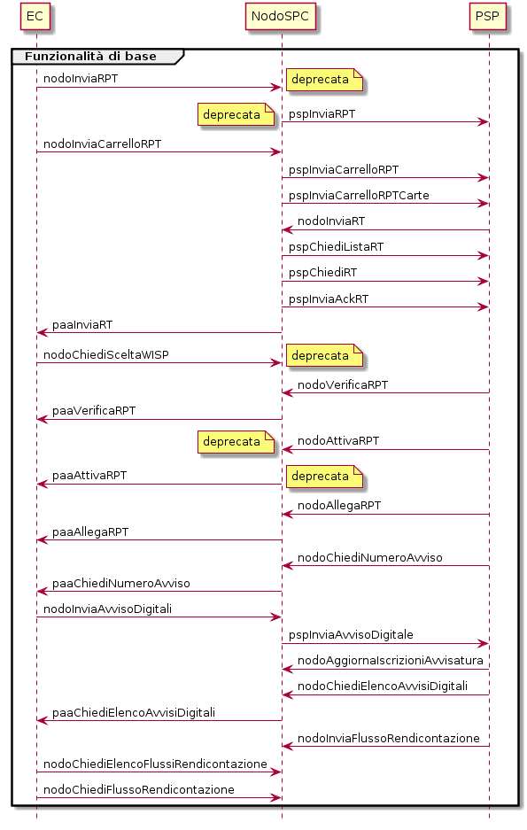
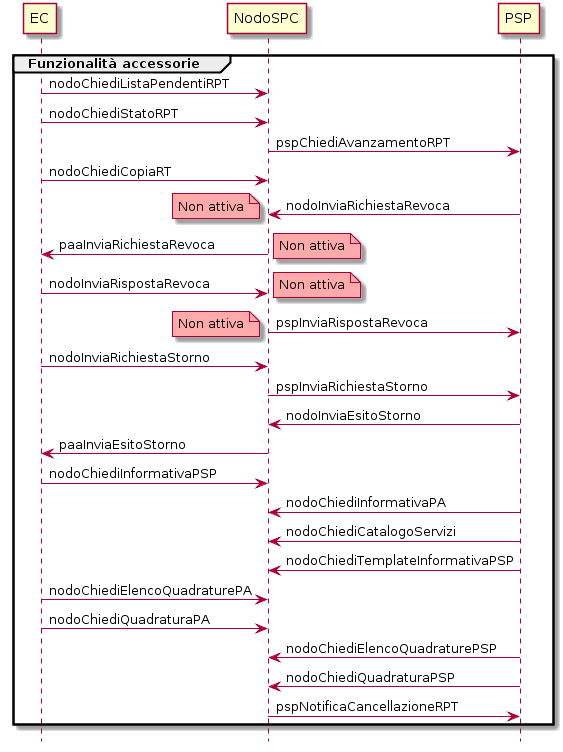
.. |PlantUML 23diagram| image:: media/image4.png
   :width: 5.60919in
   :height: 7.40157in
.. |PlantUML 24diagram| image:: media/image5.png
   :width: 5.90551in
   :height: 3.31738in
.. |PlantUML 25diagram| image:: media/image6.png
   :width: 5.90551in
   :height: 4.19938in
.. |PlantUML 26diagram| image:: media/image7.png
   :width: 5.90551in
   :height: 3.71230in
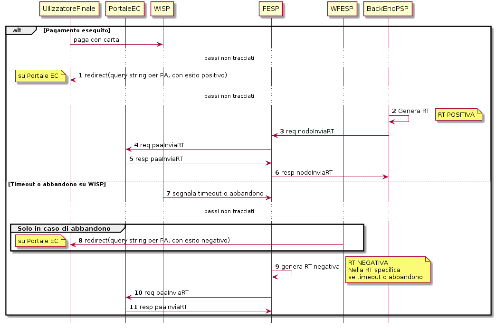
.. |PlantUML 28diagram| image:: media/image9.png
   :width: 5.90551in
   :height: 3.58066in
.. |PlantUML 29diagram| image:: media/image10.png
   :width: 5.90551in
   :height: 3.44244in
.. |PlantUML 30diagram| image:: media/image11.png
   :width: 5.90551in
   :height: 3.50826in
.. |PlantUML 31diagram| image:: media/image12.png
   :width: 5.90551in
   :height: 4.30469in
.. |PlantUML 32diagram| image:: media/image13.png
   :width: 5.90551in
   :height: 3.98875in
.. |PlantUML 33diagram| image:: media/image14.png
   :width: 5.90551in
   :height: 4.04141in
.. |PlantUML 34diagram| image:: media/image15.png
   :width: 5.90551in
   :height: 3.93284in

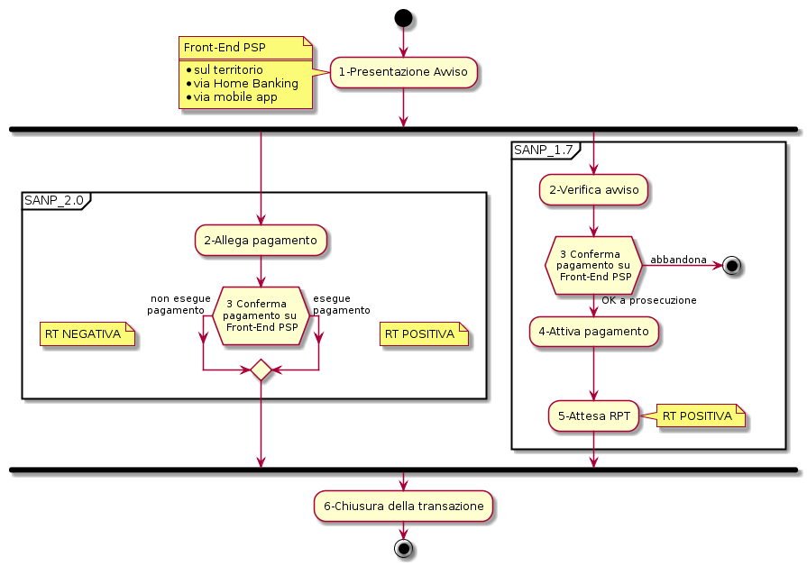
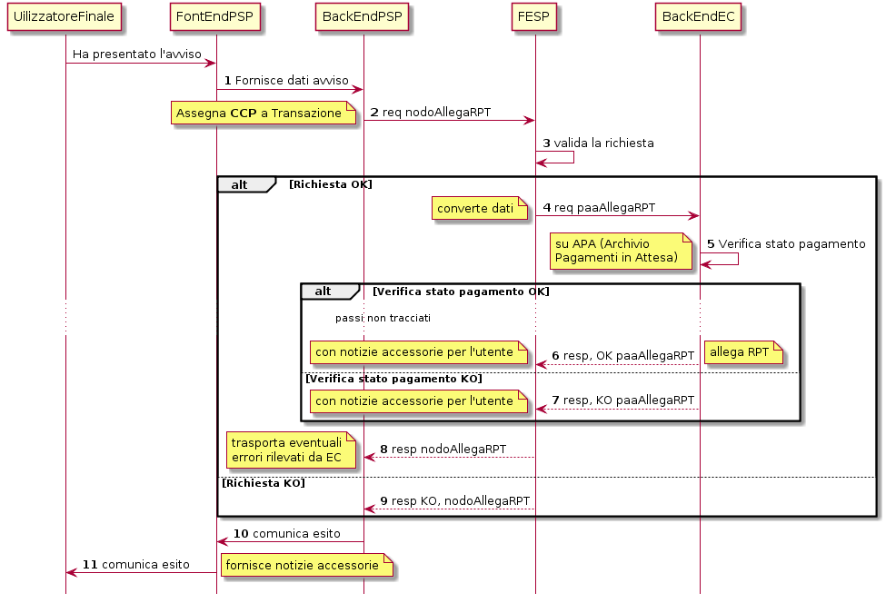
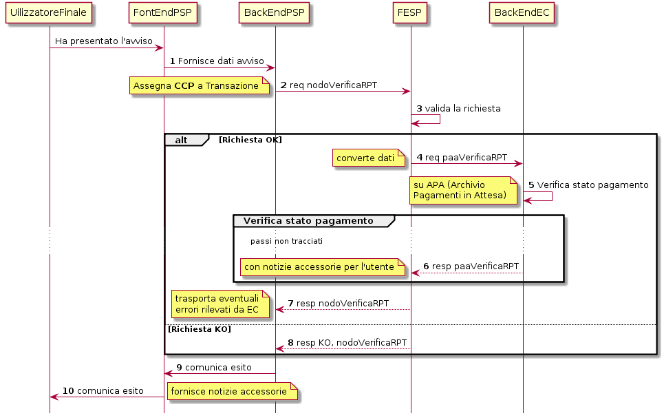
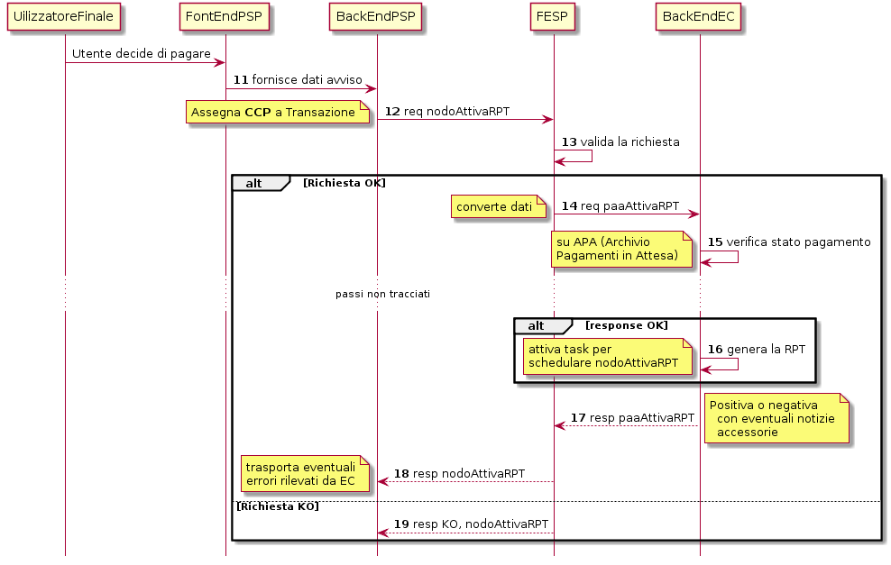
.. |PlantUML 22diagram| image:: media/image22.png
   :width: 5.90551in
   :height: 3.98875in
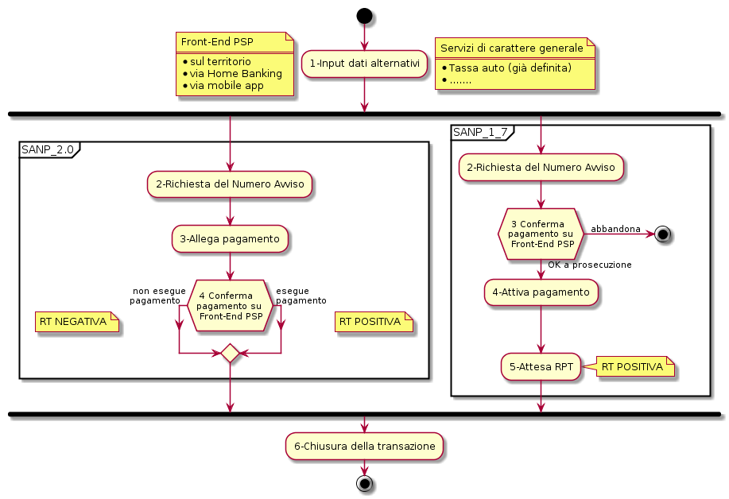
.. |PlantUML 124diagram| image:: media/image24.png
   :width: 5.90551in
   :height: 3.71230in
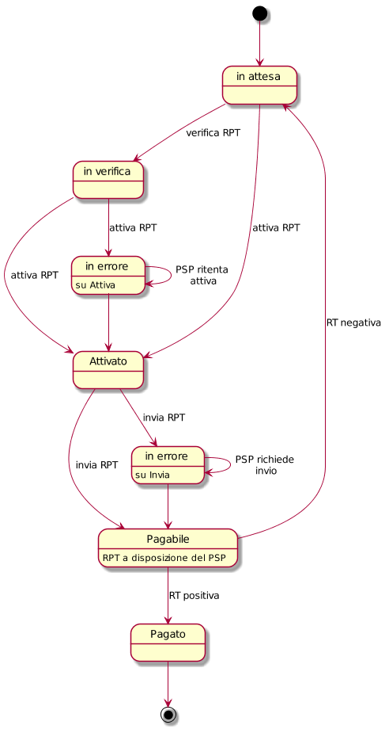
.. |PlantUML 126diagram| image:: media/image26.png
   :width: 5.90551in
   :height: 4.52848in
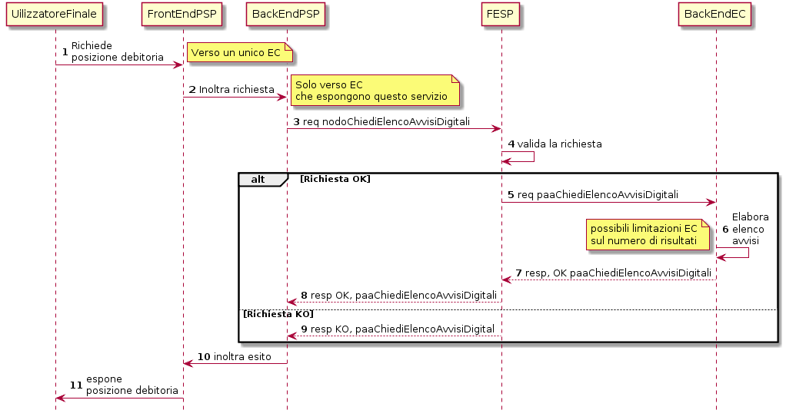
.. |PlantUML 128diagram| image:: media/image28.png
   :width: 5.90551in
   :height: 3.37003in